<div align="center">

# 🔀 Chat Merger Tool

**Merge segmented AI chat responses into clean, unified Markdown documents.**

[](https://www.python.org/downloads/)
[](https://opensource.org/licenses/MIT)
[]()

<br>

*When AI responses break mid-sentence and you have to say **"continue"** ten times —<br>
this tool stitches them back together.*

<br>

[Quick Start](#-quick-start) •
[Features](#-features) •
[Pipeline](#-pipeline) •
[Configuration](#-configuration) •
[Examples](#-examples)

</div>

---

## 📋 Table of Contents

- [Problem](#-the-problem)
- [Solution](#-the-solution)
- [Features](#-features)
- [Installation](#-installation)
- [Quick Start](#-quick-start)
- [Pipeline](#-pipeline)
- [How It Works](#-how-it-works)
- [Input Formats](#-input-formats)
- [Tools Reference](#-tools-reference)
- [Configuration](#-configuration)
- [Examples](#-examples)
- [Testing](#-testing)
- [Project Structure](#-project-structure)
- [Troubleshooting](#-troubleshooting)
- [Contributing](#-contributing)
- [License](#-license)

---

## 🧩 The Problem

When chatting with AI models (ChatGPT, Claude, etc.), long responses frequently get
**cut off mid-sentence**. You end up with conversations like:

```
You:       Write a comprehensive document about X...
Assistant: Here is part 1... [truncated]
You:       continue
Assistant: Here is part 2... [truncated]
You:       ادامه بده
Assistant: Here is part 3... [truncated]
You:       Continue
Assistant: Here is part 4... Done!
```

The result? **Your actual content is scattered across dozens of fragmented messages**,
often with overlapping text at the boundaries. Manually copying and stitching these
together is tedious, error-prone, and painful.

---

## 💡 The Solution

**Chat Merger Tool** takes your raw chat export (JSON) and produces a **single, clean
Markdown file** with:

- ✅ All segments merged in order
- ✅ Continuation commands (`continue`, `ادامه بده`, `بله`, ...) removed
- ✅ Overlapping text detected and handled
- ✅ Original requests preserved as headers
- ✅ Follow-up additions noted
- ✅ Metadata and merge reports included

---

## ✨ Features

<table>
<tr>
<td width="50%">

### Core
- 🔗 **Smart Merging** — Concatenates broken segments
- 🔍 **Overlap Detection** — Exact, line-by-line, and fuzzy matching
- 🏷️ **Message Classification** — Distinguishes continuations from new requests
- 📝 **Clean Output** — MD/MDX with frontmatter and annotations

</td>
<td width="50%">

### Advanced
- 🌐 **Multilingual** — English + Persian/Farsi continuation detection
- 🤝 **Interactive Mode** — Ask for clarification on ambiguous messages
- 🔄 **Format Converter** — ChatGPT, Claude, and custom formats
- 🧹 **Post-Processor** — TOC, validation, code extraction

</td>
</tr>
</table>

<details>
<summary><strong>🌍 Supported Continuation Commands</strong></summary>
<br>

| Language | Commands |
|----------|----------|
| English | `continue`, `Continue`, `go on`, `keep going`, `yes`, `please continue`, `go ahead`, `next`, `more`, `proceed`, `ok`, `sure`, `alright` |
| Persian | `ادامه بده`, `ادامه`, `بله`, `آره`, `بعدی`, `ادامه بدید`, `لطفا ادامه بده`, `لطفاً ادامه بده` |

> 💡 You can add custom commands in `config.yaml`

</details>

<details>
<summary><strong>🔍 Overlap Detection Methods</strong></summary>
<br>


Three strategies are applied in order:
1. **Exact substring match** — Most reliable. Auto-resolved.
2. **Line-by-line comparison** — Handles reformatted text. Auto-resolved if ≥2 lines match.
3. **Fuzzy matching** (requires `rapidfuzz`) — Catches near-matches. Always flagged for review.

```mermaid
flowchart TD
    A[User Message] --> B{Matches continuation\ncommand list?}
    B -->|Yes| C[CONTINUATION_COMMAND\n→ Skip, merge next assistant response]
    B -->|No| D{Word count ≤ 40?}
    D -->|No| E[NEW_REQUEST\n→ Start new conversation block]
    D -->|Yes| F{Looks like follow-up?\ne.g. starts with 'what about',\n'آیا', 'و' ...}
    F -->|Yes| G[SHORT_FOLLOWUP\n→ Add as sub-request in same block]
    F -->|No| H{Word count ≤ 15?}
    H -->|Yes| G
    H -->|No| E

    style C fill:#27ae60,color:#fff
    style E fill:#e74c3c,color:#fff
    style G fill:#f39c12,color:#fff
```

</details>

<details>
<summary><strong>📊 Message Classification Logic</strong></summary>
<br>



</details>

---

## 📦 Installation

### Prerequisites

- **Python 3.8+** — [Download](https://www.python.org/downloads/)
- **pip** — Included with Python

### Setup

```powershell
# Clone or navigate to project
cd D:\Code\chatMergerTool

# Create virtual environment
python -m venv venv

# Activate (PowerShell)
.\venv\Scripts\Activate.ps1

# Install dependencies
pip install -r requirements.txt
```

<details>
<summary><strong>📦 Dependencies</strong></summary>
<br>

| Package | Required? | Purpose |
|---------|-----------|---------|
| `pyyaml` | ✅ Required | Configuration file parsing |
| `rich` | ⭐ Recommended | Beautiful terminal output, interactive prompts |
| `rapidfuzz` | ⭐ Recommended | Fuzzy overlap detection |

All three are installed via `requirements.txt`. The tool works without `rich` and
`rapidfuzz` but with reduced functionality.

</details>

---

## 🚀 Quick Start

```powershell
# Activate environment
cd D:\Code\chatMergerTool
.\venv\Scripts\Activate.ps1

# Basic usage — auto-generates output filename
python chat_merger.py your_chat.json

# Specify output
python chat_merger.py your_chat.json -o output\result.md

# Quick run script (activates venv automatically)
.\run.ps1 your_chat.json
.\run.ps1 your_chat.json -o output\result.md --flag-overlaps
```

<details>
<summary><strong>⚡ All CLI Options</strong></summary>
<br>

```
python chat_merger.py <input.json> [options]

Positional:
  input                 Input JSON file containing chat messages

Options:
  -o, --output FILE     Output file path (default: <input>_merged.md)
  -c, --config FILE     Configuration file (default: config.yaml)
  -f, --format {md,mdx} Output format
  -i, --interactive     Ask for clarification on ambiguous messages
  --flag-overlaps       Flag overlaps for manual review instead of auto-removing
  -v, --verbose         Debug logging
  --dry-run             Preview without writing output file
  -h, --help            Show help
```

</details>

---

## 🔧 Pipeline

The full pipeline converts, merges, and post-processes in one command:

```powershell
.\pipeline.ps1 your_chat_export.json my_document
```



<details>
<summary><strong>🔧 Pipeline Steps in Detail</strong></summary>
<br>

```mermaid
graph LR
    subgraph "Input"
        A[Chat Export\nJSON/TXT]
    end

    subgraph "Step 1: Convert"
        B[convert_export.py\nNormalize format]
    end

    subgraph "Step 2: Merge"
        C[chat_merger.py\nClassify + Merge + Overlap]
    end

    subgraph "Step 3: Post-Process"
        D[post_process.py\nClean + TOC + Validate]
    end

    subgraph "Output"
        E[📄 Final Markdown]
        F[📁 Code Blocks]
        G[📊 Merge Report]
    end

    A --> B --> C --> D --> E
    D --> F
    C --> G

    style A fill:#3498db,color:#fff
    style E fill:#2ecc71,color:#fff
    style F fill:#9b59b6,color:#fff
    style G fill:#f39c12,color:#fff
```

| Step | Tool | Input | Output | Description |
|------|------|-------|--------|-------------|
| 1 | `convert_export.py` | Raw export | `01_converted.json` | Normalizes ChatGPT/Claude/custom formats |
| 2 | `chat_merger.py` | Standard JSON | `02_merged_raw.md` | Classifies messages, merges segments, detects overlaps |
| 3 | `post_process.py` | Raw markdown | `03_*_final.md` | Cleans blank lines, fixes code blocks, generates TOC |
| 4 | `post_process.py` | Clean markdown | `code_blocks/` | Extracts code blocks to separate files |
| 5 | `post_process.py` | Clean markdown | *(console)* | Validates structure, lists review markers |

</details>

---

## ⚙️ How It Works

### High-Level Architecture


### Data Flow Example

<details>
<summary><strong>📊 Click to see a concrete example</strong></summary>
<br>

**Input (5 messages):**

```json
[
  {"role": "user",      "content": "Write about Python decorators"},
  {"role": "assistant", "content": "# Decorators\nPart 1..."},
  {"role": "user",      "content": "continue"},
  {"role": "assistant", "content": "Part 1...\nPart 2..."},
  {"role": "user",      "content": "ادامه بده"},
  {"role": "assistant", "content": "Part 3... Done!"}
]
```

**Processing:**

```mermaid
sequenceDiagram
    participant U as User Messages
    participant C as Classifier
    participant M as Merger
    participant O as Output

    U->>C: "Write about Python decorators"
    C->>M: NEW_REQUEST → Start Block 1

    U->>C: "continue"
    C-->>C: CONTINUATION_COMMAND → Skip

    U->>C: "ادامه بده"
    C-->>C: CONTINUATION_COMMAND → Skip

    M->>M: Merge 3 assistant segments
    M->>M: Detect overlap "Part 1..." between seg 1 & 2
    M->>M: Auto-remove overlap

    M->>O: Block 1: request + merged response
    O->>O: Generate markdown
```



**Output (1 block):**

```markdown
## Conversation 1
*(3 segments merged)*

### Request
Write about Python decorators

### Response
# Decorators
Part 1...
Part 2...
Part 3... Done!

### Overlap Report
*1 overlap(s) detected:*
- **Overlap 1:** 42 chars, similarity 100%, Auto-resolved
```

</details>

---

## 📥 Input Formats

The tool supports multiple JSON formats. Use `convert_export.py` to normalize
non-standard formats.

<details>
<summary><strong>Format 1: Standard (recommended)</strong></summary>
<br>

```json
{
  "messages": [
    {
      "role": "user",
      "content": [{"type": "text", "text": "Your message here"}]
    },
    {
      "role": "assistant",
      "content": [{"type": "text", "text": "Response here"}],
      "metadata": {"model": "claude-opus-4-6"}
    }
  ]
}
```

> ✅ This is the native format. No conversion needed.

</details>

<details>
<summary><strong>Format 2: Simple string content</strong></summary>
<br>

```json
{
  "messages": [
    {"role": "user", "content": "Hello"},
    {"role": "assistant", "content": "Hi there!"}
  ]
}
```

> ✅ Auto-detected. No conversion needed.

</details>

<details>
<summary><strong>Format 3: ChatGPT Export</strong></summary>
<br>

```json
[
  {
    "title": "My Conversation",
    "mapping": {
      "msg-id-1": {
        "message": {
          "author": {"role": "user"},
          "content": {"parts": ["Hello"]}
        },
        "parent": "root-id"
      }
    }
  }
]
```

> ⚠️ Requires conversion:
> ```powershell
> python convert_export.py conversations.json -s chatgpt -o standard.json
> ```

</details>

<details>
<summary><strong>Format 4: Claude Export</strong></summary>
<br>

```json
{
  "chat_messages": [
    {"sender": "human", "text": "Hello"},
    {"sender": "assistant", "text": "Hi!"}
  ]
}
```

> ⚠️ Requires conversion:
> ```powershell
> python convert_export.py claude_chat.json -s claude -o standard.json
> ```

</details>

<details>
<summary><strong>Format 5: Plain text with markers</strong></summary>
<br>

```
USER: Hello, can you help me?
ASSISTANT: Of course! What do you need?
USER: continue
ASSISTANT: I'll continue helping...
```

> ⚠️ Requires conversion:
> ```powershell
> python convert_export.py chat.txt -s text -o standard.json
> ```

</details>

### Format Detection Flow

```mermaid
graph TD
    A[Input File] --> B{File Extension?}
    B -->|.txt| C[Text Converter]
    B -->|.json| D{Auto-detect structure}
    D -->|has 'mapping' + 'title'| E[ChatGPT Converter]
    D -->|has 'chat_messages'| F[Claude Converter]
    D -->|has 'messages' array| G[Standard - No conversion]
    D -->|direct array| H[Array Normalizer]
    D -->|unknown| I[⚠️ Error: Unknown format]

    style G fill:#2ecc71,color:#fff
    style I fill:#e74c3c,color:#fff
```



---

## 🛠️ Tools Reference

### `chat_merger.py` — Main Merger

<details>
<summary><strong>📖 Full Usage Reference</strong></summary>
<br>

```powershell
# Basic
python chat_merger.py input.json

# All options
python chat_merger.py input.json `
    --output result.md `
    --config custom_config.yaml `
    --format mdx `
    --interactive `
    --flag-overlaps `
    --verbose `
    --dry-run
```

| Option | Short | Description |
|--------|-------|-------------|
| `--output` | `-o` | Output file path |
| `--config` | `-c` | Config YAML file |
| `--format` | `-f` | `md` or `mdx` |
| `--interactive` | `-i` | Ask about ambiguous messages |
| `--flag-overlaps` | — | Mark overlaps instead of removing |
| `--verbose` | `-v` | Debug logging |
| `--dry-run` | — | Preview without writing |

</details>

### `convert_export.py` — Format Converter

<details>
<summary><strong>📖 Full Usage Reference</strong></summary>
<br>

```powershell
# Auto-detect format
python convert_export.py input_file -o output.json

# Specify source format
python convert_export.py conversations.json -s chatgpt -o standard.json
python convert_export.py claude_export.json -s claude -o standard.json
python convert_export.py chat.txt -s text -o standard.json

# With statistics
python convert_export.py input_file --stats
```

| Option | Short | Description |
|--------|-------|-------------|
| `--source` | `-s` | Source format: `auto`, `chatgpt`, `claude`, `text`, `standard` |
| `--output` | `-o` | Output JSON path |
| `--verbose` | `-v` | Debug logging |
| `--stats` | — | Show conversion statistics |

</details>

### `post_process.py` — Post-Processor

<details>
<summary><strong>📖 Full Usage Reference</strong></summary>
<br>

```powershell
# Clean up and add TOC
python post_process.py merged.md --all

# Individual actions
python post_process.py merged.md --clean
python post_process.py merged.md --toc
python post_process.py merged.md --validate
python post_process.py merged.md --review

# Extract and split
python post_process.py merged.md --extract-code code_blocks\
python post_process.py merged.md --split conversations\
```

| Option | Description |
|--------|-------------|
| `--clean` | Remove excessive blank lines, fix broken code blocks |
| `--toc` | Generate table of contents |
| `--validate` | Check markdown structure for issues |
| `--review` | Find and list all manual review markers |
| `--extract-code DIR` | Extract code blocks to separate files |
| `--split DIR` | Split by conversations into separate files |
| `--all` | Run `--clean` + `--toc` + `--validate` |
| `--output` / `-o` | Output file (default: overwrite input) |

</details>

---

## ⚙️ Configuration

Edit `config.yaml` to customize behavior.

<details>
<summary><strong>📄 Full Configuration Reference</strong></summary>
<br>

```yaml
# Commands that signal "continue the previous answer"
continuation_commands:
  - "continue"
  - "ادامه بده"
  - "بله"
  # ... add your own

# Messages with fewer words than this may be "short follow-ups"
short_followup_max_words: 40

# Overlap detection settings
overlap_detection:
  min_overlap_chars: 50        # Minimum chars to consider as overlap
  similarity_threshold: 0.82   # Fuzzy match threshold (0.0 - 1.0)
  scan_window_chars: 500       # Chars to scan at segment boundaries

# Output settings
output:
  format: "md"                 # "md" or "mdx"
  include_metadata: true       # YAML frontmatter
  include_timestamps: true     # If available in input
  flag_overlaps_only: false    # true = flag, false = auto-remove

# Logging
log_level: "INFO"              # DEBUG, INFO, WARNING, ERROR
```

</details>

<details>
<summary><strong>🔧 Configuration Tips</strong></summary>
<br>

**For aggressive overlap removal:**
```yaml
overlap_detection:
  min_overlap_chars: 30
  similarity_threshold: 0.75
  scan_window_chars: 800
output:
  flag_overlaps_only: false
```

**For conservative / manual review:**
```yaml
overlap_detection:
  min_overlap_chars: 80
  similarity_threshold: 0.90
  scan_window_chars: 300
output:
  flag_overlaps_only: true
```

**For Persian-heavy content, add more commands:**
```yaml
continuation_commands:
  # ... defaults ...
  - "برو جلو"
  - "بقیه‌اش"
  - "بیشتر بگو"
  - "ادامه‌ی متن"
```

</details>

---

## 📝 Examples

### Example 1: Simple Merge

```powershell
python chat_merger.py samples\test_chat.json -o output\simple.md
```

<details>
<summary><strong>📄 Output Preview</strong></summary>
<br>

```markdown
---
source: "samples\test_chat.json"
total_conversations: 2
total_segments_merged: 4
manual_review_needed: 0
---

# Chat Merger Report

| Metric | Value |
|--------|-------|
| Conversations | 2 |
| Total segments merged | 4 |
| Overlaps detected | 0 |

---

## Conversation 1
*(3 segments merged)*
*Model: test-model-1*

### Request
Write me a comprehensive guide about Python decorators with examples.

### Response
# Python Decorators Guide
[... complete merged content ...]

---

## Conversation 2

### Request
Now explain Python generators in detail.

### Response
# Python Generators
[... content ...]
```

</details>

### Example 2: Persian Content with Follow-ups

```powershell
python chat_merger.py samples\test_farsi_chat.json -o output\farsi.md --flag-overlaps -v
```

### Example 3: Full Pipeline

```powershell
.\pipeline.ps1 my_export.json my_document
```

<details>
<summary><strong>📁 Output Structure</strong></summary>
<br>

```
output\my_document_20240101_120000\
├── 01_converted.json           # Normalized input
├── 02_merged_raw.md            # Raw merged output
├── 03_my_document_final.md     # Clean final output with TOC
└── code_blocks\                # Extracted code
    ├── code_block_001.py
    ├── code_block_002.tex
    └── code_block_003.sh
```

</details>

### Example 4: Convert ChatGPT Export

```powershell
# Step 1: Convert
python convert_export.py conversations.json -s chatgpt -o standard.json --stats

# Step 2: Merge
python chat_merger.py standard.json -o merged.md --interactive

# Step 3: Post-process
python post_process.py merged.md --all --extract-code code\
```

---

## 🧪 Testing

```powershell
# Quick test (all automated tests)
.\test.ps1

# Or manually
python tests\test_basic.py

# Test with verbose output
python tests\test_basic.py 2>&1 | more
```

<details>
<summary><strong>🧪 Test Coverage</strong></summary>
<br>

| Test | Description | What it verifies |
|------|-------------|------------------|
| `test_config_defaults` | Default config | All defaults are sensible |
| `test_config_from_yaml` | YAML loading | Config file parses correctly |
| `test_classifier_english` | English commands | `continue`, `yes`, `ok`, etc. |
| `test_classifier_farsi` | Persian commands | `ادامه بده`, `بله`, etc. |
| `test_classifier_new_request` | Long messages | Correctly classified as new request |
| `test_parser_format1` | Content array | `[{"type":"text","text":"..."}]` |
| `test_parser_format2` | String content | `"content": "..."` |
| `test_parser_format3` | Direct array | `[{"role":"user",...}]` |
| `test_overlap_exact` | Exact overlap | Detects and auto-resolves |
| `test_overlap_none` | No overlap | No false positives |
| `test_merger_basic` | Basic merge | 3 segments → 1 block |
| `test_merger_multiple` | Multiple requests | Correct block separation |
| `test_output_generator` | MD generation | Valid markdown structure |
| `test_end_to_end` | Full pipeline | JSON in → MD out |

</details>

---

## 📁 Project Structure

```
D:\Code\chatMergerTool\
│
├── 🐍 chat_merger.py          # Main merger application
├── 🔄 convert_export.py       # Format converter
├── 🧹 post_process.py         # Post-processor
│
├── ⚙️ config.yaml              # Configuration
├── 📦 requirements.txt         # Python dependencies
├── 📦 setup.py                 # Package setup
├── 📖 README.md                # This file
├── 🚫 .gitignore               # Git ignore rules
│
├── ⚡ run.ps1                  # Quick run script
├── 🧪 test.ps1                 # Quick test script
├── 🧹 clean.ps1                # Clean output files
├── 🔧 pipeline.ps1             # Full pipeline script
│
├── 📂 venv\                    # Python virtual environment
├── 📂 tests\
│   └── test_basic.py           # Automated tests
├── 📂 samples\
│   ├── test_chat.json          # English test data
│   └── test_farsi_chat.json    # Persian test data
└── 📂 output\                  # Generated outputs
```


---

## 🔧 Troubleshooting

<details>
<summary><strong>❌ "No module named 'yaml'"</strong></summary>
<br>

```powershell
pip install pyyaml
```

Or activate your virtual environment first:
```powershell
.\venv\Scripts\Activate.ps1
pip install -r requirements.txt
```

</details>

<details>
<summary><strong>❌ "Unrecognized JSON format"</strong></summary>
<br>

Your chat export is in a non-standard format. Try converting first:

```powershell
python convert_export.py your_file.json -s auto -o standard.json
python chat_merger.py standard.json -o output.md
```

If auto-detection fails, specify the source:
```powershell
python convert_export.py your_file.json -s chatgpt -o standard.json
python convert_export.py your_file.json -s claude -o standard.json
```

</details>

<details>
<summary><strong>❌ Persian/Farsi text appears garbled</strong></summary>
<br>

Ensure your files are saved as **UTF-8**. Check:

```powershell
# Check encoding
python -c "
with open('your_file.json', 'rb') as f:
    raw = f.read(4)
    print('BOM:', raw[:3])
    print('Likely UTF-8' if raw[:3] != b'\xff\xfe' else 'Likely UTF-16')
"
```

If needed, convert:
```powershell
# Re-save as UTF-8
python -c "
import json
with open('input.json', 'r', encoding='utf-8-sig') as f:
    data = json.load(f)
with open('input_utf8.json', 'w', encoding='utf-8') as f:
    json.dump(data, f, ensure_ascii=False, indent=2)
"
```

</details>

<details>
<summary><strong>❌ Overlaps not being detected</strong></summary>
<br>

Try lowering the thresholds in `config.yaml`:

```yaml
overlap_detection:
  min_overlap_chars: 30          # Lower from 50
  similarity_threshold: 0.70     # Lower from 0.82
  scan_window_chars: 800         # Increase from 500
```

Also ensure `rapidfuzz` is installed for fuzzy matching:
```powershell
pip install rapidfuzz
```

</details>

<details>
<summary><strong>❌ Interactive mode not working</strong></summary>
<br>

Interactive mode requires `rich`:
```powershell
pip install rich
```

Without `rich`, a basic text fallback is used but may not display properly
in all terminals.

</details>

<details>
<summary><strong>❌ PowerShell script execution blocked</strong></summary>
<br>

```powershell
# Allow scripts for current user
Set-ExecutionPolicy -ExecutionPolicy RemoteSigned -Scope CurrentUser

# Or run with bypass
powershell -ExecutionPolicy Bypass -File .\run.ps1 input.json
```

</details>

---

## 🤝 Contributing

Contributions welcome! Areas that need help:

- [ ] Additional chat export formats (Gemini, Copilot, etc.)
- [ ] More language support for continuation commands
- [ ] GUI / web interface
- [ ] Better fuzzy matching algorithms
- [ ] Paragraph-level deduplication
- [ ] AI-assisted overlap resolution
- [ ] Support for image/attachment content

---

## 📜 License

MIT License — See [LICENSE](LICENSE) for details.

---

<div align="center">

**Made with 🤖 for humans who talk to AIs**

*Because life is too short to manually copy-paste 47 "continue" responses.*

<br>

```
"I asked the AI to write a document.
 It took 12 segments and 11 'continue's.
 Now it takes 1 command." 
```

</div>