# Chat Merger Report

| Metric | Value |
|--------|-------|
| Conversations | 4 |
| Total segments merged | 9 |
| Overlaps detected | 2 |
| Blocks needing review | 1 |

---

## Conversation 1
*(5 segments merged)*
*Model: claude-opus-4-6*

<!-- 🔧 MANUAL INTERVENTION NEEDED -->
> **Review needed:** Overlap detection flagged some areas

### Request

در سرزمین‌های مختلف و حوزه‌های جغرافیایی مختلف، State ها چگونه شکل گرفتند؟ رابطه‌های مختلفی که بین State  و  Nation ها و Ethnic ها بود در چه الگوهایی به لحاظ مدیریت سیاسی مورد طرح و تدوین قرار گرفته‌اند؟ ایا الگوهای موفق و یا ناموفق عمومی داریم؟ آیا به نسبت توسعه‌ی پایدار و یا توسعه‌ی سیاسی و دموکراتیک بین آن‌ها ارزشیابی‌های عمومی و مشترکی بین اندیشمندان هست؟ 

این موضوع در سیاسیت نظری و سیاست تاسیسی در قالب چه سرفصلی بررسی می‌شود و چه ابعاد و مبانی و تحلیل‌ها و یا نظریه‌های در خصوص آن وجود دارد؟
نمونه‌های تاریخی و چالش‌ها و تغییرات بزرگی که در خصوص آن شکل گرفت چیست؟ 

برای مثال.. 
نحوه‌ی تنظیمات State vs Nations در هندوستان
نحوه‌ی تنظیمات State vs Nations در انگلستان
چنین ترتیباتی در سایر کشورها و آموزه‌ها و نکات آن برای ایران

بحث دقیقی در خصوص انواع رژیم‌های سیاسی از طیف مرکزگرای کامل تا کونفدراتیو و یا اتحادیه‌ای ارائه بده و اینکه چه نمونه‌هایی از هر یک وجود دارد و اینکه چه تفاوت‌های عمده‌ای در نوع اجرای هر یک هست.. 

در خصوص کشور ایران چه دیدگاه‌هایی است؟ آیا آنرا می‌توان یک کشور چند ملتی نامید؟  مزایا و چالش‌های چند ملیتی بودن چیست؟ راهکارهای مختلفی که برای کارآمدی، رفاه، توسعه و تامین حقوق اولیه و دموکراسی در این میان هست کدام است؟ 

در قالب یک پژوهش جامع و یک کتاب کاربردی با فصل یا فصولی برای راهنمایی اجرایی و زمینه‌شناختی برای ایران در قالب لاتکس فارسی چند فایله ارائه کن. 
رنگی لوکس لایت و مدرن باشد. 
دارای عکس و نمودار و جداول عرضی و چارت ها و یا عکس‌های پیچیده و حرفه‌ای باشد. 
طراحی صفحه‌ای هم برای آن داشته باش و به آن بیافزا

ممنون

### Response

# پروژه‌ی کتاب جامع: دولت، ملت و تنوع قومی

در زیر یک پروژه‌ی چندفایله‌ی LaTeX فارسی کامل ارائه می‌دهم:

---

## ساختار فایل‌ها

```
project/
├── main.tex
├── preamble.tex
├── titlepage.tex
├── chapter1.tex   (مبانی نظری شکل‌گیری دولت)
├── chapter2.tex   (الگوهای رابطه دولت-ملت-قومیت)
├── chapter3.tex   (طیف رژیم‌های سیاسی)
├── chapter4.tex   (مطالعات تطبیقی: هند، انگلستان و...)
├── chapter5.tex   (ایران: چندملیتی بودن)
├── chapter6.tex   (راهنمای اجرایی برای ایران)
├── appendix.tex
└── references.bib
```

---

## `preamble.tex`

```latex
% preamble.tex
% ============================================================
%  بسته‌ها و تنظیمات عمومی کتاب
% ============================================================

\documentclass[
  12pt,
  a4paper,
  openany,
  twoside
]{book}

% ---------- Encoding & Fonts ----------
\usepackage{fontspec}
\usepackage[bidi=basic]{babel}
\babelprovide[import, main]{persian}
\babelprovide[import]{english}
\babelfont{rm}{XB Niloofar}
\babelfont[english]{rm}{Libertinus Serif}
\babelfont{sf}{IRanSans}
\babelfont[english]{sf}{Libertinus Sans}
\babelfont{tt}{FreeMono}

% ---------- Page Geometry ----------
\usepackage[
  top=2.8cm,
  bottom=2.8cm,
  inner=2.5cm,
  outer=2cm,
  headheight=15pt
]{geometry}

% ---------- Colors – Luxurious Light Modern Palette ----------
\usepackage[dvipsnames,svgnames,x11names]{xcolor}

\definecolor{PrimaryDark}{HTML}{1B2A4A}     % سرمه‌ای عمیق
\definecolor{PrimaryMid}{HTML}{2C5F8A}      % آبی میانه
\definecolor{PrimaryLight}{HTML}{5B9BD5}    % آبی روشن
\definecolor{AccentGold}{HTML}{D4A84B}      % طلایی
\definecolor{AccentCopper}{HTML}{C1724C}    % مسی
\definecolor{BgCream}{HTML}{FAF8F4}         % کرمی بسیار ملایم
\definecolor{BgLightBlue}{HTML}{EDF4FB}     % آبی خیلی روشن
\definecolor{BgLightGold}{HTML}{FDF8EE}     % طلایی خیلی روشن
\definecolor{TextDark}{HTML}{2D2D2D}        % مشکی ملایم
\definecolor{TextMid}{HTML}{555555}         % خاکستری متن
\definecolor{BorderLight}{HTML}{D6D6D6}     % خاکستری حاشیه
\definecolor{SuccessGreen}{HTML}{3A7D44}    % سبز
\definecolor{WarningOrange}{HTML}{E8913A}   % نارنجی
\definecolor{DangerRed}{HTML}{C0392B}       % قرمز

\pagecolor{BgCream}
\color{TextDark}

% ---------- Graphics ----------
\usepackage{graphicx}
\usepackage{tikz}
\usetikzlibrary{
  calc, positioning, arrows.meta, shapes.geometric,
  shapes.multipart, decorations.pathreplacing,
  decorations.markings, backgrounds, fit,
  patterns, shadows, matrix, chains,
  mindmap, trees, intersections,
  fadings, shadings, calendar
}
\usepackage{pgfplots}
\pgfplotsset{compat=newest}

% ---------- Tables ----------
\usepackage{array}
\usepackage{booktabs}
\usepackage{tabularx}
\usepackage{longtable}
\usepackage{multirow}
\usepackage{colortbl}
\usepackage{rotating}   % sidewaystable
\usepackage{adjustbox}

% ---------- Boxes ----------
\usepackage[most,breakable]{tcolorbox}
\tcbuselibrary{skins,hooks,theorems}

% ---------- Headers & Footers ----------
\usepackage{fancyhdr}
\pagestyle{fancy}
\fancyhf{}

\fancyhead[LE]{%
  \textcolor{PrimaryMid}{\small\thepage}%
  \quad
  \textcolor{PrimaryDark}{\small\leftmark}%
}
\fancyhead[RO]{%
  \textcolor{PrimaryDark}{\small\rightmark}%
  \quad
  \textcolor{PrimaryMid}{\small\thepage}%
}
\renewcommand{\headrulewidth}{0.4pt}
\renewcommand{\headrule}{%
  \hbox to\headwidth{%
    \color{AccentGold}\leaders\hrule height \headrulewidth\hfill
  }%
}
\fancyfoot[C]{%
  \begin{tikzpicture}
    \node[fill=PrimaryDark, text=white, rounded corners=3pt,
          inner xsep=8pt, inner ysep=2pt, font=\footnotesize]
      {\thepage};
  \end{tikzpicture}%
}

% ---------- Chapter Style ----------
\usepackage{titlesec}

\titleformat{\chapter}[display]
  {}
  {}
  {0pt}
  {%
    \begin{tikzpicture}[remember picture, overlay]
      % Background strip
      \fill[PrimaryDark]
        ([yshift=-1cm]current page.north west)
        rectangle
        ([yshift=-5.5cm]current page.north east);
      % Gold accent line
      \fill[AccentGold]
        ([yshift=-5.5cm]current page.north west)
        rectangle
        ([yshift=-5.8cm]current page.north east);
      % Chapter number circle
      \node[
        circle, fill=AccentGold, text=PrimaryDark,
        minimum size=2cm, font=\Huge\bfseries,
        inner sep=0pt
      ] at ([yshift=-3.25cm, xshift=-3cm]current page.north east)
        {\thechapter};
      % Chapter title
      \node[
        anchor=east, text=white, font=\Huge\bfseries
      ] at ([yshift=-3.25cm, xshift=-5cm]current page.north east)
        {#1};
    \end{tikzpicture}%
    \vspace{3.5cm}%
  }

\titleformat{name=\chapter,numberless}[display]
  {}
  {}
  {0pt}
  {%
    \begin{tikzpicture}[remember picture, overlay]
      \fill[PrimaryDark]
        ([yshift=-1cm]current page.north west)
        rectangle
        ([yshift=-4.5cm]current page.north east);
      \fill[AccentGold]
        ([yshift=-4.5cm]current page.north west)
        rectangle
        ([yshift=-4.8cm]current page.north east);
      \node[
        anchor=east, text=white, font=\Huge\bfseries
      ] at ([yshift=-2.8cm, xshift=-2cm]current page.north east)
        {#1};
    \end{tikzpicture}%
    \vspace{2.5cm}%
  }

\titleformat{\section}
  {\Large\bfseries\color{PrimaryDark}}
  {\colorbox{PrimaryDark}{\textcolor{white}{\;\thesection\;}}}{0.5em}{}
  [\vspace{2pt}{\color{AccentGold}\titlerule[1pt]}]

\titleformat{\subsection}
  {\large\bfseries\color{PrimaryMid}}
  {\thesubsection}{0.5em}{}
  [\vspace{1pt}{\color{BorderLight}\titlerule[0.4pt]}]

\titleformat{\subsubsection}
  {\normalsize\bfseries\color{AccentCopper}}
  {\thesubsubsection}{0.5em}{}

% ---------- TOC ----------
\usepackage{titletoc}

\titlecontents{chapter}[0pt]
  {\addvspace{12pt}\bfseries\color{PrimaryDark}}
  {\contentslabel{2em}}
  {\hspace*{-2em}}
  {\;\titlerule*[6pt]{.}\;\contentspage}

\titlecontents{section}[2em]
  {\addvspace{3pt}\color{TextDark}}
  {\contentslabel{2.5em}}
  {\hspace*{-2.5em}}
  {\;\titlerule*[4pt]{.}\;\contentspage}

\titlecontents{subsection}[4.5em]
  {\addvspace{1pt}\small\color{TextMid}}
  {\contentslabel{3em}}
  {\hspace*{-3em}}
  {\;\titlerule*[3pt]{.}\;\contentspage}

% ---------- Custom tcolorbox Styles ----------

% --- Key Concept Box ---
\newtcolorbox{keybox}[1][]{%
  enhanced, breakable,
  colback=BgLightBlue,
  colframe=PrimaryMid,
  coltitle=white,
  fonttitle=\bfseries,
  title={#1},
  attach boxed title to top right={yshift=-\tcboxedtitleheight/2, xshift=-4mm},
  boxed title style={
    colback=PrimaryMid, colframe=PrimaryDark,
    rounded corners, shadow={1mm}{-1mm}{0mm}{black!30}
  },
  arc=4pt,
  boxrule=0.8pt,
  shadow={2mm}{-2mm}{0mm}{black!10},
  left=8pt, right=8pt, top=12pt, bottom=8pt,
  before upper=\setlength{\parindent}{1.5em},
}

% --- Warning / Challenge Box ---
\newtcolorbox{challengebox}[1][]{%
  enhanced, breakable,
  colback=red!3,
  colframe=DangerRed,
  coltitle=white,
  fonttitle=\bfseries,
  title={#1},
  attach boxed title to top right={yshift=-\tcboxedtitleheight/2, xshift=-4mm},
  boxed title style={
    colback=DangerRed, rounded corners
  },
  arc=4pt, boxrule=0.6pt,
  borderline west={3pt}{0pt}{DangerRed},
  left=10pt, right=8pt, top=12pt, bottom=8pt,
}

% --- Success / Lesson Box ---
\newtcolorbox{lessonbox}[1][]{%
  enhanced, breakable,
  colback=green!3,
  colframe=SuccessGreen,
  coltitle=white,
  fonttitle=\bfseries,
  title={#1},
  attach boxed title to top right={yshift=-\tcboxedtitleheight/2, xshift=-4mm},
  boxed title style={
    colback=SuccessGreen, rounded corners
  },
  arc=4pt, boxrule=0.6pt,
  borderline west={3pt}{0pt}{SuccessGreen},
  left=10pt, right=8pt, top=12pt, bottom=8pt,
}

% --- Gold Highlight Box ---
\newtcolorbox{goldbox}[1][]{%
  enhanced, breakable,
  colback=BgLightGold,
  colframe=AccentGold,
  coltitle=PrimaryDark,
  fonttitle=\bfseries,
  title={#1},
  attach boxed title to top right={yshift=-\tcboxedtitleheight/2, xshift=-4mm},
  boxed title style={
    colback=AccentGold, rounded corners
  },
  arc=4pt, boxrule=0.8pt,
  shadow={1.5mm}{-1.5mm}{0mm}{AccentGold!20},
  left=8pt, right=8pt, top=12pt, bottom=8pt,
}

% --- Case Study Box ---
\newtcolorbox{casebox}[1][]{%
  enhanced, breakable,
  colback=white,
  colframe=PrimaryLight,
  coltitle=white,
  fonttitle=\bfseries,
  title={#1},
  attach boxed title to top right={yshift=-\tcboxedtitleheight/2, xshift=-4mm},
  boxed title style={
    colback=PrimaryLight, rounded corners
  },
  arc=6pt, boxrule=0.5pt,
  shadow={2mm}{-2mm}{0mm}{PrimaryLight!15},
  left=8pt, right=8pt, top=14pt, bottom=8pt,
}

% --- Quote Box ---
\newtcolorbox{quotebox}{%
  enhanced, breakable,
  colback=BgCream,
  colframe=BgCream,
  borderline west={4pt}{0pt}{AccentGold},
  arc=0pt, boxrule=0pt,
  left=12pt, right=8pt, top=6pt, bottom=6pt,
  fontupper=\itshape\color{TextMid},
}

% ---------- Hyperref ----------
\usepackage{hyperref}
\hypersetup{
  colorlinks=true,
  linkcolor=PrimaryMid,
  citecolor=AccentCopper,
  urlcolor=PrimaryLight,
  bookmarks=true,
  bookmarksnumbered=true,
  pdfauthor={},
  pdftitle={دولت، ملت و تنوع قومی},
  pdfsubject={سیاست تطبیقی و مدیریت تنوع},
}

% ---------- Misc ----------
\usepackage{enumitem}
\setlist{nosep, leftmargin=*}
\setlist[itemize,1]{label=\textcolor{AccentGold}{\rule[0.3ex]{0.6ex}{0.6ex}}}
\setlist[itemize,2]{label=\textcolor{PrimaryMid}{\textbullet}}
\setlist[enumerate,1]{label=\textcolor{PrimaryDark}{\bfseries\arabic*.}}

\usepackage{float}
\usepackage{caption}
\captionsetup{
  font={small},
  labelfont={bf, color=PrimaryDark},
  textfont={color=TextMid},
  justification=centering,
}

\usepackage{subcaption}
\usepackage{wrapfig}
\usepackage{pdfpages}

% line spacing
\usepackage{setspace}
\onehalfspacing

% Drop cap
\usepackage{lettrine}

% ---------- Bibliography ----------
\usepackage[
  backend=biber,
  style=authoryear,
  sorting=nyt,
  maxbibnames=99
]{biblatex}
\addbibresource{references.bib}

% ---------- Glossary / Index ----------
\usepackage{makeidx}
\makeindex

% ---------- Custom Commands ----------
\newcommand{\en}[1]{\foreignlanguage{english}{#1}}
\newcommand{\keyword}[1]{\textbf{\textcolor{PrimaryDark}{#1}}}
\newcommand{\concept}[1]{\textbf{\textcolor{AccentCopper}{#1}}}
\newcommand{\important}[1]{%
  \tikz[baseline=(X.base)]
  \node[fill=AccentGold!15, rounded corners=2pt,
        inner xsep=4pt, inner ysep=1pt] (X) {#1};%
}

% Ornamental separator
\newcommand{\ornsep}{%
  \par\vspace{6pt}
  \begin{center}
    \begin{tikzpicture}
      \draw[AccentGold, thick]
        (-2,0) -- (-0.5,0);
      \node[AccentGold] at (0,0) {\pgfornament[width=1cm]{88}};
      \draw[AccentGold, thick]
        (0.5,0) -- (2,0);
    \end{tikzpicture}
  \end{center}
  \par\vspace{6pt}
}

% Simple ornamental separator (without pgfornament dependency)
\newcommand{\simplesep}{%
  \par\vspace{8pt}
  \begin{center}
    \begin{tikzpicture}
      \draw[AccentGold, thick] (-2.5,0) -- (-0.3,0);
      \node[diamond, fill=AccentGold, minimum size=5pt, inner sep=0pt] at (0,0) {};
      \draw[AccentGold, thick] (0.3,0) -- (2.5,0);
    \end{tikzpicture}
  \end{center}
  \par\vspace{8pt}
}

% Part page style
\newcommand{\partpage}[2]{%
  \clearpage
  \thispagestyle{empty}
  \begin{tikzpicture}[remember picture, overlay]
    \fill[PrimaryDark] (current page.south west) rectangle (current page.north east);
    \node[text=AccentGold, font=\fontsize{72}{80}\selectfont\bfseries]
      at ([yshift=2cm]current page.center) {#1};
    \node[text=white, font=\LARGE]
      at ([yshift=-1cm]current page.center) {#2};
    \draw[AccentGold, line width=2pt]
      ([yshift=0.3cm, xshift=-4cm]current page.center)
      -- ([yshift=0.3cm, xshift=4cm]current page.center);
  \end{tikzpicture}
  \clearpage
}
```

---

## `titlepage.tex`

```latex
% titlepage.tex
% ============================================================
%  صفحه‌ی عنوان و شناسنامه‌ی کتاب
% ============================================================

\begin{titlepage}
\begin{tikzpicture}[remember picture, overlay]

  % --- Full-page background ---
  \fill[BgCream] (current page.south west) rectangle (current page.north east);

  % --- Top dark strip ---
  \fill[PrimaryDark]
    (current page.north west) rectangle
    ([yshift=-9cm]current page.north east);

  % --- Gold accent band ---
  \fill[AccentGold]
    ([yshift=-9cm]current page.north west) rectangle
    ([yshift=-9.4cm]current page.north east);

  % --- Decorative pattern on dark strip ---
  \foreach \i in {0,1,...,25}{
    \node[opacity=0.04, text=white, font=\fontsize{40}{40}\selectfont,
          rotate=30]
      at ([xshift=\i*1.2cm-3cm, yshift=-4cm]current page.north west)
      {◆};
  }
  \foreach \i in {0,1,...,25}{
    \node[opacity=0.03, text=white, font=\fontsize{30}{30}\selectfont,
          rotate=-15]
      at ([xshift=\i*1.5cm-2cm, yshift=-7cm]current page.north west)
      {◇};
  }

  % --- Main Title ---
  \node[anchor=east, text=white, font=\fontsize{30}{36}\selectfont\bfseries,
        text width=16cm, align=flush right]
    at ([yshift=-3.5cm, xshift=-2cm]current page.north east)
    {دولت، ملت و تنوع قومی};

  % --- Subtitle ---
  \node[anchor=east, text=AccentGold, font=\fontsize{16}{22}\selectfont,
        text width=16cm, align=flush right]
    at ([yshift=-5.8cm, xshift=-2cm]current page.north east)
    {مبانی نظری، الگوهای تطبیقی\\[4pt]
     و راهنمای اجرایی برای ایران};

  % --- English subtitle ---
  \node[anchor=east, text=white!80, font=\fontsize{11}{14}\selectfont\itshape]
    at ([yshift=-7.8cm, xshift=-2cm]current page.north east)
    {\en{State, Nation \& Ethnic Diversity: Theory, Comparative Models \& A Roadmap for Iran}};

  % --- Central decorative element ---
  \begin{scope}[shift={([yshift=-13cm]current page.north)}]
    \foreach \a in {0,45,...,315}{
      \draw[AccentGold, opacity=0.3, line width=0.5pt]
        (0,0) -- (\a:2.5);
    }
    \draw[AccentGold, line width=1.5pt] (0,0) circle (2.2);
    \draw[AccentGold, line width=0.6pt] (0,0) circle (2.5);
    \draw[AccentGold, line width=0.6pt] (0,0) circle (1.8);
    \node[text=PrimaryDark, font=\fontsize{9}{11}\selectfont, text width=3cm,
          align=center]
      at (0,0) {پژوهش تطبیقی\\سیاست تأسیسی\\مدیریت تنوع};
  \end{scope}

  % --- Bottom info area ---
  \node[anchor=south east, text=TextMid, font=\small,
        text width=8cm, align=flush right]
    at ([yshift=3cm, xshift=-2cm]current page.south east)
    {%
      \textcolor{PrimaryDark}{\bfseries تألیف:}\quad پژوهشگر سیاست تطبیقی\\[6pt]
      \textcolor{PrimaryDark}{\bfseries ناشر:}\quad مؤسسه‌ی مطالعات راهبردی\\[6pt]
      \textcolor{PrimaryDark}{\bfseries نوبت چاپ:}\quad ویرایش اول — ۱۴۰۴
    };

  % --- Bottom left decorative ---
  \fill[PrimaryDark, rounded corners=4pt]
    ([yshift=1.5cm, xshift=2cm]current page.south west)
    rectangle
    ([yshift=2cm, xshift=8cm]current page.south west);
  \node[text=AccentGold, font=\footnotesize\bfseries,
        anchor=west]
    at ([yshift=1.75cm, xshift=2.3cm]current page.south west)
    {\en{Comparative Politics \& Constitutional Design}};

  % --- Bottom strip ---
  \fill[PrimaryDark]
    (current page.south west) rectangle
    ([yshift=0.8cm]current page.south east);
  \fill[AccentGold]
    ([yshift=0.8cm]current page.south west) rectangle
    ([yshift=1.1cm]current page.south east);

\end{tikzpicture}
\end{titlepage}

% --- Blank back of title page ---
\clearpage
\thispagestyle{empty}
\begin{center}
\vspace*{\fill}
{\small\color{TextMid}
تمامی حقوق این اثر محفوظ است.\\[4pt]
بازنشر با ذکر منبع بلامانع است.\\[12pt]
\textcolor{PrimaryDark}{\bfseries شابک:}\quad
\en{978-600-XXX-XXX-X}\\[4pt]
\textcolor{PrimaryDark}{\bfseries نوبت چاپ:}\quad اول — بهار ۱۴۰۴
}
\vspace*{\fill}
\end{center}
\clearpage
```

---

## `main.tex`

```latex
% main.tex
% ============================================================
%  فایل اصلی کتاب «دولت، ملت و تنوع قومی»
% ============================================================

\input{preamble}

\begin{document}

% ---- Title Page ----
\input{titlepage}

% ---- Front Matter ----
\frontmatter
\tableofcontents
\clearpage
\listoffigures
\clearpage
\listoftables

% ---- Preface ----
\chapter*{پیش‌گفتار}
\addcontentsline{toc}{chapter}{پیش‌گفتار}

\begin{quotebox}
«هنر حکمرانی، هنر زیستن با تفاوت‌هاست.»
\hfill — ویل کیملیکا
\end{quotebox}

\vspace{6pt}

این کتاب تلاشی است برای پاسخ به پرسشی بنیادین در سیاست تأسیسی:
چگونه می‌توان ساختاری سیاسی طراحی کرد که تنوع قومی و ملّی را نه تهدید، بلکه فرصت بشمارد؟

در بخش نخست، مبانی نظری شکل‌گیری دولت و رابطه‌ی آن با مفاهیم ملت و قومیت واکاوی می‌شود. بخش دوم، الگوهای سیاسی مدیریت تنوع — از تمرکزگرایی مطلق تا کنفدراسیون — را با نمونه‌های عینی بررسی می‌کند. بخش سوم مطالعات تطبیقی مفصلی از هندوستان، بریتانیا، سوئیس، بلژیک و چند کشور دیگر ارائه می‌دهد. و سرانجام بخش چهارم، به‌طور ویژه به ایران اختصاص یافته و شامل تحلیل وضعیت، چالش‌ها و نقشه‌ی راه اجرایی است.

\simplesep

\vspace{6pt}
امید آنکه این اثر بتواند سهمی هرچند اندک در گفت‌وگوی ملّی درباره‌ی آینده‌ی ساختار سیاسی ایران داشته باشد.

\vspace{1cm}
\begin{flushleft}
\textcolor{PrimaryDark}{\bfseries پژوهشگر}\\
بهار ۱۴۰۴
\end{flushleft}

% ===========================================================
\mainmatter
% ===========================================================

% ---- PART I ----
\partpage{بخش اول}{مبانی نظری و مفهومی}

\input{chapter1}
\input{chapter2}

% ---- PART II ----
\partpage{بخش دوم}{الگوها و مطالعات تطبیقی}

\input{chapter3}
\input{chapter4}

% ---- PART III ----
\partpage{بخش سوم}{ایران: تحلیل و راهبرد}

\input{chapter5}
\input{chapter6}

% ---- Back Matter ----
\backmatter

\input{appendix}

\printbibliography[
  heading=bibintoc,
  title={کتاب‌نامه}
]

\printindex

\end{document}
```

---

## `chapter1.tex`

```latex
% chapter1.tex
% ============================================================
%  فصل ۱: مبانی نظری شکل‌گیری دولت
% ============================================================

\chapter{مبانی نظری شکل‌گیری دولت}

\begin{keybox}[خلاصه‌ی فصل]
در این فصل با مفاهیم بنیادین \keyword{دولت} (\en{State})، \keyword{ملت} (\en{Nation})
و \keyword{قومیت} (\en{Ethnicity}) آشنا می‌شویم و نظریه‌های اصلی شکل‌گیری دولت‌ها را
در حوزه‌های جغرافیایی مختلف مرور می‌کنیم.
\end{keybox}

% ============================================================
\section{مفهوم‌شناسی: دولت، ملت و قومیت}
% ============================================================

\subsection{دولت (\en{State})}

\lettrine[lines=2, findent=3pt, nindent=0pt]{\textcolor{PrimaryDark}{د}}{}%
ولت در معنای مدرن خود — آن‌چنان‌که \concept{ماکس وبر} تعریف کرده — نهادی است که
\important{انحصار مشروع خشونت} را در قلمرو جغرافیایی معیّنی در اختیار دارد.
اما این تعریف تنها نقطه‌ی آغاز است. چهار عنصر کلاسیک دولت عبارت‌اند از:

\begin{enumerate}
  \item \keyword{قلمرو مشخص} (\en{Territory})
  \item \keyword{جمعیت دائمی} (\en{Population})
  \item \keyword{حکومت} (\en{Government})
  \item \keyword{حاکمیت} (\en{Sovereignty})
\end{enumerate}

\begin{figure}[htbp]
\centering
\begin{tikzpicture}[
  every node/.style={font=\small},
  element/.style={
    draw=PrimaryMid, fill=BgLightBlue, rounded corners=8pt,
    minimum width=3.2cm, minimum height=1.4cm, align=center,
    font=\small\bfseries, text=PrimaryDark,
    drop shadow={shadow xshift=1.5pt, shadow yshift=-1.5pt, opacity=0.15}
  },
  center/.style={
    circle, draw=AccentGold, fill=BgLightGold, line width=2pt,
    minimum size=2.8cm, align=center, font=\bfseries\large,
    text=PrimaryDark,
    drop shadow={shadow xshift=2pt, shadow yshift=-2pt, opacity=0.2}
  },
  arrow/.style={
    -{Stealth[length=6pt]}, line width=1.2pt, PrimaryMid
  }
]
  \node[center] (state) {دولت\\\en{\footnotesize State}};

  \node[element, above=1.8cm of state] (territory)
    {قلمرو\\\en{\footnotesize Territory}};
  \node[element, below=1.8cm of state] (pop)
    {جمعیت\\\en{\footnotesize Population}};
  \node[element, left=2.2cm of state] (gov)
    {حکومت\\\en{\footnotesize Government}};
  \node[element, right=2.2cm of state] (sov)
    {حاکمیت\\\en{\footnotesize Sovereignty}};

  \draw[arrow] (state) -- (territory);
  \draw[arrow] (state) -- (pop);
  \draw[arrow] (state) -- (gov);
  \draw[arrow] (state) -- (sov);
\end{tikzpicture}
\caption{چهار عنصر سازنده‌ی دولت مدرن}
\label{fig:state-elements}
\end{figure}

\subsection{ملت (\en{Nation})}

مفهوم ملت به دو شکل عمده تعریف شده است:

\begin{keybox}[دو رویکرد به ملت]
\begin{description}[style=nextline, leftmargin=2cm]
  \item[\textcolor{PrimaryDark}{رویکرد مدنی (\en{Civic Nation})}]
    ملت بر پایه‌ی شهروندی مشترک، قانون اساسی واحد و اراده‌ی سیاسی مشترک تعریف می‌شود.
    نمونه: فرانسه، ایالات متحده.
  \item[\textcolor{AccentCopper}{رویکرد قومی (\en{Ethnic Nation})}]
    ملت بر پایه‌ی تبار، زبان، فرهنگ و تاریخ مشترک تعریف می‌شود.
    نمونه: آلمان (پیش از ۱۹۴۵)، ژاپن.
\end{description}
\end{keybox}

\subsection{قومیت (\en{Ethnicity})}

قومیت به گروهی اجتماعی اشاره دارد که اعضای آن بر پایه‌ی \concept{هویت فرهنگی مشترک} — شامل زبان، آداب، دین یا تبار مشترک — خود را از دیگران متمایز می‌دانند. قومیت لزوماً با ملت یکسان نیست. یک دولت ممکن است چندین قومیت و حتی چندین ملت را در بر بگیرد.

\simplesep

% ============================================================
\section{نظریه‌های شکل‌گیری دولت}
% ============================================================

\subsection{رویکردهای کلاسیک}

\begin{table}[htbp]
\centering
\caption{نظریه‌های اصلی شکل‌گیری دولت}
\label{tab:state-formation-theories}
\rowcolors{2}{BgLightBlue!40}{white}
\begin{tabularx}{\textwidth}{>{\bfseries\color{PrimaryDark}}r X >{\small\itshape\color{TextMid}}r}
\toprule
\rowcolor{PrimaryDark}
\textcolor{white}{\bfseries نظریه} &
\textcolor{white}{\bfseries شرح اجمالی} &
\textcolor{white}{\bfseries اندیشمند} \\
\midrule
قرارداد اجتماعی &
دولت حاصل توافق ارادی افراد برای خروج از وضع طبیعی است.
& هابز، لاک، روسو \\
فتح و غلبه &
دولت در نتیجه‌ی تسلط گروهی بر گروه دیگر شکل گرفته.
& ابن‌خلدون، اوپنهایمر \\
نظریه‌ی مارکسیستی &
دولت ابزار سلطه‌ی طبقاتی است که همراه مالکیت خصوصی پدید آمد.
& مارکس، انگلس، لنین \\
نظریه‌ی جنگ &
فشار نظامی و رقابت بین واحدها دولت‌های مدرن را ساخت.
& چارلز تیلی \\
نظریه‌ی هیدرولیکی &
مدیریت آبیاری در مقیاس بزرگ به دولت متمرکز انجامید.
& ویتفوگل \\
نهادگرایی تاریخی &
مسیرهای تاریخی ویژه (وابستگی به مسیر) ساختار دولت را شکل داد.
& برینگتن مور، اسکاچپل \\
\bottomrule
\end{tabularx}
\end{table}

\subsection{نظریه‌ی چارلز تیلی: «جنگ دولت می‌سازد»}

\begin{quotebox}
\en{``War made the state, and the state made war.''}
\hfill — \en{Charles Tilly}
\end{quotebox}

\concept{تیلی} استدلال می‌کند که رقابت نظامی قرون ۱۶ تا ۱۹ میلادی در اروپا، دولت‌ها را وادار به ایجاد بوروکراسی مالیاتی، ارتش دائمی و دستگاه اداری کارآمد کرد. دولت‌هایی که نتوانستند این سه کارکرد را توسعه دهند، از صحنه حذف شدند.

\begin{figure}[htbp]
\centering
\begin{tikzpicture}[
  node distance=1.5cm and 2.5cm,
  block/.style={
    rectangle, rounded corners=6pt, draw=PrimaryMid, fill=BgLightBlue,
    minimum height=1cm, minimum width=2.8cm, align=center,
    font=\small\bfseries, text=PrimaryDark
  },
  arrow/.style={-{Stealth[length=5pt]}, thick, PrimaryDark}
]
  \node[block] (war) {جنگ و رقابت\\نظامی};
  \node[block, right=of war] (tax) {نظام مالیاتی\\گسترده‌تر};
  \node[block, right=of tax] (bur) {بوروکراسی\\حرفه‌ای};
  \node[block, below=of bur] (army) {ارتش دائمی\\و بزرگ‌تر};
  \node[block, below=of war] (state) {دولت مدرن\\متمرکز};

  \draw[arrow] (war) -- (tax);
  \draw[arrow] (tax) -- (bur);
  \draw[arrow] (bur) -- (army);
  \draw[arrow] (army) -- (state);
  \draw[arrow, dashed, AccentCopper] (state) -- (war)
    node[midway, left, font=\footnotesize\color{AccentCopper}] {بازخورد};
\end{tikzpicture}
\caption{چرخه‌ی تیلی: جنگ و دولت‌سازی}
\label{fig:tilly-cycle}
\end{figure}

\subsection{مسیرهای مختلف دولت‌سازی در جهان}

\begin{goldbox}[سه مسیر عمده]
\begin{enumerate}
  \item \keyword{مسیر اروپایی:} جنگ → مالیات → بوروکراسی → دموکراسی تدریجی
  \item \keyword{مسیر پسااستعماری:} مرزهای مصنوعی → دولتِ وارداتی → بحران مشروعیت
  \item \keyword{مسیر انقلابی:} انقلاب → دولت ایدئولوژیک → اصلاحات یا فروپاشی
\end{enumerate}
\end{goldbox}

% ============================================================
\section{شکل‌گیری دولت‌ها در حوزه‌های جغرافیایی مختلف}
% ============================================================

\subsection{اروپا: از فئودالیسم تا دولت وستفالیایی}

صلح وستفالی (۱۶۴۸) نقطه‌ی عطفی در تاریخ شکل‌گیری نظام دولت‌های مدرن بود. با پایان جنگ‌های سی‌ساله، اصل \keyword{حاکمیت سرزمینی} (\en{Territorial Sovereignty}) به رسمیت شناخته شد. از آن پس، هر واحد سیاسی در درون مرزهای خود مرجع نهایی اقتدار بود.

\begin{figure}[htbp]
\centering
\begin{tikzpicture}[
  timenode/.style={
    draw=PrimaryMid, fill=BgLightBlue, rounded corners=4pt,
    minimum width=2.5cm, minimum height=0.8cm,
    font=\footnotesize\bfseries, text=PrimaryDark, align=center
  },
  yearnode/.style={
    fill=AccentGold, text=PrimaryDark, rounded corners=2pt,
    font=\footnotesize\bfseries, inner sep=3pt
  }
]
  % Timeline line
  \draw[PrimaryMid, line width=2pt] (0,0) -- (14,0);

  % Events
  \foreach \x/\year/\event in {
    1/1648/صلح وستفالی,
    4/1789/انقلاب فرانسه,
    7/1815/کنگره‌ی وین,
    10/1919/معاهده ورسای,
    13/1945/سازمان ملل
  }{
    \node[yearnode] at (\x, 0.5) {\year};
    \node[timenode, above=0.8cm] at (\x, 0.5) {\event};
    \draw[PrimaryMid, thick] (\x, 0) -- (\x, 0.35);
  }
\end{tikzpicture}
\caption{خط زمانی تحول نظام دولت‌ها در اروپا}
\label{fig:europe-timeline}
\end{figure}

\subsection{خاورمیانه: دولت‌سازی مصنوعی}

\begin{challengebox}[چالش مرزهای سایکس–پیکو]
مرزهای کنونی بسیاری از کشورهای خاورمیانه نه بر اساس واقعیت‌های قومی و فرهنگی، بلکه بر پایه‌ی توافق‌های استعماری (به‌ویژه سایکس–پیکو ۱۹۱۶) ترسیم شدند. نتیجه: دولت‌هایی چندقومی با هویت ملی شکننده.

نمونه‌ها: عراق (عرب‌شیعه، عرب‌سنی، کرد)، سوریه، لبنان.
\end{challengebox}

\subsection{آفریقا: میراث استعمار و دولت‌های ضعیف}

در آفریقا نیز مرزهای دوران استعمار بی‌اعتنا به واقعیت‌های قبیله‌ای و زبانی ترسیم شدند. پس از استقلال، بسیاری از دولت‌ها با بحران \concept{ملت‌سازی} مواجه شدند: چگونه از ده‌ها یا صدها قومیت، یک هویت ملّی واحد بسازیم؟

\subsection{آسیا: تنوع در مسیرهای دولت‌سازی}

\begin{itemize}
  \item \keyword{چین:} امپراتوری کهن → دولت‌ملت کمونیستی متمرکز
  \item \keyword{هندوستان:} تنوع عظیم + دموکراسی فدرال
  \item \keyword{ژاپن:} همگنی نسبی قومی + مدرن‌سازی سریع (اصلاحات میجی)
  \item \keyword{ایران:} امپراتوری کهن + تنوع قومی + تمرکزگرایی مدرن (پهلوی)
\end{itemize}

% ============================================================
\section{سرفصل‌های مرتبط در نظریه‌ی سیاسی}
% ============================================================

\begin{table}[htbp]
\centering
\caption{سرفصل‌های اصلی در حوزه‌ی دولت‌سازی و مدیریت تنوع}
\label{tab:subfields}
\rowcolors{2}{BgLightGold!50}{white}
\begin{tabularx}{\textwidth}{>{\bfseries\color{PrimaryDark}}r X}
\toprule
\rowcolor{PrimaryDark}
\textcolor{white}{\bfseries حوزه‌ی مطالعاتی} &
\textcolor{white}{\bfseries موضوعات کلیدی} \\
\midrule
سیاست تأسیسی \en{(Constitutional Design)} &
طراحی قانون اساسی، توزیع قدرت، نهادسازی \\
سیاست تطبیقی \en{(Comparative Politics)} &
مقایسه‌ی نظام‌ها، فدرالیسم تطبیقی، الگوهای دموکراسی \\
ملی‌گرایی و قومیت‌شناسی &
ملت‌سازی، ناسیونالیسم، مدیریت تنوع قومی \\
حقوق اقلیت‌ها &
حقوق زبانی، خودمختاری فرهنگی، نمایندگی \\
توسعه‌ی سیاسی &
دموکراتیزاسیون، پایداری نهادی، حکمرانی خوب \\
\bottomrule
\end{tabularx}
\end{table}

\simplesep

\begin{lessonbox}[جمع‌بندی فصل اول]
\begin{itemize}
  \item دولت‌ها در مسیرهای تاریخی بسیار متفاوتی شکل گرفته‌اند.
  \item تمایز میان دولت، ملت و قومیت برای فهم تنوع سیاسی ضروری است.
  \item بسیاری از چالش‌های امروز (عراق، سوریه، ایران) ریشه در عدم تطابق دولت و ملت دارند.
  \item نظریه‌های شکل‌گیری دولت ابزارهای تحلیلی قدرتمندی برای فهم وضعیت کنونی فراهم می‌کنند.
\end{itemize}
\end{lessonbox}
```

---

## `chapter2.tex`

```latex
% chapter2.tex
% ============================================================
%  فصل ۲: الگوهای رابطه‌ی دولت–ملت–قومیت
% ============================================================

\chapter{الگوهای رابطه‌ی دولت، ملت و قومیت}

\begin{keybox}[خلاصه‌ی فصل]
این فصل الگوهای اصلی مدیریت رابطه‌ی دولت با ملت‌ها و قومیت‌ها را بررسی می‌کند:
از \keyword{همسان‌سازی} تا \keyword{چندفرهنگ‌گرایی} و از \keyword{تمرکزگرایی} تا \keyword{خودمختاری}.
\end{keybox}

% ============================================================
\section{طیف الگوهای مدیریت تنوع}
% ============================================================

\begin{figure}[htbp]
\centering
\begin{tikzpicture}[
  scale=0.85, transform shape,
  box/.style={
    draw=#1, fill=#1!8, rounded corners=6pt,
    minimum width=3cm, minimum height=2cm,
    align=center, font=\small\bfseries, text=#1!80!black
  }
]
  % Spectrum arrow
  \draw[-{Stealth[length=8pt]}, line width=3pt, PrimaryMid!50]
    (-7,-4.5) -- (7,-4.5)
    node[above, font=\footnotesize\color{PrimaryDark}] {بیشترین تنوع‌پذیری};
  \node[font=\footnotesize\color{DangerRed}, above] at (-7,-4.5)
    {کمترین تنوع‌پذیری};

  % Boxes
  \node[box=DangerRed] at (-5.5,0)
    {پاک‌سازی\\قومی/نسل‌کشی\\[3pt]\footnotesize\color{TextMid}(غیراخلاقی)};

  \node[box=WarningOrange] at (-2,0)
    {همسان‌سازی\\اجباری\\[3pt]\footnotesize\color{TextMid}(فرانسه‌ی قدیم)};

  \node[box=AccentGold] at (1.5,0)
    {ادغام\\(\en{Integration})\\[3pt]\footnotesize\color{TextMid}(آمریکا)};

  \node[box=SuccessGreen] at (5,0)
    {چندفرهنگ‌گرایی\\(\en{Multiculturalism})\\[3pt]\footnotesize\color{TextMid}(کانادا)};

  \node[box=PrimaryMid] at (-2,-2.5)
    {خودمختاری\\سرزمینی\\[3pt]\footnotesize\color{TextMid}(اسپانیا)};

  \node[box=PrimaryLight] at (1.5,-2.5)
    {فدرالیسم\\قومی\\[3pt]\footnotesize\color{TextMid}(هند، بلژیک)};

  \node[box=PrimaryDark] at (5,-2.5)
    {کنفدراسیون/\\جدایی توافقی\\[3pt]\footnotesize\color{white}(چکسلواکی)};

\end{tikzpicture}
\caption{طیف الگوهای مدیریت تنوع قومی و ملی}
\label{fig:diversity-spectrum}
\end{figure}

% ============================================================
\section{الگوهای اصلی و نظریه‌پردازان آن}
% ============================================================

\subsection{همسان‌سازی (\en{Assimilation})}

\concept{همسان‌سازی} سیاستی است که اقلیت‌ها را وا‌می‌دارد (یا تشویق می‌کند) تا هویت فرهنگی، زبانی و قومی خود را رها کنند و در هویت اکثریت ادغام شوند.

\begin{itemize}
  \item \keyword{نمونه‌ی کلاسیک:} سیاست زبانی فرانسه تا اواسط قرن بیستم — سرکوب زبان‌های منطقه‌ای (بِرِتون، اوکسیتان، باسک).
  \item \keyword{نقد:} نقض حقوق فرهنگی، ایجاد مقاومت و رادیکالیسم، ناکارآمدی بلندمدت.
\end{itemize}

\subsection{ادغام (\en{Integration})}

ادغام از همسان‌سازی ملایم‌تر است: هویت ملی مشترکی بر پایه‌ی ارزش‌های مدنی ساخته می‌شود اما هویت‌های فرعی محو نمی‌شوند.

\begin{casebox}[مطالعه‌ی موردی: ایالات متحده]
مدل «ذوب فلزات» (\en{Melting Pot}) و سپس «کاسه‌ی سالاد» (\en{Salad Bowl}): آمریکا ابتدا بر ادغام فرهنگی تأکید داشت، اما از دهه‌ی ۱۹۶۰ به سوی پذیرش تکثر حرکت کرد.
\end{casebox}

\subsection{چندفرهنگ‌گرایی (\en{Multiculturalism})}

\concept{ویل کیملیکا} و \concept{چارلز تیلور} از مهم‌ترین نظریه‌پردازان این رویکرد هستند. چندفرهنگ‌گرایی مدعی است که عدالت اقتضا می‌کند دولت از هویت‌های فرهنگی متفاوت فعالانه حمایت کند.

\begin{goldbox}[اصول کلیدی چندفرهنگ‌گرایی]
\begin{enumerate}
  \item حقوق جمعی در کنار حقوق فردی
  \item حمایت رسمی از زبان‌ها و فرهنگ‌های اقلیت
  \item نمایندگی تضمین‌شده در نهادهای سیاسی
  \item خودمختاری داخلی برای گروه‌های ملّی
\end{enumerate}
\end{goldbox}

\subsection{سیاست تفاوت و نظریه‌ی آرنت لیپهارت}

\concept{لیپهارت} مفهوم \keyword{دموکراسی توافقی} (\en{Consociational Democracy}) را مطرح کرد: در جوامع چندپاره، دموکراسی اکثریتی (\en{majoritarian}) بی‌ثبات‌کننده است و باید جای خود را به ائتلاف‌های بزرگ، حق وتو متقابل و نسبی‌گرایی بدهد.

\begin{figure}[htbp]
\centering
\begin{tikzpicture}[
  pillar/.style={
    draw=PrimaryMid, fill=BgLightBlue, rounded corners=4pt,
    minimum width=3cm, minimum height=1.8cm, align=center,
    font=\small\bfseries, text=PrimaryDark
  },
  roof/.style={
    draw=AccentGold, fill=BgLightGold, rounded corners=4pt,
    minimum width=14cm, minimum height=1.2cm, align=center,
    font=\large\bfseries, text=PrimaryDark
  },
  base/.style={
    draw=PrimaryDark, fill=PrimaryDark!10, rounded corners=4pt,
    minimum width=14cm, minimum height=0.8cm, align=center,
    font=\small\bfseries, text=PrimaryDark
  }
]
  \node[roof] (roof) at (0,4) {دموکراسی توافقی \en{(Consociational Democracy)}};
  
  \node[pillar] (p1) at (-5,2) {ائتلاف\\بزرگ\\(\en{Grand Coalition})};
  \node[pillar] (p2) at (-1.7,2) {حق وتو\\متقابل\\(\en{Mutual Veto})};
  \node[pillar] (p3) at (1.7,2) {تناسب در\\نمایندگی\\(\en{Proportionality})};
  \node[pillar] (p4) at (5,2) {خودمختاری\\بخش‌ها\\(\en{Segmental\\Autonomy})};

  \node[base] (base) at (0,0.3) {جامعه‌ی چندپاره (\en{Deeply Divided Society})};

  % Lines
  \draw[PrimaryMid, thick] (p1.north) -- ([yshift=-2pt]roof.south -| p1);
  \draw[PrimaryMid, thick] (p2.north) -- ([yshift=-2pt]roof.south -| p2);
  \draw[PrimaryMid, thick] (p3.north) -- ([yshift=-2pt]roof.south -| p3);
  \draw[PrimaryMid, thick] (p4.north) -- ([yshift=-2pt]roof.south -| p4);
  \draw[PrimaryDark, thick] (p1.south) -- ([yshift=2pt]base.north -| p1);
  \draw[PrimaryDark, thick] (p2.south) -- ([yshift=2pt]base.north -| p2);
  \draw[PrimaryDark, thick] (p3.south) -- ([yshift=2pt]base.north -| p3);
  \draw[PrimaryDark, thick] (p4.south) -- ([yshift=2pt]base.north -| p4);
\end{tikzpicture}
\caption{چهار ستون دموکراسی توافقی لیپهارت}
\label{fig:lijphart-pillars}
\end{figure}

% ============================================================
\section{ارزیابی تطبیقی الگوها}
% ============================================================

\begin{sidewaystable}
\centering
\caption{ارزیابی تطبیقی الگوهای مدیریت تنوع}
\label{tab:models-eval}
\small
\rowcolors{2}{BgLightBlue!30}{white}
\begin{tabularx}{\linewidth}{
  >{\bfseries\color{PrimaryDark}}r
  >{\raggedright\arraybackslash}X
  >{\raggedright\arraybackslash}X
  >{\raggedright\arraybackslash}X
  c c
}
\toprule
\rowcolor{PrimaryDark}
\textcolor{white}{الگو} &
\textcolor{white}{مزایا} &
\textcolor{white}{معایب} &
\textcolor{white}{نمونه} &
\textcolor{white}{پایداری} &
\textcolor{white}{دموکراسی} \\
\midrule
همسان‌سازی &
وحدت ملی قوی، ساده‌سازی اداری &
سرکوب فرهنگی، مقاومت بلندمدت

ادامه‌ی پروژه را از همان نقطه‌ی قطع‌شده پی می‌گیرم:

---

## ادامه‌ی `chapter2.tex`

```latex
% ادامه‌ی chapter2.tex — از جدول عرضی ارزیابی تطبیقی
&
فرانسه (قدیم)، ترکیه (کمالیستی) &
\textcolor{WarningOrange}{متوسط} &
\textcolor{WarningOrange}{ضعیف} \\

ادغام مدنی &
انعطاف‌پذیری، جذب مهاجران &
عدم پاسخ‌گویی به مطالبات عمیق قومی &
ایالات متحده، فرانسه (معاصر) &
\textcolor{SuccessGreen}{بالا} &
\textcolor{SuccessGreen}{خوب} \\

چندفرهنگ‌گرایی &
رضایت اقلیت‌ها، ثبات اجتماعی &
هزینه‌ی بالای اداری، تشدید بالقوه‌ی مرزهای قومی &
کانادا، استرالیا &
\textcolor{SuccessGreen}{بالا} &
\textcolor{SuccessGreen}{خوب} \\

دموکراسی توافقی &
صلح در جوامع چندپاره، مشارکت همه‌ی بخش‌ها &
کُندی تصمیم‌گیری، بن‌بست سیاسی &
بلژیک، لبنان، بوسنی &
\textcolor{WarningOrange}{متوسط} &
\textcolor{WarningOrange}{متوسط} \\

فدرالیسم قومی &
خودمختاری + وحدت، انعطاف‌پذیری ساختاری &
خطر جدایی‌طلبی، پیچیدگی حقوقی &
هند، اتیوپی، بلژیک &
\textcolor{SuccessGreen}{بالا} &
\textcolor{SuccessGreen}{خوب} \\

خودمختاری سرزمینی &
پاسخ به مطالبات منطقه‌ای بدون جدایی &
نابرابری بین مناطق، تنش مرکز–پیرامون &
اسپانیا، ایتالیا، عراق (اقلیم کردستان) &
\textcolor{WarningOrange}{متوسط} &
\textcolor{SuccessGreen}{خوب} \\

کنفدراسیون / جدایی توافقی &
احترام حداکثری به حق تعیین سرنوشت &
ضعف ساختاری، ناپایداری بالقوه &
اتحادیه‌ی اروپا (شبه‌کنفدراسیون)، چکسلواکی &
\textcolor{DangerRed}{پایین} &
\textcolor{SuccessGreen}{خوب} \\

\bottomrule
\end{tabularx}
\end{sidewaystable}

% ============================================================
\section{معیارهای موفقیت و شکست: اجماع اندیشمندان}
% ============================================================

\subsection{معیارهای توسعه‌ی پایدار و دموکراتیک}

پژوهش‌گران سیاست تطبیقی — از جمله \concept{لیپهارت}، \concept{هورویتز}، \concept{کیملیکا}
و \concept{لینتس و استپان} — بر مجموعه‌ای از معیارهای مشترک برای ارزیابی موفقیت مدل‌ها توافق نسبی دارند:

\begin{figure}[htbp]
\centering
\begin{tikzpicture}[
  scale=0.9, transform shape,
  criterion/.style={
    draw=PrimaryMid, fill=BgLightBlue, rounded corners=6pt,
    minimum width=4cm, minimum height=1.2cm, align=center,
    font=\small\bfseries, text=PrimaryDark,
    drop shadow={opacity=0.12}
  },
  center/.style={
    circle, draw=AccentGold, fill=BgLightGold, line width=2.5pt,
    minimum size=3cm, align=center, font=\bfseries,
    text=PrimaryDark
  },
  conn/.style={-{Stealth[length=5pt]}, thick, PrimaryMid!70}
]
  \node[center] (c) {معیارهای\\موفقیت};

  \node[criterion, above=2cm of c] (m1) {ثبات سیاسی و نبود خشونت};
  \node[criterion, above right=1.2cm and 2.8cm of c] (m2) {رضایت‌مندی اقلیت‌ها};
  \node[criterion, right=3cm of c] (m3) {شاخص‌های توسعه‌ی انسانی};
  \node[criterion, below right=1.2cm and 2.8cm of c] (m4) {دموکراسی و مشارکت};
  \node[criterion, below=2cm of c] (m5) {یکپارچگی سرزمینی};
  \node[criterion, below left=1.2cm and 2.8cm of c] (m6) {حاکمیت قانون};
  \node[criterion, left=3cm of c] (m7) {عدالت توزیعی};
  \node[criterion, above left=1.2cm and 2.8cm of c] (m8) {به‌رسمیت‌شناسی هویت‌ها};

  \foreach \n in {m1,m2,m3,m4,m5,m6,m7,m8}
    \draw[conn] (c) -- (\n);
\end{tikzpicture}
\caption{هشت معیار مشترک اندیشمندان برای ارزیابی الگوهای مدیریت تنوع}
\label{fig:success-criteria}
\end{figure}

\subsection{یافته‌های مشترک پژوهشی}

\begin{lessonbox}[اجماع‌های نسبی در ادبیات تطبیقی]
\begin{enumerate}
  \item \keyword{هیچ مدل واحدی برای همه‌ی جوامع جواب نمی‌دهد.}
    طراحی نهادی باید \concept{زمینه‌محور} (\en{context-sensitive}) باشد.
  \item \keyword{سرکوب تنوع در بلندمدت ناکارآمد است.}
    مدل‌های همسان‌ساز ممکن است در کوتاه‌مدت وحدت ایجاد کنند اما در بلندمدت رادیکالیسم می‌زایند.
  \item \keyword{فدرالیسم غیرمتقارن اغلب از فدرالیسم متقارن کارآمدتر است}
    — زیرا مناطق مختلف نیازهای متفاوتی دارند (نمونه: اسپانیا، کانادا، هند).
  \item \keyword{دموکراسی توافقی در جوامع عمیقاً تقسیم‌شده مؤثرتر از دموکراسی اکثریتی است}
    — هرچند با خطر بن‌بست همراه است.
  \item \keyword{توسعه‌ی اقتصادی عادلانه پیش‌نیاز صلح قومی پایدار است.}
    فقر و نابرابری منطقه‌ای سوخت جدایی‌طلبی هستند.
\end{enumerate}
\end{lessonbox}

% ============================================================
\section{الگوی مفهومی جامع: از تنوع تا ثبات}
% ============================================================

\begin{figure}[htbp]
\centering
\begin{tikzpicture}[
  node distance=0.8cm and 1.5cm,
  phase/.style={
    draw=#1, fill=#1!10, rounded corners=8pt, line width=1pt,
    minimum width=3.5cm, minimum height=1.5cm, align=center,
    font=\small\bfseries, text=#1!80!black
  },
  arr/.style={-{Stealth[length=6pt]}, thick, #1}
]
  % Phases
  \node[phase=DangerRed] (p1) {واقعیت:\\تنوع قومی–ملی};
  \node[phase=WarningOrange, right=2cm of p1] (p2) {شناخت:\\نقشه‌برداری هویتی\\و مطالبات};
  \node[phase=AccentGold, right=2cm of p2] (p3) {طراحی:\\انتخاب مدل\\نهادی مناسب};
  \node[phase=SuccessGreen, below=2cm of p3] (p4) {اجرا:\\نهادسازی و\\تخصیص منابع};
  \node[phase=PrimaryMid, below=2cm of p2] (p5) {ارزیابی:\\پایش و\\اصلاح مستمر};
  \node[phase=PrimaryDark, below=2cm of p1] (p6) {نتیجه:\\ثبات پایدار و\\توسعه‌ی دموکراتیک};

  \draw[arr=WarningOrange] (p1) -- (p2);
  \draw[arr=AccentGold] (p2) -- (p3);
  \draw[arr=SuccessGreen] (p3) -- (p4);
  \draw[arr=PrimaryMid] (p4) -- (p5);
  \draw[arr=PrimaryDark] (p5) -- (p6);
  \draw[arr=DangerRed, dashed] (p6) -- (p1)
    node[midway, left, font=\footnotesize\color{DangerRed}] {بازخورد};
\end{tikzpicture}
\caption{الگوی فرایندی مدیریت تنوع: از شناخت تا ثبات}
\label{fig:process-model}
\end{figure}

\simplesep

\begin{lessonbox}[جمع‌بندی فصل دوم]
\begin{itemize}
  \item الگوهای مدیریت تنوع طیفی گسترده از سرکوب تا جدایی توافقی را در بر می‌گیرند.
  \item دموکراسی توافقی و فدرالیسم قومی بیشترین حمایت نظری و تجربی را دارند.
  \item هر الگو مزایا و معایب خود را دارد و انتخاب باید زمینه‌محور باشد.
  \item اندیشمندان بر ضرورت ترکیب طراحی نهادی با عدالت اقتصادی تأکید دارند.
\end{itemize}
\end{lessonbox}
```

---

## `chapter3.tex`

```latex
% chapter3.tex
% ============================================================
%  فصل ۳: طیف رژیم‌های سیاسی — از تمرکز مطلق تا کنفدراسیون
% ============================================================

\chapter{طیف رژیم‌های سیاسی: از تمرکز مطلق تا کنفدراسیون}

\begin{keybox}[خلاصه‌ی فصل]
در این فصل، انواع نظام‌های سیاسی بر اساس میزان توزیع قدرت بین مرکز و واحدهای فرعی
بررسی می‌شوند. برای هر نوع، نمونه‌های تاریخی و معاصر ارائه و تفاوت‌های اجرایی تحلیل می‌گردد.
\end{keybox}

% ============================================================
\section{طیف کلّی توزیع قدرت}
% ============================================================

\begin{figure}[htbp]
\centering
\begin{tikzpicture}[scale=0.85, transform shape]
  % Main axis
  \draw[-{Stealth[length=8pt]}, line width=3pt, PrimaryMid!40]
    (-7,0) -- (7,0);

  % Labels at ends
  \node[above, font=\small\bfseries\color{DangerRed}] at (-7,0.3)
    {تمرکز مطلق};
  \node[above, font=\small\bfseries\color{SuccessGreen}] at (7,0.3)
    {حداکثر تمرکززدایی};

  % Regime types on spectrum
  \foreach \x/\lbl/\col in {
    -5.5/{دولت یکپارچه‌ی\\متمرکز}/DangerRed,
    -2.5/{دولت یکپارچه‌ی\\غیرمتمرکز}/WarningOrange,
    0/{دولت منطقه‌ای‌شده\\(\en{Regionalized})}/AccentGold,
    2.5/{فدراسیون}/SuccessGreen,
    5.5/{کنفدراسیون/\\اتحادیه}/PrimaryMid
  }{
    \node[
      draw=\col, fill=\col!10, rounded corners=5pt,
      minimum width=2.4cm, minimum height=1.8cm,
      align=center, font=\footnotesize\bfseries, text=\col!80!black,
      below=0.5cm
    ] at (\x,-0.3) {\lbl};
    \fill[\col] (\x,0) circle (4pt);
  }
\end{tikzpicture}
\caption{طیف توزیع قدرت در نظام‌های سیاسی}
\label{fig:power-spectrum}
\end{figure}

% ============================================================
\section{نوع اول: دولت یکپارچه‌ی متمرکز}
\label{sec:unitary-centralized}
% ============================================================

\subsection{ویژگی‌ها}

\begin{itemize}
  \item تمامی قدرت قانون‌گذاری، اجرایی و قضایی در مرکز متمرکز است.
  \item واحدهای محلی صرفاً نمایندگان اداری مرکز هستند و اختیار ذاتی ندارند.
  \item مرکز هر زمان می‌تواند اختیارات تفویض‌شده را پس بگیرد.
\end{itemize}

\subsection{نمونه‌ها}

\begin{table}[htbp]
\centering
\caption{نمونه‌های دولت یکپارچه‌ی متمرکز}
\label{tab:unitary-centralized}
\rowcolors{2}{BgLightBlue!30}{white}
\begin{tabularx}{\textwidth}{>{\bfseries\color{PrimaryDark}}r X X}
\toprule
\rowcolor{PrimaryDark}
\textcolor{white}{کشور} &
\textcolor{white}{ویژگی‌های کلیدی} &
\textcolor{white}{ملاحظات} \\
\midrule
فرانسه (پیش از ۱۹۸۲) &
سنت ژاکوبنی، استانداران منصوب مرکزی، زبان واحد رسمی &
اصلاحات دفر ۱۹۸۲ آغاز تمرکززدایی بود \\
ترکیه (کمالیستی) &
یکپارچگی ملّی بر پایه‌ی زبان ترکی، نفی هویت کُردی &
سرکوب شدید تا دهه‌ی ۲۰۰۰ \\
ژاپن &
همگنی بالای قومی، بوروکراسی متمرکز قوی &
تمرکززدایی محدود از ۲۰۰۰ \\
ایران (پهلوی) &
ملت‌سازی متمرکز، زبان فارسی واحد، نظام استانداری &
تداوم ساختار در جمهوری اسلامی \\
\bottomrule
\end{tabularx}
\end{table}

\begin{challengebox}[چالش اصلی]
دولت‌های یکپارچه‌ی متمرکز در جوامع چندقومی اغلب با \keyword{بحران مشروعیت} در پیرامون مواجه می‌شوند. اقلیت‌ها احساس محرومیت و نادیده‌گرفته‌شدن می‌کنند که می‌تواند به جنبش‌های اعتراضی یا جدایی‌طلبانه بیانجامد.
\end{challengebox}

% ============================================================
\section{نوع دوم: دولت یکپارچه‌ی غیرمتمرکز}
\label{sec:unitary-decentralized}
% ============================================================

\subsection{ویژگی‌ها}

\begin{itemize}
  \item ساختار رسمی یکپارچه حفظ می‌شود اما بخشی از اختیارات اداری و اجرایی به سطوح محلی تفویض شده.
  \item تفویض اختیار (\en{Devolution / Delegation}) از سوی مرکز است و قابل بازپس‌گیری.
  \item تفاوت کلیدی با فدرالیسم: واحدهای محلی \textbf{حق ذاتی} ندارند.
\end{itemize}

\subsection{نمونه‌ها}

\begin{itemize}
  \item \keyword{فرانسه پس از ۱۹۸۲:} مناطق و دپارتمان‌ها اختیارات اجرایی گرفتند.
  \item \keyword{ژاپن پس از ۲۰۰۰:} اصلاحات کوئیزومی.
  \item \keyword{اندونزی پس از ۱۹۹۸:} تمرکززدایی گسترده پس از سقوط سوهارتو.
  \item \keyword{کشورهای اسکاندیناوی:} خودگردانی قوی شهرداری‌ها در چارچوب دولت یکپارچه.
\end{itemize}

% ============================================================
\section{نوع سوم: دولت منطقه‌ای‌شده (\en{Regionalized State})}
\label{sec:regionalized}
% ============================================================

\subsection{ویژگی‌ها}

حالت میانی بین دولت یکپارچه و فدراسیون. برخی مناطق خودمختاری قانون‌گذاری دارند ولی نظام رسماً فدرال نیست.

\begin{casebox}[مطالعه‌ی موردی: اسپانیا]
اسپانیا پس از ۱۹۷۸ نظام «خودمختاری‌های نامتقارن» (\en{Comunidades Autónomas}) را اتخاذ کرد. مناطقی مانند کاتالونیا، باسک و گالیسیا اختیارات قانون‌گذاری و اجرایی گسترده‌ای دارند درحالی‌که مناطق دیگر اختیارات کمتری دریافت کردند. این نظام نه رسماً فدرال است و نه کاملاً یکپارچه.

\textcolor{DangerRed}{\bfseries چالش:} بحران کاتالونیا (۲۰۱۷) و همه‌پرسی استقلال غیرقانونی نشان‌دهنده‌ی محدودیت‌های این مدل بود.
\end{casebox}

\begin{casebox}[مطالعه‌ی موردی: ایتالیا]
ایتالیا پنج منطقه‌ی «خودمختار ویژه» دارد (از جمله سیسیل، ساردنی و آلتو آدیجه) که اختیارات وسیع‌تری نسبت به مناطق عادی دارند. این نظام نامتقارن پاسخی به تنوع زبانی و فرهنگی بود.
\end{casebox}

% ============================================================
\section{نوع چهارم: فدراسیون}
\label{sec:federation}
% ============================================================

\subsection{تعریف و اصول}

\begin{goldbox}[اصول بنیادین فدرالیسم]
\begin{enumerate}
  \item \keyword{تقسیم قانون اساسی قدرت:} قدرت بین سطح فدرال و واحدها از طریق قانون اساسی تقسیم شده و هیچ سطحی نمی‌تواند یک‌جانبه سهم دیگری را تغییر دهد.
  \item \keyword{نمایندگی دوگانه:} شهروندان هم در سطح فدرال و هم در سطح ایالتی نمایندگی دارند (معمولاً از طریق مجلس دوم).
  \item \keyword{داوری قضایی:} یک دادگاه قانون اساسی یا عالی اختلافات بین سطوح را حل می‌کند.
  \item \keyword{قانون اساسی سخت:} تغییر قانون اساسی نیازمند موافقت واحدهاست.
\end{enumerate}
\end{goldbox}

\subsection{انواع فدرالیسم}

\begin{figure}[htbp]
\centering
\begin{tikzpicture}[
  type/.style={
    draw=PrimaryMid, fill=BgLightBlue, rounded corners=8pt,
    minimum width=4.5cm, minimum height=2.2cm, align=center,
    font=\small\bfseries, text=PrimaryDark,
    drop shadow={opacity=0.1}
  },
  header/.style={
    fill=PrimaryDark, text=white, rounded corners=4pt,
    minimum width=10cm, minimum height=1cm, align=center,
    font=\large\bfseries
  }
]
  \node[header] (h) at (0,4) {انواع فدرالیسم};

  \node[type] (f1) at (-4.5,1.5)
    {فدرالیسم متقارن\\[4pt]\footnotesize هر واحد اختیارات\\یکسان دارد\\[3pt]\tiny آمریکا، آلمان};

  \node[type] (f2) at (0,1.5)
    {فدرالیسم نامتقارن\\[4pt]\footnotesize واحدها اختیارات\\متفاوت دارند\\[3pt]\tiny کانادا، هند، روسیه};

  \node[type] (f3) at (4.5,1.5)
    {فدرالیسم قومی\\[4pt]\footnotesize واحدها بر پایه‌ی\\قومیت تعریف شده‌اند\\[3pt]\tiny اتیوپی، بلژیک، بوسنی};

  \node[type] (f4) at (-2.3,-1.2)
    {فدرالیسم همکاری‌محور\\(\en{Cooperative})\\[3pt]\footnotesize تعامل و هم‌پوشانی\\بین سطوح\\[3pt]\tiny آلمان};

  \node[type] (f5) at (2.3,-1.2)
    {فدرالیسم رقابتی\\(\en{Competitive})\\[3pt]\footnotesize رقابت بین واحدها\\برای جذب سرمایه\\[3pt]\tiny آمریکا};

  \draw[PrimaryMid, thick] (h.south -| f1) -- (f1.north);
  \draw[PrimaryMid, thick] (h.south) -- (f2.north);
  \draw[PrimaryMid, thick] (h.south -| f3) -- (f3.north);
  \draw[PrimaryMid, dashed] (f2.south) -- ++(0,-0.5) -| (f4.north);
  \draw[PrimaryMid, dashed] (f2.south) -- ++(0,-0.5) -| (f5.north);
\end{tikzpicture}
\caption{انواع فدرالیسم}
\label{fig:federalism-types}
\end{figure}

\subsection{جدول تطبیقی فدراسیون‌های جهان}

\begin{sidewaystable}
\centering
\caption{مقایسه‌ی فدراسیون‌های عمده‌ی جهان}
\label{tab:federations-compare}
\small
\rowcolors{2}{BgLightGold!40}{white}
\begin{tabularx}{\linewidth}{
  >{\bfseries\color{PrimaryDark}}r
  c c c
  >{\raggedright\arraybackslash}X
  >{\raggedright\arraybackslash}X
}
\toprule
\rowcolor{PrimaryDark}
\textcolor{white}{کشور} &
\textcolor{white}{تعداد واحدها} &
\textcolor{white}{نوع} &
\textcolor{white}{مجلس دوم} &
\textcolor{white}{ویژگی خاص} &
\textcolor{white}{چالش اصلی} \\
\midrule
ایالات متحده &
۵۰ ایالت &
متقارن–رقابتی &
سنا (۱۰۰ عضو) &
قدرت ایالتی بالا، دادگاه عالی قوی &
نابرابری بین‌ایالتی، قطبی‌شدن \\
آلمان &
۱۶ لَند &
متقارن–همکاری &
بوندِسرات &
فدرالیسم اجرایی، مالی انتقالی قوی &
سیاست چانه‌زنی، تفاوت شرق و غرب \\
هند &
۲۸ ایالت + ۸ ق.م. &
نامتقارن–قومی &
راجیاسبها &
تنوع عظیم زبانی، ایالت‌سازی زبانی &
تنش‌های مذهبی، نابرابری منطقه‌ای \\
کانادا &
۱۰ استان + ۳ ق.ا. &
نامتقارن &
سنا (منصوب) &
فدرالیسم نامتقارن (کِبِک)، دوزبانگی &
جدایی‌طلبی کبک \\
سوئیس &
۲۶ کانتون &
متقارن &
شورای ایالات &
دموکراسی مستقیم + فدرالیسم، چهارزبانه &
فرایند تصمیم‌گیری کُند \\
بلژیک &
۳ منطقه + ۳ جامعه &
نامتقارن–قومی &
سنا (اصلاح‌شده) &
فدرالیسم گریز از مرکز، تقسیم زبانی &
بن‌بست سیاسی مکرر \\
روسیه &
۸۵ واحد &
نامتقارن &
شورای فدراسیون &
فدرالیسم رسمی اما عملاً متمرکز &
اقتدارگرایی، چچن \\
اتیوپی &
۱۱ ایالت &
قومی &
مجلس فدراسیون &
حق جدایی در قانون اساسی (ماده ۳۹) &
جنگ تیگرای، تنش‌های قومی \\
\bottomrule
\end{tabularx}
\end{sidewaystable}

% ============================================================
\section{نوع پنجم: کنفدراسیون و اتحادیه}
\label{sec:confederation}
% ============================================================

\subsection{تعریف}

\begin{keybox}[کنفدراسیون در مقابل فدراسیون]
\begin{description}[style=nextline, leftmargin=1.5cm]
  \item[\textcolor{PrimaryDark}{فدراسیون}]
    دولت مرکزی حاکمیت خود را مستقیماً بر شهروندان اعمال می‌کند.
    واحدها نمی‌توانند یک‌جانبه خارج شوند.
  \item[\textcolor{AccentCopper}{کنفدراسیون}]
    واحدهای عضو حاکمیت کامل خود را حفظ می‌کنند. نهاد مرکزی صرفاً هماهنگ‌کننده است.
    خروج یک‌جانبه ممکن است.
\end{description}
\end{keybox}

\subsection{نمونه‌های تاریخی و معاصر}

\begin{table}[htbp]
\centering
\caption{نمونه‌های کنفدراسیون و شبه‌کنفدراسیون}
\label{tab:confederations}
\rowcolors{2}{BgLightBlue!30}{white}
\begin{tabularx}{\textwidth}{>{\bfseries\color{PrimaryDark}}r >{\small}X c}
\toprule
\rowcolor{PrimaryDark}
\textcolor{white}{نمونه} &
\textcolor{white}{توضیح} &
\textcolor{white}{وضعیت} \\
\midrule
مواد کنفدراسیون آمریکا (۱۷۸۱–۱۷۸۹) &
اولین قانون اساسی آمریکا؛ حکومت مرکزی بسیار ضعیف، بدون قدرت مالیاتی و اجرایی. ناکارآمدی آن به تدوین قانون اساسی فدرال انجامید. &
\textcolor{DangerRed}{شکست} \\
کنفدراسیون سوئیس (تا ۱۸۴۸) &
اتحاد آزاد کانتون‌ها؛ پس از جنگ داخلی زوندربوند به فدراسیون تبدیل شد. &
\textcolor{AccentGold}{تحول} \\
اتحادیه‌ی اروپا &
نهاد فراملی با اختیارات فزاینده اما بدون حاکمیت کامل بر اعضا. شبه‌کنفدراسیون / شبه‌فدراسیون. &
\textcolor{SuccessGreen}{پویا} \\
صربستان و مونته‌نگرو (۲۰۰۳–۲۰۰۶) &
اتحادیه‌ی سست؛ مونته‌نگرو پس از همه‌پرسی جدا شد. &
\textcolor{DangerRed}{فروپاشی} \\
\bottomrule
\end{tabularx}
\end{table}

% ============================================================
\section{مقایسه‌ی تحلیلی کلّی}
% ============================================================

\begin{figure}[htbp]
\centering
\begin{tikzpicture}
\begin{axis}[
  width=14cm, height=9cm,
  ybar,
  bar width=12pt,
  ylabel={امتیاز (از ۱۰)},
  xlabel={},
  symbolic x coords={
    {ثبات سیاسی},
    {دموکراسی},
    {حقوق اقلیت‌ها},
    {کارایی اداری},
    {انعطاف‌پذیری}
  },
  xtick=data,
  x tick label style={rotate=30, anchor=east, font=\small},
  ymin=0, ymax=10,
  legend style={
    at={(0.5,1.05)}, anchor=south, legend columns=5,
    font=\footnotesize,
    /tikz/every even column/.append style={column sep=0.3cm}
  },
  nodes near coords,
  every node near coord/.append style={font=\tiny, color=TextDark},
  grid=major,
  major grid style={draw=BorderLight, dashed},
  axis line style={PrimaryDark},
  tick label style={color=TextDark},
  ylabel style={color=PrimaryDark, font=\small\bfseries},
]
  \addplot[fill=DangerRed!60] coordinates {
    ({ثبات سیاسی},7)
    ({دموکراسی},4)
    ({حقوق اقلیت‌ها},2)
    ({کارایی اداری},8)
    ({انعطاف‌پذیری},2)
  };
  \addplot[fill=WarningOrange!60] coordinates {
    ({ثبات سیاسی},7)
    ({دموکراسی},6)
    ({حقوق اقلیت‌ها},5)
    ({کارایی اداری},7)
    ({انعطاف‌پذیری},5)
  };
  \addplot[fill=AccentGold!80] coordinates {
    ({ثبات سیاسی},6)
    ({دموکراسی},7)
    ({حقوق اقلیت‌ها},7)
    ({کارایی اداری},6)
    ({انعطاف‌پذیری},7)
  };
  \addplot[fill=SuccessGreen!60] coordinates {
    ({ثبات سیاسی},8)
    ({دموکراسی},8)
    ({حقوق اقلیت‌ها},8)
    ({کارایی اداری},6)
    ({انعطاف‌پذیری},8)
  };
  \addplot[fill=PrimaryMid!50] coordinates {
    ({ثبات سیاسی},4)
    ({دموکراسی},7)
    ({حقوق اقلیت‌ها},9)
    ({کارایی اداری},3)
    ({انعطاف‌پذیری},9)
  };
  \legend{
    متمرکز,
    غیرمتمرکز,
    منطقه‌ای,
    فدرال,
    کنفدرال
  }
\end{axis}
\end{tikzpicture}
\caption{مقایسه‌ی شاخص‌های کلیدی انواع نظام‌های سیاسی (ارزیابی تقریبی)}
\label{fig:regime-comparison-chart}
\end{figure}

\simplesep

\begin{lessonbox}[جمع‌بندی فصل سوم]
\begin{itemize}
  \item نظام‌های سیاسی را می‌توان بر طیفی از تمرکز مطلق تا کنفدراسیون قرار داد.
  \item هیچ نقطه‌ای بر طیف ذاتاً برتر نیست؛ مناسبت هر مدل به زمینه بستگی دارد.
  \item فدرالیسم در مجموع بهترین موازنه را بین وحدت و تنوع ارائه می‌دهد.
  \item کنفدراسیون‌ها اغلب ناپایدارند مگر آنکه نهادسازی قوی صورت گیرد (نمونه: اتحادیه‌ی اروپا).
  \item دولت‌های یکپارچه‌ی متمرکز در جوامع همگن موفق‌ترند.
\end{itemize}
\end{lessonbox}
```

---

## `chapter4.tex`

```latex
% chapter4.tex
% ============================================================
%  فصل ۴: مطالعات تطبیقی — هندوستان، بریتانیا و دیگر کشورها
% ============================================================

\chapter{مطالعات تطبیقی: هند، بریتانیا و آموزه‌ها}

\begin{keybox}[خلاصه‌ی فصل]
در این فصل دو نمونه‌ی بزرگ — \keyword{هندوستان} و \keyword{بریتانیا} — به‌تفصیل بررسی می‌شوند.
سپس نمونه‌های تکمیلی (سوئیس، بلژیک، عراق، اتیوپی) و آموزه‌های آن‌ها برای ایران مرور می‌گردد.
\end{keybox}

% ============================================================
\section{هندوستان: آزمایشگاه بزرگ مدیریت تنوع}
% ============================================================

\subsection{زمینه}

\begin{itemize}
  \item بیش از ۱.۴ میلیارد نفر جمعیت
  \item بیش از ۲۰۰۰ گروه قومی و ۲۲ زبان رسمی در ضمیمه‌ی هشتم قانون اساسی
  \item ادیان متعدد: هندوئیسم، اسلام، مسیحیت، سیکیسم، بودیسم، جینیسم و...
  \item نظام کاستی تاریخی
\end{itemize}

\subsection{طراحی نهادی}

\begin{figure}[htbp]
\centering
\begin{tikzpicture}[
  node distance=0.8cm,
  level/.style={
    draw=PrimaryMid, fill=BgLightBlue, rounded corners=6pt,
    minimum width=5cm, minimum height=1.4cm, align=center,
    font=\small\bfseries, text=PrimaryDark
  },
  sublevel/.style={
    draw=AccentGold, fill=BgLightGold, rounded corners=4pt,
    minimum width=4cm, minimum height=1cm, align=center,
    font=\footnotesize, text=PrimaryDark
  },
  arr/.style={-{Stealth[length=5pt]}, thick, PrimaryMid}
]
  \node[level] (fed) {حکومت فدرال\\(دهلی نو)};
  \node[level, below=1.5cm of fed] (state) {ایالت‌ها\\(۲۸ ایالت + ۸ قلمرو اتحادی)};
  \node[level, below=1.5cm of state] (local) {حکومت‌های محلی\\(پنچایات، شهرداری‌ها)};

  \draw[arr] (fed) -- (state) node[midway, right, font=\footnotesize\color{TextMid}]
    {فهرست مشترک + فهرست ایالتی};
  \draw[arr] (state) -- (local) node[midway, right, font=\footnotesize\color{TextMid}]
    {اصلاحیه‌های ۷۳ و ۷۴};

  \node[sublevel, right=2.5cm of fed] (sc) {دادگاه عالی\\(حل اختلاف)};
  \node[sublevel, right=2.5cm of state] (com) {کمیسیون‌های\\زبانی/کاستی};
  \node[sublevel, left=2.5cm of state] (gov) {فرمانداران\\(منصوب مرکز)};

  \draw[AccentGold, thick, dashed] (fed) -- (sc);
  \draw[AccentGold, thick, dashed] (state) -- (com);
  \draw[AccentGold, thick, dashed] (state) -- (gov);
\end{tikzpicture}
\caption{ساختار فدرال هندوستان}
\label{fig:india-federal}
\end{figure}

\subsection{ابزارهای کلیدی مدیریت تنوع در هند}

\begin{table}[htbp]
\centering
\caption{ابزارهای مدیریت تنوع در هندوستان}
\label{tab:india-tools}
\rowcolors{2}{BgLightGold!40}{white}
\begin{tabularx}{\textwidth}{>{\bfseries\color{PrimaryDark}}r X l}
\toprule
\rowcolor{PrimaryDark}
\textcolor{white}{ابزار} &
\textcolor{white}{شرح} &
\textcolor{white}{تاریخ} \\
\midrule
بازترسیم مرزهای ایالتی &
ایجاد ایالت‌های جدید بر پایه‌ی زبان (کمیسیون فضل‌علی ۱۹۵۳، ایالات‌سازی ۱۹۵۶) &
۱۹۵۶– \\
سیستم سهمیه‌بندی (\en{Reservation}) &
سهمیه در آموزش و استخدام برای طبقات محروم (دالیت‌ها، قبایل) &
۱۹۵۰ \\
چندزبانگی رسمی &
۲۲ زبان در ضمیمه‌ی هشتم + فرمول سه‌زبانه در آموزش &
۱۹۵۰ \\
فهرست‌های سه‌گانه &
تقسیم صلاحیت: فهرست فدرال (۹۷)، ایالتی (۶۶)، مشترک (۴۷) &
۱۹۵۰ \\
ماده ۳۷۰ (کشمیر) &
خودمختاری ویژه تا ۲۰۱۹ &
۱۹۵۰–۲۰۱۹ \\
ضمیمه‌ی ششم &
خودمختاری مناطق قبیله‌ای شمال‌شرق &
۱۹۵۰ \\
\bottomrule
\end{tabularx}
\end{table}

\subsection{ارزیابی و چالش‌ها}

\begin{lessonbox}[موفقیت‌های هند]
\begin{itemize}
  \item بزرگ‌ترین دموکراسی جهان با بیش از ۷۰ سال ثبات نسبی
  \item مدیریت تنوع زبانی از طریق ایالت‌سازی زبانی
  \item جلوگیری از فروپاشی در برابر فشارهای جدایی‌طلبانه
\end{itemize}
\end{lessonbox}

\begin{challengebox}[چالش‌های پابرجا]
\begin{itemize}
  \item تنش مداوم در کشمیر و لغو ماده‌ی ۳۷۰
  \item جنبش‌های ناکسالی و شورش‌های شمال‌شرق
  \item ناسیونالیسم هندوتوا و تهدید سکولاریسم
  \item نابرابری عمیق منطقه‌ای و اقتصادی
\end{itemize}
\end{challengebox}

\simplesep

% ============================================================
\section{بریتانیا: واگذاری قدرت (\en{Devolution})}
% ============================================================

\subsection{زمینه}

پادشاهی متحده از چهار «ملت» تشکیل شده: \keyword{انگلستان}، \keyword{اسکاتلند}، \keyword{ولز} و \keyword{ایرلند شمالی}. بریتانیا رسماً یک دولت یکپارچه است اما از ۱۹۹۸ به بعد واگذاری قدرت (\en{devolution}) نامتقارنی انجام داده.

\subsection{ساختار واگذاری قدرت}

\begin{figure}[htbp]
\centering
\begin{tikzpicture}[
  nation/.style={
    draw=#1, fill=#1!10, rounded corners=8pt,
    minimum width=3.5cm, minimum height=2.8cm, align=center,
    font=\small, text=TextDark
  },
  center/.style={
    draw=PrimaryDark, fill=PrimaryDark!10, rounded corners=8pt,
    minimum width=4cm, minimum height=2cm, align=center,
    font=\bfseries, text=PrimaryDark
  }
]
  \node[center] (westminster) at (0,3.5)
    {وست‌مینستر\\(پارلمان بریتانیا)};

  \node[nation=PrimaryMid] (scot) at (-5,0)
    {\bfseries\textcolor{PrimaryMid}{اسکاتلند}\\[3pt]
     پارلمان اسکاتلند\\
     اختیارات: آموزش، بهداشت،\\
     حقوق، مالیات جزئی\\[3pt]
     \footnotesize\textcolor{TextMid}{از ۱۹۹۹}};

  \node[nation=SuccessGreen] (wales) at (0,0)
    {\bfseries\textcolor{SuccessGreen}{ولز}\\[3pt]
     مجلس ملی ولز\\
     (سِنِد کِمرو)\\
     اختیارات: محدودتر\\
     از اسکاتلند\\[3pt]
     \footnotesize\textcolor{TextMid}{از ۱۹۹۹}};

  \node[nation=WarningOrange] (ni) at (5,0)
    {\bfseries\textcolor{WarningOrange}{ایرلند شمالی}\\[3pt]
     مجلس استورمونت\\
     اختیارات: گسترده\\
     (توافق جمعه‌ی نیک)\\[3pt]
     \footnotesize\textcolor{TextMid}{از ۱۹۹۸}};

  \node[nation=BorderLight] (eng) at (0,-3.5)
    {\bfseries\textcolor{TextDark}{انگلستان}\\[3pt]
     بدون پارلمان جداگانه\\
     «مسئله‌ی وست‌لوثیان»\\[3pt]
     \footnotesize\textcolor{TextMid}{حکومت مستقیم وست‌مینستر}};

  \draw[PrimaryDark, thick] (westminster) -- (scot);
  \draw[PrimaryDark, thick] (westminster) -- (wales);
  \draw[PrimaryDark, thick] (westminster) -- (ni);
  \draw[PrimaryDark, thick, dashed] (westminster) -- (eng)
    node[midway, right, font=\footnotesize\color{DangerRed}] {بدون واگذاری!};
\end{tikzpicture}
\caption{ساختار واگذاری قدرت در بریتانیا}
\label{fig:uk-devolution}
\end{figure}

\subsection{آموزه‌های کلیدی از تجربه‌ی بریتانیا}

\begin{goldbox}[آموزه‌ها برای ایران]
\begin{enumerate}
  \item \keyword{واگذاری نامتقارن ممکن و گاه ضروری است.} نیازی نیست همه‌ی مناطق اختیارات یکسان داشته باشند.
  \item \keyword{واگذاری لزوماً به جدایی نمی‌انجامد.} همه‌پرسی اسکاتلند ۲۰۱۴ نشان داد که خودمختاری می‌تواند مطالبات جدایی‌طلبانه را مدیریت (نه حذف) کند.
  \item \keyword{مسئله‌ی وست‌لوثیان:} وقتی برخی مناطق پارلمان دارند و برخی ندارند، بی‌عدالتی نمایندگی پدید می‌آید — باید تمهیداتی اندیشید.
  \item \keyword{برِگزیت:} خروج بریتانیا از اتحادیه‌ی اروپا تنش‌های بین مرکز و واحدها (به‌ویژه اسکاتلند) را تشدید کرد — هشدار درباره‌ی پیامدهای تصمیمات یک‌جانبه‌ی مرکز.
\end{enumerate}
\end{goldbox}

\simplesep

% ============================================================
\section{نمونه‌های تکمیلی}
% ============================================================

\subsection{سوئیس: الگوی موفق چندزبانگی و فدرالیسم}

\begin{casebox}[سوئیس در یک نگاه]
\begin{itemize}
  \item ۲۶ کانتون با خودمختاری بسیار بالا
  \item ۴ زبان رسمی: آلمانی (۶۳\%)، فرانسوی (۲۳\%)، ایتالیایی (۸\%)، رومانش (۰.۵\%)
  \item دموکراسی مستقیم (همه‌پرسی مکرر)
  \item سنت مذاکره و اجماع (\en{Konkordanzdemokratie})
  \item شاخص‌های بالای توسعه‌ی انسانی و ثبات سیاسی
\end{itemize}
\vspace{6pt}
\textcolor{SuccessGreen}{\bfseries آموزه‌ی کلیدی:} فدرالیسم + دموکراسی مستقیم + فرهنگ اجماع می‌تواند تنوع زبانی را به ثروت تبدیل کند.
\end{casebox}

\subsection{بلژیک: فدرالیسم بحران‌زده اما پابرجا}

\begin{casebox}[بلژیک]
\begin{itemize}
  \item تقسیم عمیق بین والونی (فرانسوی‌زبان) و فلاندر (هلندی‌زبان)
  \item شش اصلاحیه‌ی قانون اساسی برای تعمیق فدرالیسم (۱۹۷۰–۲۰۱۴)
  \item بحران ۲۰۱۰–۲۰۱۱: ۵۴۱ روز بدون دولت!
  \item تقسیم نهادی بر دو محور: منطقه‌ای (اقتصادی) و جامعه‌ای (فرهنگی–زبانی)
\end{itemize}
\vspace{6pt}
\textcolor{WarningOrange}{\bfseries آموزه‌ی کلیدی:} فدرالیسم قومی می‌تواند جدایی را بازدارد اما به بن‌بست نیز بیانجامد. طراحی مکانیسم‌های حل اختلاف ضروری است.
\end{casebox}

\subsection{عراق: فدرالیسم ناتمام}

\begin{challengebox}[عراق]
\begin{itemize}
  \item قانون اساسی ۲۰۰۵ فدرالیسم را به‌رسمیت شناخت اما فقط اقلیم کردستان عملاً شکل گرفت.
  \item تنش مداوم بغداد–اربیل بر سر نفت، بودجه و مناطق مورد مناقشه (کرکوک).
  \item همه‌پرسی استقلال کردستان (۲۰۱۷) با واکنش نظامی بغداد مواجه شد.
  \item فدرالیسم بدون اعتماد متقابل و بدون نهادهای قوی کارآمد نیست.
\end{itemize}
\end{challengebox}

\subsection{اتیوپی: فدرالیسم قومی و خطر فروپاشی}

\begin{challengebox}[اتیوپی]
\begin{itemize}
  \item قانون اساسی ۱۹۹۵: حق جدایی صریح (ماده ۳۹) — تنها فدراسیون جهان.
  \item ایالت‌ها بر مبنای قومیت تعریف شده‌اند.
  \item نتیجه: تثبیت هویت‌های قومی و تشدید رقابت قومی.
  \item جنگ تیگرای (۲۰۲۰–۲۰۲۲) و بحران‌های منطقه‌ای.
\end{itemize}
\vspace{6pt}
\textcolor{DangerRed}{\bfseries هشدار:} قانونی‌کردن حق جدایی بدون نهادسازی قوی و توسعه‌ی اقتصادی عادلانه، تنش‌ها را تشدید می‌کند.
\end{challengebox}

% ============================================================
\section{جدول جامع: آموزه‌ها برای ایران}
% ============================================================

\begin{table}[htbp]
\centering
\caption{آموزه‌های کلیدی از تجربیات تطبیقی برای ایران}
\label{tab:lessons-iran}
\rowcolors{2}{BgLightGold!40}{white}
\begin{tabularx}{\textwidth}{>{\bfseries\color{PrimaryDark}}r X X}
\toprule
\rowcolor{PrimaryDark}
\textcolor{white}{کشور} &
\textcolor{white}{آموزه‌ی مثبت} &
\textcolor{white}{هشدار} \\
\midrule
هند &
ایالت‌سازی زبانی، سهمیه‌بندی، فدرالیسم نامتقارن &
تمرکزگرایی مقطعی (لغو ماده ۳۷۰) نتیجه‌ی معکوس دارد \\
بریتانیا &
واگذاری تدریجی و نامتقارن، مدیریت بدون فدرالیسم رسمی &
عدم واگذاری به انگلستان، تنش برگزیت \\
سوئیس &
فدرالیسم + دموکراسی مستقیم + اجماع &
نیاز به فرهنگ سیاسی بلوغ‌یافته \\
بلژیک &
حل خلاقانه‌ی تعارض زبانی &
بن‌بست سیاسی مکرر \\
عراق &
به‌رسمیت‌شناسی اصل فدرالیسم قومی &
فدرالیسم بدون اعتماد ناکارآمد است \\
اتیوپی &
صراحت قانون اساسی &
فدرالیسم قومی افراطی خطرناک است \\
\bottomrule
\end{tabularx}
\end{table}

\simplesep

ادامه‌ی پروژه را از انتهای فصل چهارم پی می‌گیرم:

---

## ادامه‌ی `chapter4.tex`

```latex
% ادامه‌ی chapter4.tex

\begin{lessonbox}[جمع‌بندی فصل چهارم]
\begin{itemize}
  \item هندوستان نشان می‌دهد که مدیریت تنوع عظیم در چارچوب دموکراسی فدرال ممکن است — مشروط بر انعطاف‌پذیری نهادی.
  \item بریتانیا اثبات می‌کند که واگذاری نامتقارن می‌تواند بدون تغییر رسمی ماهیت دولت، مطالبات ملّی را مدیریت کند.
  \item سوئیس الگویی آرمانی اما دشوار برای تقلید است: نیازمند فرهنگ سیاسی اجماع‌محور.
  \item بلژیک هشدار می‌دهد که فدرالیسم قومی بدون مکانیسم حل بن‌بست به فلج سیاسی می‌انجامد.
  \item عراق و اتیوپی نشان می‌دهند که طراحی نهادی بدون اعتمادسازی و توسعه‌ی اقتصادی عادلانه بی‌ثمر است.
  \item برای ایران: ترکیبی خلاقانه از عناصر هندی (فدرالیسم نامتقارن)، بریتانیایی (واگذاری تدریجی) و سوئیسی (اجماع‌سازی) قابل تأمل است.
\end{itemize}
\end{lessonbox}
```

---

## `chapter5.tex`

```latex
% chapter5.tex
% ============================================================
%  فصل ۵: ایران — دولتِ چندملیتی؟
% ============================================================

\chapter{ایران: تحلیل ساختار قومی–ملّی}

\begin{keybox}[خلاصه‌ی فصل]
آیا ایران یک کشور \keyword{چندملیتی} (\en{Multinational State}) است؟
در این فصل ترکیب جمعیتی ایران، تاریخچه‌ی سیاست‌های هویتی، دیدگاه‌های مختلف
و مزایا و چالش‌های چندملیتی بودن بررسی می‌شود.
\end{keybox}

% ============================================================
\section{ترکیب قومی–زبانی ایران}
% ============================================================

\subsection{نقشه‌ی تنوع}

\begin{figure}[htbp]
\centering
\begin{tikzpicture}[scale=0.8, transform shape]
  % Simplified map outline of Iran (schematic)
  \draw[PrimaryDark, line width=1.5pt, rounded corners=8pt]
    (0,0) -- (3,1) -- (5,2.5) -- (7,3) -- (8,2) -- (9,3.5)
    -- (10,4) -- (11,3) -- (11.5,1) -- (11,-1) -- (10,-2.5)
    -- (8,-3) -- (6,-3.5) -- (4,-3) -- (2,-2) -- (0.5,-1) -- cycle;

  % Ethnic regions (approximate schematic)
  \node[fill=PrimaryMid!20, rounded corners=4pt, minimum width=2cm,
        minimum height=1cm, font=\footnotesize\bfseries, text=PrimaryDark]
    at (5.5,0) {فارس‌ها};

  \node[fill=SuccessGreen!20, rounded corners=4pt, minimum width=1.8cm,
        minimum height=0.8cm, font=\footnotesize\bfseries, text=SuccessGreen!80!black]
    at (2.5,2) {کُردها};

  \node[fill=DangerRed!15, rounded corners=4pt, minimum width=2cm,
        minimum height=0.8cm, font=\footnotesize\bfseries, text=DangerRed!80!black]
    at (8,3) {آذری‌ها};

  \node[fill=AccentGold!25, rounded corners=4pt, minimum width=1.5cm,
        minimum height=0.8cm, font=\footnotesize\bfseries, text=AccentGold!80!black]
    at (3,-2) {عرب‌ها};

  \node[fill=WarningOrange!20, rounded corners=4pt, minimum width=1.8cm,
        minimum height=0.8cm, font=\footnotesize\bfseries, text=WarningOrange!80!black]
    at (9,-1.5) {بلوچ‌ها};

  \node[fill=PrimaryLight!20, rounded corners=4pt, minimum width=1.5cm,
        minimum height=0.8cm, font=\footnotesize\bfseries, text=PrimaryLight!80!black]
    at (8.5,0.5) {لُرها};

  \node[fill=AccentCopper!15, rounded corners=4pt, minimum width=1.5cm,
        minimum height=0.8cm, font=\footnotesize\bfseries, text=AccentCopper!80!black]
    at (10,1.5) {ترکمن‌ها};

  \node[fill=BorderLight, rounded corners=4pt, minimum width=1.5cm,
        minimum height=0.8cm, font=\footnotesize\bfseries, text=TextDark]
    at (7,-2) {گیلک و\\مازنی};

  % Title
  \node[above, font=\small\bfseries\color{PrimaryDark}] at (5.5,4.5)
    {نقشه‌ی شماتیک پراکندگی قومی–زبانی ایران};
\end{tikzpicture}
\caption{پراکندگی شماتیک گروه‌های قومی–زبانی اصلی ایران}
\label{fig:iran-ethnic-map}
\end{figure}

\subsection{ترکیب جمعیتی تقریبی}

\begin{table}[htbp]
\centering
\caption{ترکیب تقریبی قومی–زبانی ایران}
\label{tab:iran-ethnic}
\rowcolors{2}{BgLightBlue!30}{white}
\begin{tabularx}{\textwidth}{
  >{\bfseries\color{PrimaryDark}}r
  c
  >{\raggedright\arraybackslash}X
  c
}
\toprule
\rowcolor{PrimaryDark}
\textcolor{white}{گروه قومی–زبانی} &
\textcolor{white}{درصد تقریبی} &
\textcolor{white}{زبان اصلی} &
\textcolor{white}{مذهب غالب} \\
\midrule
فارس &
$\sim$۵۰–۵۵\% &
فارسی &
شیعه \\
آذربایجانی (ترک آذری) &
$\sim$۱۵–۲۰\% &
ترکی آذربایجانی &
شیعه \\
کُرد &
$\sim$۷–۱۰\% &
کُردی (کُرمانجی/سورانی) &
سنّی/شیعه \\
لُر و بختیاری &
$\sim$۶–۸\% &
لُری/بختیاری &
شیعه \\
گیلکی و مازندرانی &
$\sim$۵–۷\% &
گیلکی/مازندرانی/تالشی &
شیعه \\
عرب &
$\sim$۲–۳\% &
عربی &
شیعه/سنّی \\
بلوچ &
$\sim$۲–۳\% &
بلوچی &
سنّی \\
ترکمن &
$\sim$۱–۲\% &
ترکمنی &
سنّی \\
سایر (قشقایی، تات، طالش، ارمنی و...) &
$\sim$۳–۵\% &
متنوع &
متنوع \\
\bottomrule
\end{tabularx}
\vspace{4pt}
{\footnotesize\color{TextMid}
توجه: آمار رسمی تفکیکی قومی در ایران منتشر نمی‌شود.
این ارقام بر اساس برآوردهای مختلف پژوهشی است.}
\end{table}

\begin{figure}[htbp]
\centering
\begin{tikzpicture}
\begin{axis}[
  width=12cm, height=12cm,
  ybar stacked,
  title={\bfseries\color{PrimaryDark} ترکیب تقریبی قومی–زبانی ایران},
  /pgf/number format/.cd, use comma, 1000 sep={},
  pie chart,
]
\end{axis}
% Use a pie chart via TikZ directly
\def\angle{0}
\def\radius{4.5}
\def\innerradius{2}

\foreach \percent/\name/\col in {
  52/فارس/PrimaryMid,
  17/آذری/DangerRed,
  9/کُرد/SuccessGreen,
  7/لُر و بختیاری/PrimaryLight,
  6/گیلک و مازنی/AccentCopper,
  3/عرب/AccentGold,
  2.5/بلوچ/WarningOrange,
  1.5/ترکمن/PrimaryDark,
  2/سایر/BorderLight
}{
  \pgfmathsetmacro{\endangle}{\angle + \percent * 3.6}

  \filldraw[\col!70, draw=white, line width=1.5pt]
    (\angle:\innerradius) arc (\angle:\endangle:\innerradius)
    -- (\endangle:\radius) arc (\endangle:\angle:\radius) -- cycle;

  \pgfmathsetmacro{\midangle}{(\angle + \endangle) / 2}
  \pgfmathsetmacro{\labelradius}{\radius + 0.8}

  \ifdim \percent pt > 4pt
    \node[font=\footnotesize\bfseries, text=\col!80!black]
      at (\midangle:{\radius*0.72}) {\name};
    \node[font=\scriptsize, text=TextMid]
      at (\midangle:{\radius*0.55}) {\percent\%};
  \else
    \draw[\col, thin] (\midangle:\radius) -- (\midangle:\labelradius);
    \node[font=\scriptsize\bfseries, text=\col!80!black, anchor={\midangle > 180 ? "east" : "west"}]
      at (\midangle:{\labelradius + 0.3}) {\name\;\percent\%};
  \fi

  \global\let\angle\endangle
}
\end{tikzpicture}
\caption{نمودار دایره‌ای ترکیب قومی–زبانی تقریبی ایران}
\label{fig:iran-ethnic-pie}
\end{figure}

% ============================================================
\section{آیا ایران یک کشور چندملیتی است؟}
% ============================================================

\subsection{دیدگاه‌های مختلف}

\begin{figure}[htbp]
\centering
\begin{tikzpicture}[
  view/.style={
    draw=#1, fill=#1!8, rounded corners=8pt,
    minimum width=4.8cm, minimum height=3.5cm, align=center,
    font=\small, text=TextDark,
    drop shadow={opacity=0.1}
  },
  title/.style={
    font=\bfseries\color{#1}, above=2pt
  }
]
  % View 1
  \node[view=DangerRed] (v1) at (-5.5,0) {
    \textbf{\textcolor{DangerRed}{دیدگاه تک‌ملیتی}}\\[6pt]
    ایران \underline{یک ملت} با\\
    اقوام متعدد است.\\
    فارسی زبان وحدت‌بخش\\
    و هویت ایرانی فراقومی\\[4pt]
    \footnotesize\textcolor{TextMid}{طرفداران: ملی‌گرایان\\
    متمرکز، پهلوی‌خواهان}
  };

  % View 2
  \node[view=AccentGold] (v2) at (0,0) {
    \textbf{\textcolor{AccentGold}{دیدگاه میانه}}\\[6pt]
    ایران \underline{یک ملت سیاسی}\\
    با \underline{چند خرده‌ملت فرهنگی}\\
    (\en{sub-nations}) است.\\
    نیاز به شناسایی و\\
    خودمختاری فرهنگی\\[4pt]
    \footnotesize\textcolor{TextMid}{طرفداران: اصلاح‌طلبان،\\
    لیبرال‌ها}
  };

  % View 3
  \node[view=SuccessGreen] (v3) at (5.5,0) {
    \textbf{\textcolor{SuccessGreen}{دیدگاه چندملیتی}}\\[6pt]
    ایران \underline{چند ملت} را\\
    در بر دارد: فارس، ترک،\\
    کُرد، عرب، بلوچ و...\\
    حق تعیین سرنوشت\\[4pt]
    \footnotesize\textcolor{TextMid}{طرفداران: احزاب قومی،\\
    برخی چپ‌ها}
  };

  % Spectrum arrow
  \draw[-{Stealth[length=6pt]}, thick, PrimaryMid!50]
    (-8,-2.8) -- (8,-2.8);
  \node[font=\footnotesize\color{DangerRed}] at (-8,-3.2) {تمرکزگرا};
  \node[font=\footnotesize\color{SuccessGreen}] at (8,-3.2) {تنوع‌گرا};
\end{tikzpicture}
\caption{سه دیدگاه اصلی درباره‌ی ماهیت ملّی ایران}
\label{fig:iran-views}
\end{figure}

\subsection{تحلیل انتقادی هر دیدگاه}

\begin{table}[htbp]
\centering
\caption{تحلیل نقاط قوت و ضعف دیدگاه‌ها}
\label{tab:iran-views-analysis}
\rowcolors{2}{BgLightGold!40}{white}
\begin{tabularx}{\textwidth}{
  >{\bfseries\color{PrimaryDark}}r
  >{\raggedright\arraybackslash}X
  >{\raggedright\arraybackslash}X
}
\toprule
\rowcolor{PrimaryDark}
\textcolor{white}{دیدگاه} &
\textcolor{white}{نقاط قوت} &
\textcolor{white}{نقاط ضعف} \\
\midrule
تک‌ملیتی &
تأکید بر هویت مشترک تاریخی، جلوگیری از تجزیه، ساده‌سازی اداری &
نادیده‌گرفتن واقعیت تنوع، سرکوب مطالبات فرهنگی، ایجاد بیگانگی در اقلیت‌ها \\

میانه (ملت سیاسی + خرده‌ملت‌های فرهنگی) &
سازگاری با واقعیت تنوع و وحدت، انعطاف‌پذیری، حفظ یکپارچگی سرزمینی ضمن احترام به تفاوت‌ها &
ابهام مفهومی (خرده‌ملت چیست؟)، دشواری اجرایی، مقاومت هر دو طرف افراطی \\

چندملیتی &
صراحت در شناسایی تنوع، مبنای حقوقی قوی برای حقوق گروهی &
خطر تشدید مرزبندی‌های قومی، دشواری تعریف مرزهای ملت‌ها، خطر بالقوه‌ی تجزیه \\
\bottomrule
\end{tabularx}
\end{table}

% ============================================================
\section{تاریخچه‌ی سیاست‌های هویتی در ایران}
% ============================================================

\begin{figure}[htbp]
\centering
\begin{tikzpicture}[
  node distance=0cm,
  era/.style={
    draw=PrimaryMid, fill=#1!10, rounded corners=4pt,
    minimum width=2.8cm, minimum height=1.8cm, align=center,
    font=\footnotesize\bfseries, text=TextDark
  },
  eraarrow/.style={-{Stealth[length=5pt]}, thick, PrimaryMid}
]
  % Timeline
  \draw[PrimaryMid, line width=2.5pt] (0,0) -- (16,0);

  % Eras
  \node[era=AccentGold] (e1) at (1.5,2) {قاجار\\[2pt]\scriptsize تنوع بدون\\مدیریت};
  \node[era=DangerRed] (e2) at (4.5,2) {پهلوی اول\\[2pt]\scriptsize ملت‌سازی\\متمرکز};
  \node[era=WarningOrange] (e3) at (7.5,2) {پهلوی دوم\\[2pt]\scriptsize تداوم تمرکز\\+ مدرن‌سازی};
  \node[era=PrimaryDark] (e4) at (10.5,2) {ج.ا. (دهه ۶۰)\\[2pt]\scriptsize هویت اسلامی\\فراقومی};
  \node[era=PrimaryMid] (e5) at (13.5,2) {ج.ا. (معاصر)\\[2pt]\scriptsize تنش بین\\تمرکز و مطالبات};

  % Year markers
  \foreach \x/\y in {1.5/1796, 4.5/1925, 7.5/1941, 10.5/1979, 13.5/2000}{
    \fill[AccentGold] (\x,0) circle (3pt);
    \node[below, font=\scriptsize\color{TextMid}] at (\x,-0.3) {\y};
    \draw[PrimaryMid, thin] (\x,0.15) -- (\x,0.8);
  }

  \draw[thin, PrimaryMid] (1.5,0.8) -- (e1.south);
  \draw[thin, PrimaryMid] (4.5,0.8) -- (e2.south);
  \draw[thin, PrimaryMid] (7.5,0.8) -- (e3.south);
  \draw[thin, PrimaryMid] (10.5,0.8) -- (e4.south);
  \draw[thin, PrimaryMid] (13.5,0.8) -- (e5.south);
\end{tikzpicture}
\caption{خط زمانی سیاست‌های هویتی در ایران}
\label{fig:iran-identity-timeline}
\end{figure}

\subsection{دوره‌ی پهلوی: ملت‌سازی به شیوه‌ی فرانسوی}

\begin{itemize}
  \item \keyword{رضاشاه:} ممنوعیت لباس‌های محلی، تحمیل زبان فارسی در آموزش، یکسان‌سازی اداری.
  \item \keyword{محمدرضاشاه:} تداوم سیاست تمرکز اما با مدرن‌سازی اقتصادی.
  \item \keyword{نتیجه:} ایجاد هویت ملّی فارسی‌محور اما همراه با حاشیه‌رانی اقلیت‌ها.
  \item \keyword{واکنش‌ها:} جمهوری‌های کوتاه‌مدت مهاباد (کُرد، ۱۹۴۶) و آذربایجان (۱۹۴۵–۱۹۴۶).
\end{itemize}

\subsection{جمهوری اسلامی: هویت اسلامی به‌جای هویت قومی}

\begin{itemize}
  \item \keyword{قانون اساسی ۱۹۷۹:} اصول ۱۵ (حق آموزش به زبان مادری)
    و ۱۹ (برابری اقوام) — اما اجرای ناقص.
  \item هویت شیعی جایگزین هویت قومی شد اما اقلیت‌های سنّی (کُرد، بلوچ، ترکمن) احساس حاشیه‌رانی مضاعف کردند.
  \item \keyword{اصل ۴۸:} ممنوعیت تبعیض منطقه‌ای — اما در عمل نابرابری فاحش توسعه‌ای وجود دارد.
\end{itemize}

% ============================================================
\section{مزایا و چالش‌های چندملیتی بودن}
% ============================================================

\begin{figure}[htbp]
\centering
\begin{tikzpicture}[
  pro/.style={
    draw=SuccessGreen, fill=SuccessGreen!8, rounded corners=6pt,
    minimum width=6cm, minimum height=1cm, align=right,
    font=\small, text=TextDark
  },
  con/.style={
    draw=DangerRed, fill=DangerRed!6, rounded corners=6pt,
    minimum width=6cm, minimum height=1cm, align=right,
    font=\small, text=TextDark
  },
  header/.style={
    fill=#1, text=white, rounded corners=4pt,
    minimum width=6cm, minimum height=0.8cm,
    font=\bfseries, align=center
  }
]
  % Advantages
  \node[header=SuccessGreen] (ph) at (-4,5) {مزایا};
  \node[pro, below=0.3cm of ph] (p1) {غنای فرهنگی و خلاقیت اجتماعی};
  \node[pro, below=0.15cm of p1] (p2) {پتانسیل دیپلماسی چندبُعدی};
  \node[pro, below=0.15cm of p2] (p3) {انعطاف‌پذیری اقتصادی (تنوع بازار)};
  \node[pro, below=0.15cm of p3] (p4) {نوآوری ناشی از تعامل فرهنگ‌ها};
  \node[pro, below=0.15cm of p4] (p5) {گردشگری فرهنگی متنوع};

  % Challenges
  \node[header=DangerRed] (ch) at (4,5) {چالش‌ها};
  \node[con, below=0.3cm of ch] (c1) {خطر تنش‌های قومی و جدایی‌طلبی};
  \node[con, below=0.15cm of c1] (c2) {دشواری ساختن هویت ملّی فراگیر};
  \node[con, below=0.15cm of c2] (c3) {پیچیدگی اداری و هزینه‌ی مدیریت};
  \node[con, below=0.15cm of c3] (c4) {نابرابری منطقه‌ای و احساس تبعیض};
  \node[con, below=0.15cm of c4] (c5) {سوءاستفاده‌ی بازیگران خارجی};
\end{tikzpicture}
\caption{مزایا و چالش‌های چندملیتی بودن}
\label{fig:pros-cons-multinational}
\end{figure}

% ============================================================
\section{شاخص‌های نابرابری منطقه‌ای در ایران}
% ============================================================

\begin{figure}[htbp]
\centering
\begin{tikzpicture}
\begin{axis}[
  width=14cm, height=8cm,
  ybar,
  bar width=14pt,
  title={\bfseries\color{PrimaryDark} مقایسه‌ی شاخص HDI استانی (تقریبی)},
  ylabel={شاخص توسعه‌ی انسانی},
  symbolic x coords={
    تهران, اصفهان, فارس, آذربایجان‌شرقی,
    کُردستان, خوزستان, سیستان‌وبلوچستان,
    کرمانشاه, گلستان
  },
  xtick=data,
  x tick label style={rotate=45, anchor=east, font=\scriptsize},
  ymin=0.5, ymax=0.9,
  nodes near coords,
  every node near coord/.append style={font=\tiny, color=TextDark},
  grid=major,
  major grid style={draw=BorderLight, dashed},
  axis line style={PrimaryDark},
]
  \addplot[fill=PrimaryMid!60] coordinates {
    (تهران, 0.85)
    (اصفهان, 0.80)
    (فارس, 0.77)
    (آذربایجان‌شرقی, 0.74)
    (کُردستان, 0.69)
    (خوزستان, 0.68)
    (سیستان‌وبلوچستان, 0.58)
    (کرمانشاه, 0.67)
    (گلستان, 0.70)
  };

  % Average line
  \draw[DangerRed, dashed, thick] (axis cs:تهران,0.72)
    -- (axis cs:گلستان,0.72)
    node[above, pos=0.5, font=\footnotesize\color{DangerRed}] {میانگین ملّی};
\end{axis}
\end{tikzpicture}
\caption{مقایسه‌ی تقریبی شاخص‌ توسعه‌ی انسانی استان‌های منتخب ایران}
\label{fig:iran-hdi-comparison}
\end{figure}

\begin{challengebox}[شکاف توسعه‌ای]
استان‌هایی مانند \keyword{سیستان و بلوچستان}، \keyword{کردستان}، \keyword{خوزستان} و \keyword{کرمانشاه}
— که عمدتاً اقلیت‌نشین هستند — به‌طور مداوم در شاخص‌های توسعه پایین‌تر از میانگین ملی قرار دارند.
این نابرابری مهم‌ترین محرّک نارضایتی قومی و بستر جدایی‌طلبی بالقوه است.
\end{challengebox}

% ============================================================
\section{بررسی اصول قانون اساسی مرتبط}
% ============================================================

\begin{table}[htbp]
\centering
\caption{اصول قانون اساسی جمهوری اسلامی مرتبط با تنوع قومی}
\label{tab:iran-constitution}
\rowcolors{2}{BgLightBlue!30}{white}
\begin{tabularx}{\textwidth}{c >{\raggedright\arraybackslash}X >{\small\color{TextMid}\raggedright\arraybackslash}X}
\toprule
\rowcolor{PrimaryDark}
\textcolor{white}{\bfseries اصل} &
\textcolor{white}{\bfseries مفاد} &
\textcolor{white}{\bfseries ارزیابی اجرا} \\
\midrule
۱۵ &
زبان رسمی فارسی است؛ استفاده از زبان‌های محلی و قومی در مطبوعات و آموزش آزاد است. &
اجرای بسیار ناقص: آموزش به زبان مادری عملاً محقق نشده. \\
۱۹ &
مردم ایران از هر قوم و قبیله‌ای حقوق مساوی دارند. &
تبعیض ساختاری در توسعه و نمایندگی همچنان وجود دارد. \\
۴۸ &
در بهره‌برداری از منابع طبیعی نباید تبعیض باشد. &
خوزستان (ثروت نفتی عظیم) از محروم‌ترین استان‌هاست. \\
۱۰۰ &
شوراهای محلی نقش نظارتی و مشورتی دارند. &
اختیارات شوراها بسیار محدود و عملاً بی‌اثر است. \\
\bottomrule
\end{tabularx}
\end{table}

% ============================================================
\section{دیدگاه‌های نظری درباره‌ی آینده‌ی ایران}
% ============================================================

\subsection{سناریوهای ممکن}

\begin{figure}[htbp]
\centering
\begin{tikzpicture}[
  scenario/.style={
    draw=#1, fill=#1!8, rounded corners=8pt,
    minimum width=3.8cm, minimum height=3cm, align=center,
    font=\small, text=TextDark
  },
  sarrow/.style={-{Stealth[length=5pt]}, thick, #1}
]
  \node[scenario=DangerRed] (s1) at (-5,0) {
    \textbf{\textcolor{DangerRed}{سناریوی ۱}}\\[4pt]
    تداوم تمرکزگرایی\\
    سرکوب + ناپایداری\\
    مزمن\\[4pt]
    \scriptsize\textcolor{TextMid}{ریسک: فروپاشی ناگهانی}
  };

  \node[scenario=AccentGold] (s2) at (0,0) {
    \textbf{\textcolor{AccentGold}{سناریوی ۲}}\\[4pt]
    اصلاحات تدریجی\\
    تمرکززدایی اداری\\
    + حقوق فرهنگی\\[4pt]
    \scriptsize\textcolor{TextMid}{الگو: بریتانیا}
  };

  \node[scenario=SuccessGreen] (s3) at (5,0) {
    \textbf{\textcolor{SuccessGreen}{سناریوی ۳}}\\[4pt]
    فدرالیسم نامتقارن\\
    خودمختاری سیاسی\\
    + اقتصادی\\[4pt]
    \scriptsize\textcolor{TextMid}{الگو: هند}
  };

  \node[scenario=PrimaryMid] (s4) at (0,-4) {
    \textbf{\textcolor{PrimaryMid}{سناریوی ۴}}\\[4pt]
    بازطراحی بنیادین:\\
    جمهوری فدرال\\
    دموکراتیک سکولار\\[4pt]
    \scriptsize\textcolor{TextMid}{الگو: سوئیس/آلمان}
  };

  % Arrows showing probability/feasibility
  \draw[sarrow=DangerRed, dashed] (s1.south) -- ++(0,-0.5)
    node[below, font=\scriptsize\color{DangerRed}] {محتمل اما خطرناک};
  \draw[sarrow=AccentGold] (s2.south) -- ++(0,-0.5)
    node[below, font=\scriptsize\color{AccentGold}] {مطلوب میان‌مدت};
  \draw[sarrow=SuccessGreen] (s3.south) -- ++(0,-0.5)
    node[below, font=\scriptsize\color{SuccessGreen}] {مطلوب بلندمدت};
\end{tikzpicture}
\caption{سناریوهای ممکن برای آینده‌ی ساختار سیاسی ایران}
\label{fig:iran-scenarios}
\end{figure}

\simplesep

\begin{lessonbox}[جمع‌بندی فصل پنجم]
\begin{itemize}
  \item ایران یک کشور \keyword{چندقومی} و به بیان محتاطانه‌تر \keyword{چندفرهنگی–زبانی} است. اینکه آن را چندملیتی بنامیم به تعریف ما از «ملت» بستگی دارد.
  \item تنوع قومی ایران هم فرصت (غنای فرهنگی، دیپلماسی) و هم چالش (نابرابری، جدایی‌طلبی) است.
  \item نابرابری توسعه‌ای بین مناطق اقلیت‌نشین و مرکز، مهم‌ترین محرّک نارضایتی قومی است.
  \item قانون اساسی فعلی ظرفیت‌هایی برای شناسایی تنوع دارد (اصول ۱۵، ۱۹، ۴۸) اما اجرا بسیار ناقص بوده.
  \item هر راه‌حلی باید هم یکپارچگی سرزمینی و هم حقوق فرهنگی و مشارکت سیاسی را تضمین کند.
\end{itemize}
\end{lessonbox}
```

---

## `chapter6.tex`

```latex
% chapter6.tex
% ============================================================
%  فصل ۶: راهنمای اجرایی برای ایران
% ============================================================

\chapter{نقشه‌ی راه: طراحی نهادی برای ایران}

\begin{keybox}[خلاصه‌ی فصل]
این فصل، بر اساس مبانی نظری و آموزه‌های تطبیقی فصول پیشین، یک \keyword{چارچوب اجرایی} برای
مدیریت تنوع قومی–ملّی در ایران ارائه می‌دهد. تأکید بر \concept{واقع‌گرایی}، \concept{تدریجی‌بودن}
و \concept{جامعیت} است.
\end{keybox}

% ============================================================
\section{اصول راهنما}
% ============================================================

\begin{goldbox}[هشت اصل بنیادین]
\begin{enumerate}[label=\textcolor{AccentGold}{\bfseries\Roman*.}]
  \item \keyword{یکپارچگی سرزمینی:}
    هیچ طرحی نباید تمامیت ارضی ایران را به خطر اندازد.
  \item \keyword{دموکراسی و حقوق بشر:}
    مبنای هر اصلاحی باید حقوق فردی و جمعیِ شهروندان باشد.
  \item \keyword{به‌رسمیت‌شناسی تنوع:}
    تنوع قومی، زبانی و فرهنگی باید به‌رسمیت شناخته و از آن حمایت شود.
  \item \keyword{تدریجی‌بودن:}
    اصلاحات باید مرحله‌به‌مرحله و با ارزیابی مستمر اجرا شوند.
  \item \keyword{تقارن / عدم تقارن هوشمند:}
    واحدهای مختلف می‌توانند اختیارات متفاوت داشته باشند (فدرالیسم نامتقارن).
  \item \keyword{عدالت توزیعی:}
    توسعه‌ی اقتصادی عادلانه پیش‌شرط هر اصلاح سیاسی است.
  \item \keyword{مشارکت و اجماع:}
    طراحی نهادی باید حاصل گفت‌وگوی ملّی و نه تحمیل از بالا باشد.
  \item \keyword{سکولاریسم شمول‌گرا:}
    جدایی دین از حکومت ضمن احترام به باورهای دینی همه‌ی گروه‌ها.
\end{enumerate}
\end{goldbox}

% ============================================================
\section{مرحله‌ی اول: اصلاحات فوری (کوتاه‌مدت: ۱–۳ سال)}
% ============================================================

\begin{figure}[htbp]
\centering
\begin{tikzpicture}[
  node distance=0.6cm,
  action/.style={
    draw=PrimaryMid, fill=BgLightBlue, rounded corners=6pt,
    minimum width=12cm, minimum height=1.2cm, align=right,
    font=\small, text=TextDark,
    text width=11.5cm
  },
  phase/.style={
    fill=#1, text=white, rounded corners=4pt,
    minimum width=13cm, minimum height=1cm,
    font=\bfseries\large, align=center
  }
]
  \node[phase=WarningOrange] (ph1) {مرحله‌ی اول: اصلاحات فوری (۱–۳ سال)};
  \node[action, below=0.4cm of ph1] (a1)
    {\textcolor{PrimaryDark}{\bfseries ۱.۱.}
     اجرای کامل اصل ۱۵ قانون اساسی: آموزش رسمی به زبان‌های محلی در مدارس مناطق اقلیت‌نشین};
  \node[action, below=0.15cm of a1] (a2)
    {\textcolor{PrimaryDark}{\bfseries ۱.۲.}
     تأسیس شبکه‌های رادیو و تلویزیون استانی به زبان‌های محلی با بودجه‌ی کافی};
  \node[action, below=0.15cm of a2] (a3)
    {\textcolor{PrimaryDark}{\bfseries ۱.۳.}
     تصویب قانون ضد تبعیض قومی و زبانی با مکانیسم شکایت و پیگرد};
  \node[action, below=0.15cm of a3] (a4)
    {\textcolor{PrimaryDark}{\bfseries ۱.۴.}
     آغاز برنامه‌ی ویژه‌ی توسعه‌ی اقتصادی مناطق محروم (سیستان و بلوچستان، کردستان، خوزستان)};
  \node[action, below=0.15cm of a4] (a5)
    {\textcolor{PrimaryDark}{\bfseries ۱.۵.}
     افزایش اختیارات شوراهای شهر و استان (بازنگری قانون شوراها)};
  \node[action, below=0.15cm of a5] (a6)
    {\textcolor{PrimaryDark}{\bfseries ۱.۶.}
     تشکیل «کمیسیون ملّی گفت‌وگوی قومی» با مشارکت نمایندگان همه‌ی گروه‌ها};
\end{tikzpicture}
\caption{اقدامات مرحله‌ی اول (کوتاه‌مدت)}
\label{fig:phase1}
\end{figure}

% ============================================================
\section{مرحله‌ی دوم: تمرکززدایی ساختاری (میان‌مدت: ۳–۷ سال)}
% ============================================================

\begin{figure}[htbp]
\centering
\begin{tikzpicture}[
  node distance=0.6cm,
  action/.style={
    draw=AccentGold, fill=BgLightGold, rounded corners=6pt,
    minimum width=12cm, minimum height=1.2cm, align=right,
    font=\small, text=TextDark,
    text width=11.5cm
  },
  phase/.style={
    fill=#1, text=white, rounded corners=4pt,
    minimum width=13cm, minimum height=1cm,
    font=\bfseries\large, align=center
  }
]
  \node[phase=AccentGold] (ph2) {مرحله‌ی دوم: تمرکززدایی ساختاری (۳–۷ سال)};
  \node[action, below=0.4cm of ph2] (b1)
    {\textcolor{PrimaryDark}{\bfseries ۲.۱.}
     ایجاد مجالس قانون‌گذاری منطقه‌ای با اختیارات مشخص
     (آموزش، بهداشت، فرهنگ، زیرساخت محلی)};
  \node[action, below=0.15cm of b1] (b2)
    {\textcolor{PrimaryDark}{\bfseries ۲.۲.}
     انتخابی‌شدن استانداران و فرمانداران (به‌جای انتصابی)};
  \node[action, below=0.15cm of b2] (b3)
    {\textcolor{PrimaryDark}{\bfseries ۲.۳.}
     تخصیص سهم مشخصی از درآمدهای ملّی (نفت، مالیات) به مناطق بر اساس فرمول عادلانه};
  \node[action, below=0.15cm of b3] (b4)
    {\textcolor{PrimaryDark}{\bfseries ۲.۴.}
     ایجاد نظام مالیاتی دوسطحی (ملّی + منطقه‌ای)};
  \node[action, below=0.15cm of b4] (b5)
    {\textcolor{PrimaryDark}{\bfseries ۲.۵.}
     تأسیس مجلس دوم (مجلس مناطق/اقوام) با نمایندگی تضمین‌شده‌ی همه‌ی گروه‌ها};
  \node[action, below=0.15cm of b5] (b6)
    {\textcolor{PrimaryDark}{\bfseries ۲.۶.}
     ایجاد دادگاه قانون اساسی مستقل برای حل اختلافات مرکز–منطقه};
\end{tikzpicture}
\caption{اقدامات مرحله‌ی دوم (میان‌مدت)}
\label{fig:phase2}
\end{figure}

% ============================================================
\section{مرحله‌ی سوم: نهادسازی فدرال (بلندمدت: ۷–۱۵ سال)}
% ============================================================

\begin{figure}[htbp]
\centering
\begin{tikzpicture}[
  node distance=0.6cm,
  action/.style={
    draw=SuccessGreen, fill=green!4, rounded corners=6pt,
    minimum width=12cm, minimum height=1.2cm, align=right,
    font=\small, text=TextDark,
    text width=11.5cm
  },
  phase/.style={
    fill=#1, text=white, rounded corners=4pt,
    minimum width=13cm, minimum height=1cm,
    font=\bfseries\large, align=center
  }
]
  \node[phase=SuccessGreen] (ph3) {مرحله‌ی سوم: نهادسازی فدرال (۷–۱۵ سال)};
  \node[action, below=0.4cm of ph3] (c1)
    {\textcolor{PrimaryDark}{\bfseries ۳.۱.}
     تدوین قانون اساسی جدید با ماهیت فدرال از طریق مجلس مؤسسان منتخب};
  \node[action, below=0.15cm of c1] (c2)
    {\textcolor{PrimaryDark}{\bfseries ۳.۲.}
     تعیین واحدهای فدرال بر اساس ترکیب جغرافیایی–فرهنگی (نه صرفاً قومی)};
  \node[action, below=0.15cm of c2] (c3)
    {\textcolor{PrimaryDark}{\bfseries ۳.۳.}
     تنظیم فهرست‌های سه‌گانه‌ی صلاحیت: فدرال، منطقه‌ای، مشترک};
  \node[action, below=0.15cm of c3] (c4)
    {\textcolor{PrimaryDark}{\bfseries ۳.۴.}
     تضمین حقوق اساسی شهروندی فراقومی در سطح فدرال};
  \node[action, below=0.15cm of c4] (c5)
    {\textcolor{PrimaryDark}{\bfseries ۳.۵.}
     ایجاد مکانیسم‌های فدرالیسم مالی عادلانه (صندوق انتقالی، بودجه‌ی تعدیلی)};
  \node[action, below=0.15cm of c5] (c6)
    {\textcolor{PrimaryDark}{\bfseries ۳.۶.}
     همه‌پرسی ملّی برای تصویب قانون اساسی جدید};
\end{tikzpicture}
\caption{اقدامات مرحله‌ی سوم (بلندمدت)}
\label{fig:phase3}
\end{figure}

% ============================================================
\section{ساختار نهادی پیشنهادی}
% ============================================================

\begin{figure}[htbp]
\centering
\begin{tikzpicture}[
  scale=0.85, transform shape,
  inst/.style={
    draw=PrimaryMid, fill=BgLightBlue, rounded corners=8pt,
    minimum width=4cm, minimum height=1.8cm, align=center,
    font=\small\bfseries, text=PrimaryDark,
    drop shadow={opacity=0.12}
  },
  sub/.style={
    draw=AccentGold, fill=BgLightGold, rounded corners=6pt,
    minimum width=3.2cm, minimum height=1.2cm, align=center,
    font=\footnotesize, text=PrimaryDark
  },
  arr/.style={-{Stealth[length=5pt]}, thick, PrimaryMid},
  darr/.style={-{Stealth[length=5pt]}, thick, AccentGold, dashed}
]
  % Federal Level
  \node[fill=PrimaryDark, text=white, rounded corners=4pt,
        minimum width=14cm, minimum height=1cm, font=\large\bfseries]
    (flabel) at (0,8) {سطح فدرال};

  \node[inst] (president) at (-5,6) {رئیس‌جمهور\\(منتخب مستقیم)};
  \node[inst] (parl1) at (0,6) {مجلس ملّی\\(نمایندگان مردم)};
  \node[inst] (parl2) at (5,6) {مجلس مناطق\\(نمایندگان واحدها)};
  \node[inst] (court) at (0,3.8) {دادگاه قانون\\اساسی};
  \node[inst] (cabinet) at (-5,3.8) {هیئت دولت\\فدرال};

  % Regional Level
  \node[fill=AccentGold, text=PrimaryDark, rounded corners=4pt,
        minimum width=14cm, minimum height=1cm, font=\large\bfseries]
    (rlabel) at (0,1.8) {سطح منطقه‌ای (واحدهای فدرال)};

  \node[sub] (rgov) at (-4,0) {فرماندار منتخب\\منطقه};
  \node[sub] (rparl) at (0,0) {مجلس قانون‌گذاری\\منطقه‌ای};
  \node[sub] (rcourt) at (4,0) {دادگستری\\منطقه‌ای};

  % Local Level
  \node[fill=SuccessGreen, text=white, rounded corners=4pt,
        minimum width=14cm, minimum height=1cm, font=\large\bfseries]
    (llabel) at (0,-1.5) {سطح محلی};

  \node[sub, draw=SuccessGreen, fill=green!5] (city) at (-3,-3)
    {شهرداری‌ها\\و شوراهای شهر};
  \node[sub, draw=SuccessGreen, fill=green!5] (village) at (3,-3)
    {دهیاری‌ها\\و شوراهای روستا};

  % Arrows
  \draw[arr] (president) -- (cabinet);
  \draw[arr] (parl1) -- (court);
  \draw[arr] (parl2) -- (court);
  \draw[darr] (cabinet) -- (rgov);
  \draw[darr] (parl1.south) -- ++(0,-0.5) -| (rparl);
  \draw[darr] (court) -- (rcourt);
  \draw[SuccessGreen, thick, dashed, -{Stealth[length=4pt]}]
    (rgov) -- (city);
  \draw[SuccessGreen, thick, dashed, -{Stealth[length=4pt]}]
    (rparl) -- (village);

  % Bidirectional for Senate
  \draw[arr, PrimaryDark] (parl2.south east) -- ++(0.5,-0.5) -- (rcourt.north east)
    node[midway, right, font=\scriptsize\color{PrimaryDark}] {نمایندگی};
\end{tikzpicture}
\caption{ساختار نهادی پیشنهادی سه‌سطحی برای ایران فدرال}
\label{fig:proposed-structure}
\end{figure}

% ============================================================
\section{تقسیم صلاحیت‌ها}
% ============================================================

\begin{sidewaystable}
\centering
\caption{پیشنهاد تقسیم صلاحیت‌ها در نظام فدرال ایران}
\label{tab:competence-division}
\small
\rowcolors{2}{BgLightBlue!30}{white}
\begin{tabularx}{\linewidth}{
  >{\raggedright\arraybackslash}X
  >{\raggedright\arraybackslash}X
  >{\raggedright\arraybackslash}X
}
\toprule
\rowcolor{PrimaryDark}
\textcolor{white}{\bfseries صلاحیت فدرال (انحصاری)} &
\textcolor{white}{\bfseries صلاحیت مشترک} &
\textcolor{white}{\bfseries صلاحیت منطقه‌ای (انحصاری)} \\
\midrule
دفاع ملّی و ارتش &
بهداشت عمومی &
آموزش (محتوای منطقه‌ای + زبان) \\
سیاست خارجی و دیپلماسی &
محیط زیست &
فرهنگ و میراث فرهنگی محلی \\
پول و بانکداری مرکزی &
انرژی (تولید و توزیع) &
گردشگری منطقه‌ای \\
گمرک و تجارت خارجی &
حمل‌ونقل بین‌منطقه‌ای &
حمل‌ونقل درون‌منطقه‌ای \\
حقوق شهروندی و قانون مدنی پایه &
آموزش عالی &
کشاورزی و منابع طبیعی محلی \\
دادگاه قانون اساسی &
تأمین اجتماعی &
مسکن و شهرسازی \\
مالیات‌های فدرال &
صنعت و معدن &
مالیات‌های منطقه‌ای \\
مهاجرت و تابعیت &
امنیت داخلی (هماهنگی) &
پلیس محلی \\
\bottomrule
\end{tabularx}
\end{sidewaystable}

% ============================================================
\section{فدرالیسم مالی: مدل پیشنهادی}
% ============================================================

\begin{figure}[htbp]
\centering
\begin{tikzpicture}[
  node distance=1cm,
  fund/.style={
    draw=PrimaryMid, fill=BgLightBlue, rounded corners=8pt,
    minimum width=4cm, minimum height=2cm, align=center,
    font=\small\bfseries, text=PrimaryDark
  },
  flow/.style={-{Stealth[length=6pt]}, thick, #1}
]
  % Revenue sources
  \node[fund] (natrev) at (0,5) {درآمدهای ملّی\\(نفت، گمرک،\\مالیات فدرال)};

  % Distribution
  \node[fund, fill=BgLightGold, draw=AccentGold] (pool) at (0,2)
    {صندوق توزیع\\ملّی};

  % Destinations
  \node[fund] (fed) at (-5,-1) {بودجه‌ی\\فدرال\\(۵۰\%)};
  \node[fund] (reg) at (0,-1) {سهم مناطق\\بر اساس فرمول\\(۳۵\%)};
  \node[fund] (eq) at (5,-1) {صندوق\\تعدیل\\(۱۵\%)};

  % Formula detail
  \node[draw=AccentGold, fill=BgLightGold, rounded corners=4pt,
        minimum width=5.5cm, align=center, font=\footnotesize, text=TextDark,
        below=0.5cm of reg]
    (formula) {فرمول = f(جمعیت، وسعت،\\
    شاخص محرومیت، درآمد سرانه)};

  \node[draw=SuccessGreen, fill=green!5, rounded corners=4pt,
        minimum width=5cm, align=center, font=\footnotesize, text=TextDark,
        below=0.5cm of eq]
    (eqdetail) {تخصیص ویژه به\\
    مناطق محروم و اقلیت‌نشین\\
    (سیستان، کردستان، خوزستان)};

  \draw[flow=PrimaryMid] (natrev) -- (pool);
  \draw[flow=PrimaryDark] (pool) -- (fed);
  \draw[flow=AccentGold] (pool) -- (reg);
  \draw[flow=SuccessGreen] (pool) -- (eq);
  \draw[AccentGold, dashed] (reg) -- (formula);
  \draw[SuccessGreen, dashed] (eq) -- (eqdetail);

  % Regional own revenue
  \node[fund, draw=WarningOrange, fill=WarningOrange!8] (ownrev) at (-5,-4)
    {درآمدهای اختصاصی\\منطقه‌ای\\(مالیات محلی،\\عوارض)};

  \draw[flow=WarningOrange, dashed] (ownrev.east) -- ++(2,0)
    node[above, midway, font=\scriptsize\color{WarningOrange}] {مکمل};
\end{tikzpicture}
\caption{مدل فدرالیسم مالی پیشنهادی}
\label{fig:fiscal-federalism}
\end{figure}

% ============================================================
\section{سیاست زبانی پیشنهادی}

<!-- POSSIBLE OVERLAP DETECTED (similarity: 90%) - REVIEW BELOW -->

ادامه‌ی پروژه را از بخش سیاست زبانی فصل ششم پی می‌گیرم:

---

## ادامه‌ی `chapter6.tex`

```latex
% ادامه‌ی chapter6.tex — از بخش سیاست زبانی

% ============================================================
% \section{سیاست زبانی پیشنهادی} — ادامه
% ============================================================

\section{سیاست زبانی پیشنهادی}

\begin{goldbox}[اصول سیاست زبانی]
\begin{enumerate}[label=\textcolor{AccentGold}{\bfseries\alph*.}]
  \item \keyword{فارسی} زبان مشترک ملّی (\en{lingua franca}) باقی می‌ماند:
    زبان ارتباط بین‌منطقه‌ای، قانون‌گذاری فدرال و دیپلماسی.
  \item زبان‌های منطقه‌ای در واحدهای فدرال مربوطه
    \keyword{زبان رسمی دوم} می‌شوند.
  \item آموزش ابتدایی به زبان مادری + آموزش فارسی از پایه‌ی سوم.
  \item خدمات دولتی منطقه‌ای به هر دو زبان (فارسی + زبان محلی) ارائه شود.
  \item حمایت ویژه از زبان‌های در خطر انقراض (تالشی، رومانش ایرانی و...).
\end{enumerate}
\end{goldbox}

\subsection{مدل سه‌لایه‌ای زبانی (الهام از هند و سوئیس)}

\begin{figure}[htbp]
\centering
\begin{tikzpicture}[
  layer/.style={
    draw=#1, fill=#1!10, rounded corners=8pt,
    minimum width=13cm, minimum height=2cm, align=center,
    font=\small, text=TextDark
  }
]
  \node[layer=PrimaryDark] (l1) at (0,5) {
    \textbf{\textcolor{PrimaryDark}{\large لایه‌ی اول: زبان ملّی مشترک}}\\[4pt]
    فارسی — زبان ارتباط ملّی، قانون‌گذاری فدرال، دانشگاه‌ها (در کنار زبان محلی)
  };

  \node[layer=AccentGold] (l2) at (0,2.5) {
    \textbf{\textcolor{AccentGold}{\large لایه‌ی دوم: زبان‌های رسمی منطقه‌ای}}\\[4pt]
    ترکی آذربایجانی (شمال غرب) • کُردی (غرب) • عربی (جنوب غرب)\\
    بلوچی (جنوب شرق) • ترکمنی (شمال شرق) • گیلکی/مازندرانی (شمال)
  };

  \node[layer=SuccessGreen] (l3) at (0,0) {
    \textbf{\textcolor{SuccessGreen}{\large لایه‌ی سوم: زبان بین‌المللی}}\\[4pt]
    انگلیسی — از مقطع راهنمایی به‌عنوان زبان بین‌المللی آموزش داده شود
  };

  \draw[PrimaryMid, thick, -{Stealth[length=5pt]}] (l1) -- (l2)
    node[midway, right, font=\footnotesize\color{PrimaryMid}] {مکمل};
  \draw[PrimaryMid, thick, -{Stealth[length=5pt]}] (l2) -- (l3)
    node[midway, right, font=\footnotesize\color{PrimaryMid}] {مکمل};
\end{tikzpicture}
\caption{مدل سه‌لایه‌ای سیاست زبانی پیشنهادی}
\label{fig:language-model}
\end{figure}

\subsection{مقایسه با مدل‌های موجود}

\begin{table}[htbp]
\centering
\caption{مقایسه‌ی سیاست‌های زبانی: ایران فعلی، هند و مدل پیشنهادی}
\label{tab:language-compare}
\rowcolors{2}{BgLightBlue!30}{white}
\begin{tabularx}{\textwidth}{
  >{\bfseries\color{PrimaryDark}}r
  >{\raggedright\arraybackslash}X
  >{\raggedright\arraybackslash}X
  >{\raggedright\arraybackslash}X
}
\toprule
\rowcolor{PrimaryDark}
\textcolor{white}{معیار} &
\textcolor{white}{ایران فعلی} &
\textcolor{white}{هند} &
\textcolor{white}{مدل پیشنهادی} \\
\midrule
زبان رسمی ملّی &
فارسی (تنها زبان رسمی) &
هندی + انگلیسی &
فارسی (زبان مشترک ملّی) \\
زبان‌های منطقه‌ای &
غیررسمی (اصل ۱۵ اجرا نشده) &
۲۲ زبان رسمی در ضمیمه‌ی ۸ &
رسمیت در واحدهای فدرال \\
آموزش ابتدایی &
فقط به فارسی &
به زبان ایالتی + هندی/انگلیسی &
به زبان مادری + فارسی از سوم \\
خدمات دولتی &
فقط فارسی &
دوزبانه در ایالات &
دوزبانه در مناطق \\
رسانه‌ی عمومی &
محدود به فارسی (با برنامه‌های اندک محلی) &
شبکه‌های ایالتی قوی &
شبکه‌های منطقه‌ای تمام‌عیار \\
\bottomrule
\end{tabularx}
\end{table}

% ============================================================
\section{نظام نمایندگی و مشارکت سیاسی}
% ============================================================

\subsection{مجلس دوم: مجلس مناطق}

\begin{keybox}[طراحی مجلس مناطق]
\begin{itemize}
  \item هر واحد فدرال تعداد مساوی نماینده (مثلاً ۴ نفر) به مجلس مناطق می‌فرستد — صرف‌نظر از جمعیت.
  \item نمایندگان مجلس مناطق \textbf{منتخب مستقیم} مردم آن منطقه هستند (نه منصوب).
  \item صلاحیت‌های ویژه: حق وتوی تعلیقی بر قوانینی که حقوق مناطق را تحت تأثیر قرار می‌دهند، تصویب تغییرات قانون اساسی، تأیید قضات دادگاه قانون اساسی.
\end{itemize}
\end{keybox}

\begin{figure}[htbp]
\centering
\begin{tikzpicture}[
  chamber/.style={
    draw=PrimaryMid, fill=BgLightBlue, rounded corners=10pt,
    minimum width=5.5cm, minimum height=3cm, align=center,
    font=\small, text=TextDark,
    drop shadow={opacity=0.12}
  },
  joint/.style={
    draw=AccentGold, fill=BgLightGold, rounded corners=8pt,
    minimum width=4cm, minimum height=1.5cm, align=center,
    font=\small\bfseries, text=PrimaryDark
  }
]
  \node[chamber] (m1) at (-4,0) {
    \textbf{\textcolor{PrimaryDark}{\large مجلس ملّی}}\\[6pt]
    نمایندگان بر اساس جمعیت\\
    (۱ نماینده به ازای هر ۲۰۰ هزار نفر)\\[4pt]
    \textcolor{TextMid}{\footnotesize صلاحیت: قانون‌گذاری عمومی،\\
    بودجه، نظارت بر دولت}
  };

  \node[chamber] (m2) at (4,0) {
    \textbf{\textcolor{AccentCopper}{\large مجلس مناطق}}\\[6pt]
    نمایندگان مساوی از هر واحد فدرال\\
    (۴ نماینده از هر منطقه)\\[4pt]
    \textcolor{TextMid}{\footnotesize صلاحیت: قوانین مناطقی،\\
    وتوی تعلیقی، قانون اساسی}
  };

  \node[joint] (jc) at (0,-3.5) {نشست مشترک\\(موارد اختلافی)};

  \draw[PrimaryMid, thick, -{Stealth[length=5pt]}] (m1.south) -- ++(0,-0.8) -| (jc);
  \draw[AccentCopper, thick, -{Stealth[length=5pt]}] (m2.south) -- ++(0,-0.8) -| (jc);

  % Output
  \node[draw=SuccessGreen, fill=green!5, rounded corners=6pt,
        minimum width=3cm, minimum height=1cm, align=center,
        font=\small\bfseries, text=SuccessGreen] (law) at (0,-5.5)
    {قانون مصوب};
  \draw[SuccessGreen, thick, -{Stealth[length=5pt]}] (jc) -- (law);
\end{tikzpicture}
\caption{ساختار دومجلسی پیشنهادی}
\label{fig:bicameral}
\end{figure}

\subsection{تضمین نمایندگی اقلیت‌ها}

\begin{table}[htbp]
\centering
\caption{مکانیسم‌های تضمین نمایندگی}
\label{tab:representation-mechanisms}
\rowcolors{2}{BgLightGold!40}{white}
\begin{tabularx}{\textwidth}{
  >{\bfseries\color{PrimaryDark}}r
  >{\raggedright\arraybackslash}X
  >{\small\color{TextMid}\raggedright\arraybackslash}X
}
\toprule
\rowcolor{PrimaryDark}
\textcolor{white}{مکانیسم} &
\textcolor{white}{شرح} &
\textcolor{white}{نمونه‌ی مشابه} \\
\midrule
مجلس مناطق با نمایندگی مساوی &
هر واحد فدرال بدون توجه به جمعیت نمایندگی مساوی دارد &
سنای آمریکا، شورای ایالات سوئیس \\
نظام انتخاباتی نسبی &
تناسب بین آرا و کرسی‌ها (به‌جای اکثریتی) &
آلمان، هلند \\
سهمیه‌ی اقلیت‌ها &
کرسی‌های تضمین‌شده برای گروه‌های کوچک‌تر &
هند (طبقات محروم)، نیوزلند (مائوری) \\
حق وتوی اقلیت &
اقلیت‌ها حق وتوی تعلیقی بر قوانین مؤثر بر حقوقشان دارند &
بلژیک \\
چرخش در مناصب کلیدی &
ریاست و مناصب حساس بین گروه‌ها چرخش کند &
سوئیس (شورای فدرال)، بوسنی \\
\bottomrule
\end{tabularx}
\end{table}

% ============================================================
\section{واحدبندی پیشنهادی: اصول و ملاحظات}
% ============================================================

\begin{challengebox}[هشدار مهم]
واحدبندی بر اساس \textbf{صرفاً قومیت} (مدل اتیوپی) خطرناک است. واحدها باید بر اساس ترکیبی از معیارها تعریف شوند تا از تثبیت مرزهای قومی و «زندان‌های هویتی» جلوگیری شود.
\end{challengebox}

\begin{table}[htbp]
\centering
\caption{معیارهای واحدبندی فدرال}
\label{tab:unit-criteria}
\rowcolors{2}{BgLightBlue!30}{white}
\begin{tabularx}{\textwidth}{
  >{\bfseries\color{PrimaryDark}}r
  c
  >{\raggedright\arraybackslash}X
}
\toprule
\rowcolor{PrimaryDark}
\textcolor{white}{معیار} &
\textcolor{white}{وزن پیشنهادی} &
\textcolor{white}{توضیح} \\
\midrule
هویت فرهنگی–زبانی &
۳۰\% &
زبان غالب و فرهنگ منطقه‌ای \\
جغرافیا و پیوستگی سرزمینی &
۲۵\% &
طبیعی‌بودن مرزها، ارتباط جغرافیایی \\
جمعیت و اقتصاد &
۲۰\% &
تعادل جمعیتی و خودکفایی اقتصادی نسبی \\
تاریخ اداری موجود &
۱۵\% &
ساختارهای استانی فعلی (برای سهولت گذار) \\
ترجیح مردم &
۱۰\% &
نظرسنجی و همه‌پرسی محلی \\
\bottomrule
\end{tabularx}
\end{table}

\subsection{پیشنهاد اولیه: ۸ تا ۱۲ واحد فدرال}

\begin{figure}[htbp]
\centering
\begin{tikzpicture}[
  region/.style={
    draw=#1, fill=#1!12, rounded corners=6pt,
    minimum width=3.5cm, minimum height=1.6cm, align=center,
    font=\footnotesize\bfseries, text=#1!80!black,
    drop shadow={opacity=0.08}
  }
]
  % Title
  \node[font=\large\bfseries\color{PrimaryDark}] at (0,7)
    {واحدهای فدرال پیشنهادی (یک سناریوی ممکن)};

  % Row 1
  \node[region=PrimaryMid] at (-5,5)
    {آذربایجان\\(آذربایجان شرقی/غربی/اردبیل/زنجان)};
  \node[region=SuccessGreen] at (0,5)
    {کردستان\\(کردستان/کرمانشاه/ایلام)};
  \node[region=AccentGold] at (5,5)
    {خوزستان\\(خوزستان + بخش‌هایی از جنوب)};

  % Row 2
  \node[region=PrimaryLight] at (-5,3)
    {شمال (کاسپین)\\(گیلان/مازندران/گلستان)};
  \node[region=AccentCopper] at (0,3)
    {مرکزی–فارس\\(تهران/اصفهان/فارس/...)};
  \node[region=DangerRed] at (5,3)
    {خراسان\\(خراسان رضوی/شمالی/جنوبی)};

  % Row 3
  \node[region=WarningOrange] at (-2.5,1)
    {بلوچستان\\(سیستان‌وبلوچستان)};
  \node[region=PrimaryDark] at (2.5,1)
    {جنوب\\(هرمزگان/بوشهر/کهگیلویه)};

  % Note
  \node[text width=14cm, align=center, font=\footnotesize\color{TextMid}]
    at (0,-0.5)
    {* این واحدبندی صرفاً یک سناریو است و باید از طریق گفت‌وگوی ملّی و کمیسیون
    مستقل واحدبندی تعیین شود. مرزهای دقیق نیاز به بررسی‌های جمعیت‌شناختی و
    اقتصادی تفصیلی دارد.};
\end{tikzpicture}
\caption{واحدبندی فدرال پیشنهادی (سناریوی نمونه)}
\label{fig:proposed-units}
\end{figure}

% ============================================================
\section{مدیریت گذار: چارچوب فرایندی}
% ============================================================

\begin{figure}[htbp]
\centering
\begin{tikzpicture}[
  scale=0.82, transform shape,
  step/.style={
    draw=PrimaryMid, fill=BgLightBlue, rounded corners=8pt,
    minimum width=2.8cm, minimum height=2.2cm, align=center,
    font=\footnotesize\bfseries, text=PrimaryDark,
    drop shadow={opacity=0.1}
  },
  timeline/.style={-{Stealth[length=6pt]}, line width=2.5pt, PrimaryMid!40},
  con/.style={-{Stealth[length=4pt]}, thick, AccentGold}
]
  % Timeline
  \draw[timeline] (-1,-1) -- (16,-1);

  % Year markers
  \foreach \x/\yr in {0/سال ۱, 3/سال ۳, 6/سال ۵, 9/سال ۷, 12/سال ۱۰, 15/سال ۱۵}{
    \fill[AccentGold] (\x,-1) circle (3pt);
    \node[below, font=\scriptsize\color{TextMid}] at (\x,-1.4) {\yr};
  }

  % Steps
  \node[step, fill=WarningOrange!10, draw=WarningOrange] (s1) at (0,1.5)
    {گفت‌وگوی\\ملّی\\و اعتمادسازی};
  \node[step, fill=AccentGold!10, draw=AccentGold] (s2) at (3,1.5)
    {اصلاحات\\زبانی و\\فرهنگی};
  \node[step] (s3) at (6,1.5)
    {تمرکززدایی\\اداری و\\مالی};
  \node[step] (s4) at (9,1.5)
    {مجلس\\مؤسسان و\\قانون اساسی};
  \node[step, fill=SuccessGreen!10, draw=SuccessGreen] (s5) at (12,1.5)
    {استقرار\\نهادهای\\فدرال};
  \node[step, fill=PrimaryDark!10, draw=PrimaryDark] (s6) at (15,1.5)
    {ارزیابی و\\اصلاح\\مستمر};

  \draw[con] (s1) -- (s2);
  \draw[con] (s2) -- (s3);
  \draw[con] (s3) -- (s4);
  \draw[con] (s4) -- (s5);
  \draw[con] (s5) -- (s6);

  % Feedback
  \draw[DangerRed, dashed, thick, -{Stealth[length=4pt]}]
    (s6.south) -- ++(0,-1.5) -| (s1.south)
    node[pos=0.25, below, font=\scriptsize\color{DangerRed}] {بازخورد و اصلاح};

  % Parallel tracks
  \node[draw=SuccessGreen, fill=green!5, rounded corners=4pt,
        minimum width=15cm, minimum height=0.8cm, align=center,
        font=\footnotesize\bfseries, text=SuccessGreen]
    at (7.5,4) {خط موازی: توسعه‌ی اقتصادی مناطق محروم (در تمام مراحل)};

  \node[draw=PrimaryMid, fill=BgLightBlue, rounded corners=4pt,
        minimum width=15cm, minimum height=0.8cm, align=center,
        font=\footnotesize\bfseries, text=PrimaryMid]
    at (7.5,5) {خط موازی: آموزش شهروندی و فرهنگ دموکراتیک (در تمام مراحل)};
\end{tikzpicture}
\caption{نقشه‌ی راه گذار: از وضع موجود تا نظام فدرال دموکراتیک}
\label{fig:transition-roadmap}
\end{figure}

% ============================================================
\section{پیش‌نیازهای موفقیت}
% ============================================================

\begin{figure}[htbp]
\centering
\begin{tikzpicture}[
  mindmap, grow cyclic,
  every node/.style={concept, font=\footnotesize\bfseries},
  concept color=PrimaryDark,
  root concept/.append style={
    concept color=PrimaryDark, fill=PrimaryDark, text=white,
    minimum size=3.5cm, font=\bfseries\normalsize
  },
  level 1/.append style={
    level distance=4.5cm, sibling angle=60,
    concept color=PrimaryMid, font=\footnotesize\bfseries
  },
  level 2/.append style={
    level distance=3cm, sibling angle=40,
    concept color=AccentGold, font=\scriptsize
  }
]
  \node[root concept] {پیش‌نیازهای\\موفقیت}
    child { node {اراده‌ی\\سیاسی}
      child { node {نخبگان\\اصلاح‌طلب} }
      child { node {فشار\\مدنی} }
    }
    child { node {فرهنگ\\سیاسی}
      child { node {تحمل\\تفاوت} }
      child { node {مذاکره\\و اجماع} }
    }
    child { node {عدالت\\اقتصادی}
      child { node {توسعه‌ی\\مناطق} }
      child { node {کاهش\\فقر} }
    }
    child { node {نهادسازی\\حقوقی}
      child { node {قانون اساسی\\جدید} }
      child { node {قوه‌ی قضائیه\\مستقل} }
    }
    child { node {امنیت\\ملّی}
      child { node {ارتش\\حرفه‌ای} }
      child { node {مرزهای\\امن} }
    }
    child { node {مشارکت\\بین‌المللی}
      child { node {حمایت\\سازمان ملل} }
      child { node {تجربه‌های\\تطبیقی} }
    };
\end{tikzpicture}
\caption{نقشه‌ی ذهنی پیش‌نیازهای موفقیت اصلاحات ساختاری}
\label{fig:prerequisites-mindmap}
\end{figure}

% ============================================================
\section{ریسک‌ها و راه‌های مهار آن‌ها}
% ============================================================

\begin{sidewaystable}
\centering
\caption{ماتریس ریسک و راهکارهای مهار}
\label{tab:risk-matrix}
\small
\rowcolors{2}{BgLightBlue!30}{white}
\begin{tabularx}{\linewidth}{
  >{\bfseries\color{PrimaryDark}\raggedright\arraybackslash}p{3cm}
  c c
  >{\raggedright\arraybackslash}X
  >{\raggedright\arraybackslash}X
}
\toprule
\rowcolor{PrimaryDark}
\textcolor{white}{ریسک} &
\textcolor{white}{احتمال} &
\textcolor{white}{شدت} &
\textcolor{white}{توضیح} &
\textcolor{white}{راهکار مهار} \\
\midrule
تشدید جدایی‌طلبی &
\textcolor{WarningOrange}{متوسط} &
\textcolor{DangerRed}{بالا} &
خودمختاری ممکن است به‌جای کاهش، تقاضای جدایی را تشدید کند &
ترکیب خودمختاری با عدالت اقتصادی؛ عدم واحدبندی صرفاً قومی؛ تقویت هویت مشترک ایرانی \\

مداخله‌ی خارجی &
\textcolor{WarningOrange}{متوسط} &
\textcolor{DangerRed}{بالا} &
قدرت‌های منطقه‌ای ممکن است از تنوع قومی سوءاستفاده کنند &
دیپلماسی فعال؛ حفظ ارتش فدرال قوی؛ اتحاد‌های منطقه‌ای \\

مقاومت نخبگان متمرکزگرا &
\textcolor{DangerRed}{بالا} &
\textcolor{WarningOrange}{متوسط} &
بوروکراسی و نخبگان سیاسی فعلی از دست‌دادن قدرت را نمی‌پذیرند &
گفت‌وگو و مذاکره؛ نشان‌دادن منافع ملّی تمرکززدایی؛ فشار مدنی \\

بن‌بست سیاسی &
\textcolor{WarningOrange}{متوسط} &
\textcolor{WarningOrange}{متوسط} &
نظام فدرال ممکن است به بن‌بست بین مرکز و مناطق بیانجامد (مدل بلژیک) &
طراحی مکانیسم‌های حل اختلاف (دادگاه قانون اساسی، کمیسیون میانجی‌گری) \\

ناکارآمدی اداری &
\textcolor{WarningOrange}{متوسط} &
\textcolor{AccentGold}{متوسط} &
تکثیر لایه‌های بوروکراسی &
آموزش کارکنان محلی؛ فناوری اداری (دولت الکترونیک)؛ ساده‌سازی فرایندها \\

نابرابری بین واحدها &
\textcolor{DangerRed}{بالا} &
\textcolor{WarningOrange}{متوسط} &
واحدهای ثروتمند (تهران، اصفهان) در مقابل واحدهای فقیر &
صندوق انتقالی قوی (مدل آلمان)؛ فرمول توزیع عادلانه‌ی بودجه \\
\bottomrule
\end{tabularx}
\end{sidewaystable}

% ============================================================
\section{مطالعات موردی: اقدامات عملی}
% ============================================================

\subsection{اقدام نمونه ۱: طرح زبان مادری در مدارس}

\begin{casebox}[طرح آزمایشی آموزش دوزبانه]
\begin{description}[style=nextline, leftmargin=1.5cm]
  \item[\textcolor{PrimaryDark}{هدف}]
    آموزش ابتدایی (پایه‌ی ۱ تا ۳) به زبان مادری + فارسی از پایه‌ی سوم
  \item[\textcolor{PrimaryDark}{اجرا (فاز آزمایشی)}]
    ۱۰ استان منتخب — ۱۰۰ مدرسه — ۲ سال تحصیلی
  \item[\textcolor{PrimaryDark}{ارزیابی}]
    مقایسه‌ی نتایج تحصیلی، نرخ ترک‌تحصیل و رضایت‌مندی
  \item[\textcolor{PrimaryDark}{هزینه‌ی تقریبی}]
    تهیه‌ی کتب درسی + آموزش معلمان:
    $\sim$۵۰۰ میلیارد تومان (فاز اول)
  \item[\textcolor{PrimaryDark}{نمونه‌ی مشابه}]
    فرمول سه‌زبانه‌ی هندوستان (\en{Three-Language Formula})
\end{description}
\end{casebox}

\subsection{اقدام نمونه ۲: صندوق تعدیل منطقه‌ای}

\begin{casebox}[صندوق تعدیل ایرانی (پیشنهادی)]
\begin{description}[style=nextline, leftmargin=1.5cm]
  \item[\textcolor{PrimaryDark}{الگوی مشابه}]
    \en{Länderfinanzausgleich} (آلمان) — نظام انتقال بودجه بین ایالت‌ها
  \item[\textcolor{PrimaryDark}{مکانیسم}]
    ۱۵\% درآمد ملّی → صندوق → تخصیص بر اساس شاخص محرومیت
  \item[\textcolor{PrimaryDark}{اولویت‌ها}]
    سیستان‌وبلوچستان، کردستان، خوزستان، ایلام، کهگیلویه
  \item[\textcolor{PrimaryDark}{حوزه‌های سرمایه‌گذاری}]
    زیرساخت، آموزش، بهداشت، اشتغال
  \item[\textcolor{PrimaryDark}{نظارت}]
    کمیسیون مستقل فدرال + حسابرسی عمومی + شفافیت آنلاین
\end{description}
\end{casebox}

% ============================================================
\section{شاخص‌های پایش و ارزیابی}
% ============================================================

\begin{table}[htbp]
\centering
\caption{شاخص‌های کلیدی عملکرد (\en{KPIs}) برای پایش اصلاحات}
\label{tab:kpis}
\rowcolors{2}{BgLightGold!40}{white}
\begin{tabularx}{\textwidth}{
  >{\bfseries\color{PrimaryDark}}r
  >{\raggedright\arraybackslash}X
  c
  c
}
\toprule
\rowcolor{PrimaryDark}
\textcolor{white}{شاخص} &
\textcolor{white}{تعریف} &
\textcolor{white}{هدف ۵ ساله} &
\textcolor{white}{هدف ۱۵ ساله} \\
\midrule
شکاف HDI &
اختلاف HDI بالاترین و پایین‌ترین منطقه &
< ۰.۱۵ &
< ۰.۰۸ \\
نرخ آموزش به زبان مادری &
درصد دانش‌آموزان اقلیت با دسترسی &
۵۰\% &
۹۵\% \\
شاخص رضایت‌مندی قومی &
پیمایش سالانه (۱ تا ۱۰) &
> ۶ &
> ۸ \\
نمایندگی اقلیت‌ها &
درصد اقلیت‌ها در مناصب کلیدی &
۲۰\% &
متناسب \\
شاخص شفافیت بودجه‌ی منطقه‌ای &
امتیاز شفافیت (۱ تا ۱۰۰) &
> ۶۰ &
> ۸۵ \\
نرخ مهاجرت معکوس &
درصد بازگشت به مناطق اقلیت‌نشین &
+ ۱۰\% &
+ ۲۵\% \\
شاخص ثبات سیاسی &
\en{Fragile States Index} (بهبود رتبه) &
+۱۰ رتبه &
+۳۰ رتبه \\
\bottomrule
\end{tabularx}
\end{table}

% ============================================================
\section{جمع‌بندی: دَه فرمان اصلاحات ساختاری}
% ============================================================

\begin{figure}[htbp]
\centering
\begin{tikzpicture}[
  commandment/.style={
    draw=AccentGold, fill=BgLightGold, rounded corners=6pt,
    minimum width=6cm, minimum height=0.9cm, align=right,
    font=\small, text=TextDark, text width=5.5cm
  },
  number/.style={
    circle, fill=PrimaryDark, text=white, minimum size=0.7cm,
    font=\bfseries\small, inner sep=0pt
  }
]
  \foreach \i/\txt [count=\n] in {
    {وحدت در تنوع: یکپارچگی سرزمینی + احترام به تفاوت‌ها},
    {تدریجی‌بودن: عجله دشمن اصلاحات است},
    {عدالت اقتصادی پیش‌شرط صلح قومی است},
    {زبان مادری حق است نه امتیاز},
    {فدرالیسم نامتقارن بر فدرالیسم متقارن ترجیح دارد},
    {واحدبندی جغرافیایی–فرهنگی نه صرفاً قومی},
    {مجلس دوم برای صدای مناطق ضروری است},
    {دادگاه قانون اساسی مستقل داور نهایی است},
    {دموکراسی محلی پایه‌ی دموکراسی ملّی است},
    {گفت‌وگوی ملّی جایگزین تحمیل از بالاست}
  }{
    \pgfmathsetmacro{\ypos}{5.5 - (\n-1)*1.1}
    \node[number] at (-4, \ypos) {\n};
    \node[commandment] at (0, \ypos) {\txt};
  }

  % Decorative frame
  \draw[AccentGold, thick, rounded corners=12pt]
    (-5.5, -5.8) rectangle (3.5, 6.5);
  \node[above, font=\large\bfseries\color{PrimaryDark}] at (-1, 6.5)
    {دَه فرمان اصلاحات ساختاری};
\end{tikzpicture}
\caption{دَه فرمان اصلاحات ساختاری برای ایران}
\label{fig:ten-commandments}
\end{figure}

\simplesep

\begin{lessonbox}[جمع‌بندی فصل ششم]
\begin{itemize}
  \item اصلاحات ساختاری ایران باید \keyword{مرحله‌ای}، \keyword{اجماع‌محور} و \keyword{زمینه‌محور} باشد.
  \item مرحله‌ی اول (فوری): اجرای قوانین موجود + توسعه‌ی مناطق محروم.
  \item مرحله‌ی دوم (میان‌مدت): تمرکززدایی اداری و مالی + مجلس مناطق.
  \item مرحله‌ی سوم (بلندمدت): نظام فدرال دموکراتیک از طریق مجلس مؤسسان.
  \item فدرالیسم نامتقارن جغرافیایی–فرهنگی (نه صرفاً قومی) مناسب‌ترین مدل برای ایران.
  \item عدالت اقتصادی، سیاست زبانی فراگیر و نهادسازی حقوقی سه ستون اصلی هستند.
  \item مدیریت ریسک و پایش مستمر ضرورت هر گذار موفق است.
\end{itemize}
\end{lessonbox}
```

---

## `appendix.tex`

```latex
% appendix.tex
% ============================================================
%  پیوست‌ها
% ============================================================

\appendix

\chapter*{پیوست‌ها}
\addcontentsline{toc}{chapter}{پیوست‌ها}

% ============================================================
\section*{پیوست الف: واژه‌نامه‌ی تخصصی}
\addcontentsline{toc}{section}{پیوست الف: واژه‌نامه‌ی تخصصی}
% ============================================================

\begin{longtable}{
  >{\bfseries\color{PrimaryDark}}r
  >{\small\en}l
  >{\small\raggedright\arraybackslash}p{7cm}
}
\caption{واژه‌نامه‌ی تخصصی فارسی–انگلیسی}
\label{tab:glossary} \\
\toprule
\rowcolor{PrimaryDark}
\textcolor{white}{\bfseries واژه‌ی فارسی} &
\textcolor{white}{\bfseries English Term} &
\textcolor{white}{\bfseries تعریف مختصر} \\
\midrule
\endfirsthead
\rowcolor{PrimaryDark}
\textcolor{white}{\bfseries واژه‌ی فارسی} &
\textcolor{white}{\bfseries English Term} &
\textcolor{white}{\bfseries تعریف مختصر} \\
\midrule
\endhead
\bottomrule
\endfoot

دولت & State & نهاد سیاسی دارای حاکمیت بر قلمرو مشخص \\
ملت & Nation & جامعه‌ای با هویت مشترک (مدنی یا قومی) \\
قومیت & Ethnicity & گروه فرهنگی با هویت مشترک \\
فدرالیسم & Federalism & توزیع قانون‌اساسی قدرت بین سطوح \\
کنفدراسیون & Confederation & اتحاد دولت‌های مستقل با نهاد مرکزی ضعیف \\
تمرکززدایی & Decentralization & انتقال اختیارات از مرکز به سطوح پایین‌تر \\
واگذاری قدرت & Devolution & انتقال اختیارات قانون‌گذاری به مناطق \\
دموکراسی توافقی & Consociational Democracy & مدل لیپهارت برای جوامع چندپاره \\
دموکراسی اکثریتی & Majoritarian Democracy & تصمیم‌گیری بر اساس اکثریت ساده \\
فدرالیسم نامتقارن & Asymmetric Federalism & اختیارات متفاوت برای واحدهای مختلف \\
فدرالیسم مالی & Fiscal Federalism & توزیع درآمدها و هزینه‌ها بین سطوح حکومت \\
حق تعیین سرنوشت & Self-Determination & حق ملت‌ها/گروه‌ها برای تعیین وضعیت سیاسی \\
خودمختاری & Autonomy & حق اداره‌ی امور داخلی بدون جدایی \\
چندفرهنگ‌گرایی & Multiculturalism & سیاست حمایت فعال از تنوع فرهنگی \\
همسان‌سازی & Assimilation & سیاست ادغام اقلیت‌ها در فرهنگ اکثریت \\
سیاست تأسیسی & Constitutional Design & طراحی نهادهای بنیادین حکومت \\
حکمرانی خوب & Good Governance & حکومت شفاف، پاسخ‌گو و کارآمد \\
ملت‌سازی & Nation-Building & فرایند ایجاد هویت ملّی مشترک \\
صندوق تعدیل & Equalization Fund & مکانیسم انتقال منابع به مناطق محروم \\
مجلس مؤسسان & Constituent Assembly & مجلس منتخب برای تدوین قانون اساسی \\
\end{longtable}

% ============================================================
\section*{پیوست ب: نقشه‌ی مفهومی جامع کتاب}
\addcontentsline{toc}{section}{پیوست ب: نقشه‌ی مفهومی جامع کتاب}
% ============================================================

\begin{figure}[htbp]
\centering
\begin{tikzpicture}[
  scale=0.7, transform shape,
  mindmap, grow cyclic,
  every node/.style={concept, font=\scriptsize\bfseries, align=center},
  concept color=PrimaryDark,
  root concept/.append style={
    concept color=PrimaryDark, fill=PrimaryDark, text=white,
    minimum size=3cm, font=\small\bfseries
  },
  level 1/.append style={
    level distance=4.5cm, sibling angle=51.4,
    concept color=PrimaryMid
  },
  level 2/.append style={
    level distance=3cm, sibling angle=35,
    concept color=AccentGold
  }
]
  \node[root concept] {دولت، ملت\\و تنوع قومی}
    child { node {مبانی\\نظری}
      child { node {تعریف\\دولت} }
      child { node {ملت\\قومیت} }
      child { node {نظریه‌های\\دولت‌سازی} }
    }
    child { node {الگوهای\\مدیریت}
      child { node {همسان‌سازی} }
      child { node {چندفرهنگ‌گرایی} }
      child { node {توافقی} }
    }
    child { node {طیف\\رژیم‌ها}
      child { node {یکپارچه} }
      child { node {فدرال} }
      child { node {کنفدرال} }
    }
    child { node {مطالعات\\تطبیقی}
      child { node {هند} }
      child { node {بریتانیا} }
      child { node {سوئیس} }
    }
    child { node {ایران:\\تحلیل}
      child { node {تنوع\\قومی} }
      child { node {نابرابری\\منطقه‌ای} }
      child { node {قانون\\اساسی} }
    }
    child { node {نقشه‌ی\\راه}
      child { node {مرحله‌ی\\کوتاه‌مدت} }
      child { node {مرحله‌ی\\بلندمدت} }
      child { node {ساختار\\پیشنهادی} }
    }
    child { node {ابزارها}
      child { node {سیاست\\زبانی} }
      child { node {فدرالیسم\\مالی} }
      child { node {نمایندگی} }
    };
\end{tikzpicture}
\caption{نقشه‌ی مفهومی جامع کتاب}
\label{fig:book-mindmap}
\end{figure}

% ============================================================
\section*{پیوست ج: فهرست منابع پیشنهادی برای مطالعه‌ی بیشتر}
\addcontentsline{toc}{section}{پیوست ج: منابع پیشنهادی}
% ============================================================

\begin{keybox}[کتاب‌های کلیدی]
\begin{enumerate}
  \item \en{Lijphart, Arend.} \textit{\en{Patterns of Democracy}} (2012)
  \item \en{Kymlicka, Will.} \textit{\en{Multicultural Citizenship}} (1995)
  \item \en{Tilly, Charles.} \textit{\en{Coercion, Capital and European States}} (1990)
  \item \en{Linz, Juan \& Stepan, Alfred.} \textit{\en{Problems of Democratic Transition}} (1996)
  \item \en{Horowitz, Donald.} \textit{\en{Ethnic Groups in Conflict}} (1985)
  \item \en{Anderson, Benedict.} \textit{\en{Imagined Communities}} (1983)
  \item \en{Gellner, Ernest.} \textit{\en{Nations and Nationalism}} (1983)
  \item \en{McGarry, John \& O'Leary, Brendan.} \textit{\en{The Politics of Ethnic Conflict Regulation}} (1993)
  \item \en{Watts, Ronald.} \textit{\en{Comparing Federal Systems}} (2008)
  \item \en{Stepan, Alfred.} \textit{\en{Arguing Comparative Politics}} (2001)
\end{enumerate}
\end{keybox}

\begin{keybox}[منابع فارسی]
\begin{enumerate}
  \item قاضی، ابوالفضل. \textit{حقوق اساسی و نهادهای سیاسی}
  \item بشیریه، حسین. \textit{آموزش دانش سیاسی}
  \item احمدی، حمید. \textit{قومیت و قوم‌گرایی در ایران: افسانه و واقعیت}
  \item کاتوزیان، محمدعلی (همایون). \textit{تضاد دولت و ملت}
  \item آبراهامیان، یرواند. \textit{ایران بین دو انقلاب}
  \item اشرف، احمد. \textit{هویت ایرانی}
\end{enumerate}
\end{keybox}

% ============================================================
\section*{پیوست د: جدول خلاصه‌ی مقایسه‌ی نظام‌ها}
\addcontentsline{toc}{section}{پیوست د: جدول خلاصه‌ی مقایسه‌ی نظام‌ها}
% ============================================================

\begin{sidewaystable}
\centering
\caption{جدول جامع مقایسه‌ی نظام‌های سیاسی و الگوهای مدیریت تنوع}
\label{tab:comprehensive-comparison}
\scriptsize
\rowcolors{2}{BgLightBlue!20}{white}
\begin{tabularx}{\linewidth}{
  >{\bfseries\color{PrimaryDark}}r
  c c c c c c c c
}
\toprule
\rowcolor{PrimaryDark}
\textcolor{white}{کشور} &
\textcolor{white}{\shortstack{نوع\\نظام}} &
\textcolor{white}{\shortstack{تعداد\\قومیت‌ها}} &
\textcolor{white}{\shortstack{زبان‌های\\رسمی}} &
\textcolor{white}{\shortstack{مدل\\مدیریت}} &
\textcolor{white}{\shortstack{مجلس\\دوم}} &
\textcolor{white}{\shortstack{HDI\\(۲۰۲۳)}} &
\textcolor{white}{\shortstack{شاخص\\دموکراسی}} &
\textcolor{white}{\shortstack{ثبات\\سیاسی}} \\
\midrule
آمریکا & فدرال متقارن & متعدد & ۱ (عملی) & ادغام مدنی & سنا & ۰.۹۲ & ۷.۹ & بالا \\
آلمان & فدرال متقارن & کم & ۱ & ادغام & بوندسرات & ۰.۹۴ & ۸.۷ & بالا \\
هند & فدرال نامتقارن & ۲۰۰۰+ & ۲۳ & فدرالیسم قومی & راجیاسبها & ۰.۶۳ & ۷.۰ & متوسط \\
کانادا & فدرال نامتقارن & متعدد & ۲ & چندفرهنگ‌گرایی & سنا & ۰.۹۳ & ۸.۹ & بالا \\
سوئیس & فدرال متقارن & ۴ زبانی & ۴ & اجماع + مستقیم & شورای ایالات & ۰.۹۶ & ۹.۱ & بالا \\
بلژیک & فدرال قومی & ۳ & ۳ & توافقی & سنا & ۰.۹۳ & ۷.۶ & متوسط \\
بریتانیا & یکپارچه+واگذاری & ۴ ملت & ۱+محلی & واگذاری نامتقارن & لُردها & ۰.۹۳ & ۸.۱ & بالا \\
اسپانیا & منطقه‌ای‌شده & متعدد & ۱+منطقه‌ای & خودمختاری & سنا & ۰.۹۰ & ۸.۱ & متوسط \\
عراق & فدرال (رسمی) & ۳ اصلی & ۲ & فدرالیسم ناتمام & — & ۰.۶۹ & ۳.۱ & پایین \\
اتیوپی & فدرال قومی & ۸۰+ & ۵ فدرال & فدرالیسم قومی & مجلس فدراسیون & ۰.۴۹ & ۳.۰ & پایین \\
ایران & یکپارچه متمرکز & ۸–۱۰ اصلی & ۱ (رسمی) & تمرکز+اسلامی & — & ۰.۷۴ & ۱.۹ & پایین \\
\bottomrule
\end{tabularx}
\end{sidewaystable}

% ============================================================
\section*{پیوست ه: چک‌لیست اجرایی برای سیاست‌گذاران}
\addcontentsline{toc}{section}{پیوست ه: چک‌لیست اجرایی}
% ============================================================

\begin{table}[htbp]
\centering
\caption{چک‌لیست اقدامات اولویت‌دار}
\label{tab:checklist}
\rowcolors{2}{BgLightGold!40}{white}
\begin{tabularx}{\textwidth}{
  c
  >{\raggedright\arraybackslash}X
  c
  c
}
\toprule
\rowcolor{PrimaryDark}
\textcolor{white}{\bfseries \#} &
\textcolor{white}{\bfseries اقدام} &
\textcolor{white}{\bfseries اولویت} &
\textcolor{white}{\bfseries بازه} \\
\midrule
۱ & اجرای کامل اصل ۱۵ (آموزش به زبان مادری) &
\textcolor{DangerRed}{\bfseries فوری} & ۱–۲ سال \\
۲ & تصویب قانون ضد تبعیض قومی &
\textcolor{DangerRed}{\bfseries فوری} & ۱ سال \\
۳ & برنامه‌ی ویژه‌ی توسعه‌ی مناطق محروم &
\textcolor{DangerRed}{\bfseries فوری} & ۱–۳ سال \\
۴ & تقویت شوراهای محلی و استانی &
\textcolor{WarningOrange}{\bfseries بالا} & ۲–۳ سال \\
۵ & تشکیل کمیسیون ملّی گفت‌وگوی قومی &
\textcolor{WarningOrange}{\bfseries بالا} & ۱–۲ سال \\
۶ & انتخابی‌شدن استانداران &
\textcolor{AccentGold}{\bfseries متوسط} & ۳–۵ سال \\
۷ & ایجاد مجالس قانون‌گذاری منطقه‌ای &
\textcolor{AccentGold}{\bfseries متوسط} & ۳–۵ سال \\
۸ & ایجاد مجلس مناطق (مجلس دوم) &
\textcolor{AccentGold}{\bfseries متوسط} & ۵–۷ سال \\
۹ & صندوق تعدیل منطقه‌ای &
\textcolor{AccentGold}{\bfseries متوسط} & ۳–۵ سال \\
۱۰ & دادگاه قانون اساسی مستقل &
\textcolor{PrimaryMid}{\bfseries بلندمدت} & ۵–۱۰ سال \\
۱۱ & مجلس مؤسسان و قانون اساسی جدید &
\textcolor{PrimaryMid}{\bfseries بلندمدت} & ۷–۱۵ سال \\
۱۲ & همه‌پرسی ملّی &
\textcolor{PrimaryMid}{\bfseries بلندمدت} & ۱۰–۱۵ سال \\
\bottomrule
\end{tabularx}
\end{table}
```

---

## `references.bib`

```bibtex
% references.bib
% ============================================================
%  منابع کتاب‌شناختی
% ============================================================

@book{lijphart2012,
  author    = {Lijphart, Arend},
  title     = {Patterns of Democracy: Government Forms and Performance 
               in Thirty-Six Countries},
  edition   = {2},
  publisher = {Yale University Press},
  year      = {2012},
  address   = {New Haven}
}

@book{kymlicka1995,
  author    = {Kymlicka, Will},
  title     = {Multicultural Citizenship: A Liberal Theory of Minority Rights},
  publisher = {Oxford University Press},
  year      = {1995},
  address   = {Oxford}
}

@book{tilly1990,
  author    = {Tilly, Charles},
  title     = {Coercion, Capital and European States, AD 990--1990},
  publisher = {Blackwell},
  year      = {1990},
  address   = {Oxford}
}

@book{linz1996,
  author    = {Linz, Juan J. and Stepan, Alfred},
  title     = {Problems of Democratic Transition and Consolidation},
  publisher = {Johns Hopkins University Press},
  year      = {1996},
  address   = {Baltimore}
}

@book{horowitz1985,
  author    = {Horowitz, Donald L.},
  title     = {Ethnic Groups in Conflict},
  publisher = {University of California Press},
  year      = {1985},
  address   = {Berkeley}
}

@book{anderson1983,
  author    = {Anderson, Benedict},
  title     = {Imagined Communities: Reflections on the Origin and Spread 
               of Nationalism},
  publisher = {Verso},
  year      = {1983},
  address   = {London}
}

@book{gellner1983,
  author    = {Gellner, Ernest},
  title     = {Nations and Nationalism},
  publisher =

<!-- POSSIBLE OVERLAP DETECTED (similarity: 97%) - REVIEW BELOW -->

ادامه‌ی پروژه را از فایل `references.bib` و سپس فایل‌های تکمیلی پی می‌گیرم:

---

## ادامه‌ی `references.bib`

```bibtex
% ادامه‌ی references.bib

@book{gellner1983,
  author    = {Gellner, Ernest},
  title     = {Nations and Nationalism},
  publisher = {Cornell University Press},
  year      = {1983},
  address   = {Ithaca}
}

@book{watts2008,
  author    = {Watts, Ronald L.},
  title     = {Comparing Federal Systems},
  edition   = {3},
  publisher = {McGill-Queen's University Press},
  year      = {2008},
  address   = {Montreal}
}

@book{stepan2001,
  author    = {Stepan, Alfred},
  title     = {Arguing Comparative Politics},
  publisher = {Oxford University Press},
  year      = {2001},
  address   = {Oxford}
}

@book{mcgarry1993,
  author    = {McGarry, John and O'Leary, Brendan},
  title     = {The Politics of Ethnic Conflict Regulation},
  publisher = {Routledge},
  year      = {1993},
  address   = {London}
}

@book{weber1919,
  author    = {Weber, Max},
  title     = {Politik als Beruf},
  year      = {1919},
  publisher = {Duncker \& Humblot},
  address   = {Munich}
}

@book{hobbes1651,
  author    = {Hobbes, Thomas},
  title     = {Leviathan},
  year      = {1651},
  publisher = {Andrew Crooke},
  address   = {London}
}

@book{locke1689,
  author    = {Locke, John},
  title     = {Two Treatises of Government},
  year      = {1689},
  publisher = {Awnsham Churchill},
  address   = {London}
}

@book{rousseau1762,
  author    = {Rousseau, Jean-Jacques},
  title     = {Du contrat social},
  year      = {1762},
  publisher = {Marc-Michel Rey},
  address   = {Amsterdam}
}

@book{wittfogel1957,
  author    = {Wittfogel, Karl August},
  title     = {Oriental Despotism: A Comparative Study of Total Power},
  publisher = {Yale University Press},
  year      = {1957},
  address   = {New Haven}
}

@book{moore1966,
  author    = {Moore, Barrington},
  title     = {Social Origins of Dictatorship and Democracy},
  publisher = {Beacon Press},
  year      = {1966},
  address   = {Boston}
}

@book{skocpol1979,
  author    = {Skocpol, Theda},
  title     = {States and Social Revolutions},
  publisher = {Cambridge University Press},
  year      = {1979},
  address   = {Cambridge}
}

@book{taylor1994,
  author    = {Taylor, Charles},
  title     = {Multiculturalism: Examining the Politics of Recognition},
  publisher = {Princeton University Press},
  year      = {1994},
  address   = {Princeton}
}

@book{ibnkhaldun1377,
  author    = {Ibn Khaldun},
  title     = {Muqaddimah},
  year      = {1377},
  note      = {Written c.~1377}
}

@book{oppenheimer1914,
  author    = {Oppenheimer, Franz},
  title     = {The State},
  publisher = {B.W. Huebsch},
  year      = {1914},
  address   = {New York}
}

@book{ahmadi2008,
  author    = {احمدی، حمید},
  title     = {قومیت و قوم‌گرایی در ایران: افسانه و واقعیت},
  publisher = {نشر نی},
  year      = {1387},
  address   = {تهران}
}

@book{bashiriyeh2001,
  author    = {بشیریه، حسین},
  title     = {آموزش دانش سیاسی},
  publisher = {نگاه معاصر},
  year      = {1380},
  address   = {تهران}
}

@book{ghazi2004,
  author    = {قاضی، ابوالفضل},
  title     = {حقوق اساسی و نهادهای سیاسی},
  publisher = {میزان},
  year      = {1383},
  address   = {تهران}
}

@book{katouzian2003,
  author    = {کاتوزیان، محمدعلی همایون},
  title     = {تضاد دولت و ملت: نظریه‌ی تاریخ و سیاست در ایران},
  publisher = {نشر نی},
  year      = {1382},
  address   = {تهران}
}

@book{abrahamian1982,
  author    = {Abrahamian, Ervand},
  title     = {Iran Between Two Revolutions},
  publisher = {Princeton University Press},
  year      = {1982},
  address   = {Princeton}
}

@book{ashraf2006,
  author    = {اشرف، احمد},
  title     = {هویت ایرانی},
  publisher = {نشر نی},
  year      = {1385},
  address   = {تهران}
}

@article{lijphart1969,
  author  = {Lijphart, Arend},
  title   = {Consociational Democracy},
  journal = {World Politics},
  volume  = {21},
  number  = {2},
  pages   = {207--225},
  year    = {1969}
}

@article{stepan1999,
  author  = {Stepan, Alfred},
  title   = {Federalism and Democracy: Beyond the U.S. Model},
  journal = {Journal of Democracy},
  volume  = {10},
  number  = {4},
  pages   = {19--34},
  year    = {1999}
}

@article{kymlicka2006,
  author  = {Kymlicka, Will},
  title   = {Emerging Western Models of Multination Federalism},
  journal = {Nationalism and Ethnic Politics},
  volume  = {12},
  number  = {3--4},
  pages   = {371--396},
  year    = {2006}
}

@incollection{horowitz2002,
  author    = {Horowitz, Donald L.},
  title     = {Constitutional Design: Proposals versus Processes},
  booktitle = {The Architecture of Democracy},
  editor    = {Reynolds, Andrew},
  publisher = {Oxford University Press},
  year      = {2002},
  pages     = {15--36}
}

@book{brancati2009,
  author    = {Brancati, Dawn},
  title     = {Peace by Design: Managing Intrastate Conflict through 
               Decentralization},
  publisher = {Oxford University Press},
  year      = {2009},
  address   = {Oxford}
}

@book{hale2008,
  author    = {Hale, Henry E.},
  title     = {The Foundations of Ethnic Politics: Separatism of States 
               and Nations in Eurasia and the World},
  publisher = {Cambridge University Press},
  year      = {2008},
  address   = {Cambridge}
}

@book{gurr1993,
  author    = {Gurr, Ted Robert},
  title     = {Minorities at Risk: A Global View of Ethnopolitical Conflicts},
  publisher = {United States Institute of Peace Press},
  year      = {1993},
  address   = {Washington, D.C.}
}

@book{elazar1987,
  author    = {Elazar, Daniel J.},
  title     = {Exploring Federalism},
  publisher = {University of Alabama Press},
  year      = {1987},
  address   = {Tuscaloosa}
}

@book{riker1964,
  author    = {Riker, William H.},
  title     = {Federalism: Origin, Operation, Significance},
  publisher = {Little, Brown},
  year      = {1964},
  address   = {Boston}
}

@book{smith1986,
  author    = {Smith, Anthony D.},
  title     = {The Ethnic Origins of Nations},
  publisher = {Blackwell},
  year      = {1986},
  address   = {Oxford}
}

@book{connor1994,
  author    = {Connor, Walker},
  title     = {Ethnonationalism: The Quest for Understanding},
  publisher = {Princeton University Press},
  year      = {1994},
  address   = {Princeton}
}

@book{reilly2001,
  author    = {Reilly, Benjamin},
  title     = {Democracy in Divided Societies: Electoral Engineering for 
               Conflict Management},
  publisher = {Cambridge University Press},
  year      = {2001},
  address   = {Cambridge}
}

@book{norris2008,
  author    = {Norris, Pippa},
  title     = {Driving Democracy: Do Power-Sharing Institutions Work?},
  publisher = {Cambridge University Press},
  year      = {2008},
  address   = {Cambridge}
}

@book{bermeo2004,
  author    = {Bermeo, Nancy},
  title     = {Ordinary People in Extraordinary Times: The Citizenry 
               and the Breakdown of Democracy},
  publisher = {Princeton University Press},
  year      = {2003},
  address   = {Princeton}
}
```

---

## فایل تکمیلی: `dedication.tex`

```latex
% dedication.tex
% ============================================================
%  صفحه‌ی تقدیم
% ============================================================

\clearpage
\thispagestyle{empty}

\begin{tikzpicture}[remember picture, overlay]
  \fill[BgCream] (current page.south west) rectangle (current page.north east);
  
  % Decorative border
  \draw[AccentGold, line width=1.5pt, rounded corners=15pt]
    ([xshift=2cm, yshift=2cm]current page.south west)
    rectangle
    ([xshift=-2cm, yshift=-2cm]current page.north east);
  
  \draw[AccentGold, line width=0.5pt, rounded corners=12pt]
    ([xshift=2.3cm, yshift=2.3cm]current page.south west)
    rectangle
    ([xshift=-2.3cm, yshift=-2.3cm]current page.north east);

  % Diamond decorations
  \foreach \pos in {
    {([xshift=2cm, yshift=2cm]current page.south west)},
    {([xshift=-2cm, yshift=2cm]current page.south east)},
    {([xshift=2cm, yshift=-2cm]current page.north west)},
    {([xshift=-2cm, yshift=-2cm]current page.north east)}
  }{
    \node[diamond, fill=AccentGold, minimum size=6pt, inner sep=0pt] at \pos {};
  }

  % Dedication text
  \node[text width=10cm, align=center, font=\large, text=PrimaryDark]
    at ([yshift=2cm]current page.center) {
      \textit{تقدیم به}\\[12pt]
      {\Large\bfseries همه‌ی مردمان سرزمین ایران}\\[8pt]
      {\normalsize از هر تبار و زبان و باور}\\[8pt]
      {\normalsize که رؤیای زیستن در صلح و آزادی و برابری را}\\[4pt]
      {\normalsize در دل می‌پرورانند.}
    };

  % Ornamental line
  \draw[AccentGold, thick]
    ([yshift=-1cm, xshift=-3cm]current page.center)
    -- ([yshift=-1cm, xshift=3cm]current page.center);
  \node[diamond, fill=AccentGold, minimum size=5pt, inner sep=0pt]
    at ([yshift=-1cm]current page.center) {};
\end{tikzpicture}

\clearpage
```

---

## فایل تکمیلی: `colophon.tex`

```latex
% colophon.tex
% ============================================================
%  صفحه‌ی پایانی (شناسنامه‌ی فنی)
% ============================================================

\clearpage
\thispagestyle{empty}

\begin{tikzpicture}[remember picture, overlay]
  \fill[PrimaryDark] (current page.south west) rectangle (current page.north east);
  
  % Content
  \node[text width=12cm, align=center, text=white]
    at (current page.center) {
      {\color{AccentGold}\rule{8cm}{0.5pt}}\\[20pt]
      {\Large\bfseries\color{AccentGold} شناسنامه‌ی فنّی کتاب}\\[20pt]
      {\color{AccentGold}\rule{8cm}{0.5pt}}\\[30pt]
      {\small
        \begin{tabular}{rl}
          \textcolor{AccentGold}{\bfseries عنوان:} &
            دولت، ملت و تنوع قومی \\[6pt]
          \textcolor{AccentGold}{\bfseries زیرعنوان:} &
            مبانی نظری، الگوهای تطبیقی و راهنمای اجرایی برای ایران \\[6pt]
          \textcolor{AccentGold}{\bfseries تألیف:} &
            پژوهشگر سیاست تطبیقی \\[6pt]
          \textcolor{AccentGold}{\bfseries حروف‌چینی:} &
            \en{\XeLaTeX{} + TikZ + tcolorbox} \\[6pt]
          \textcolor{AccentGold}{\bfseries قلم فارسی:} &
            \en{XB Niloofar / IRanSans} \\[6pt]
          \textcolor{AccentGold}{\bfseries قلم لاتین:} &
            \en{Libertinus Serif / Sans} \\[6pt]
          \textcolor{AccentGold}{\bfseries ویرایش:} &
            اول — بهار ۱۴۰۴ \\[6pt]
          \textcolor{AccentGold}{\bfseries تعداد فصول:} &
            ۶ فصل + پیوست‌ها \\[6pt]
          \textcolor{AccentGold}{\bfseries قطع:} &
            وزیری (\en{A4}) \\[6pt]
          \textcolor{AccentGold}{\bfseries شابک:} &
            \en{978-600-XXX-XXX-X}
        \end{tabular}
      }\\[30pt]
      {\color{AccentGold}\rule{8cm}{0.5pt}}\\[15pt]
      {\footnotesize\color{white!70}
        این کتاب با نرم‌افزارهای آزاد حروف‌چینی شده\\
        و تمامی نمودارها و تصاویر با \en{TikZ/PGF} تولید شده‌اند.\\[8pt]
        بازنشر با ذکر منبع بلامانع است.
      }
    };
\end{tikzpicture}

\clearpage
```

---

## به‌روزرسانی `main.tex` (نسخه‌ی نهایی کامل)

```latex
% main.tex — نسخه‌ی نهایی
% ============================================================

\input{preamble}

\begin{document}

% ---- Title Page ----
\input{titlepage}

% ---- Dedication ----
\input{dedication}

% ---- Front Matter ----
\frontmatter
\tableofcontents
\clearpage
\listoffigures
\clearpage
\listoftables

% ---- Preface ----
\chapter*{پیش‌گفتار}
\addcontentsline{toc}{chapter}{پیش‌گفتار}

\begin{quotebox}
«هنر حکمرانی، هنر زیستن با تفاوت‌هاست.»
\hfill — ویل کیملیکا
\end{quotebox}

\vspace{6pt}

این کتاب تلاشی است برای پاسخ به پرسشی بنیادین در سیاست تأسیسی:
چگونه می‌توان ساختاری سیاسی طراحی کرد که تنوع قومی و ملّی را نه تهدید، بلکه فرصت بشمارد؟

در بخش نخست، مبانی نظری شکل‌گیری دولت و رابطه‌ی آن با مفاهیم ملت و قومیت واکاوی می‌شود.
بخش دوم، الگوهای سیاسی مدیریت تنوع — از تمرکزگرایی مطلق تا کنفدراسیون — را با نمونه‌های
عینی بررسی می‌کند. بخش سوم مطالعات تطبیقی مفصلی از هندوستان، بریتانیا، سوئیس، بلژیک
و چند کشور دیگر ارائه می‌دهد. و سرانجام بخش چهارم، به‌طور ویژه به ایران اختصاص یافته
و شامل تحلیل وضعیت، چالش‌ها و نقشه‌ی راه اجرایی است.

این اثر نه مدعی ارائه‌ی نسخه‌ی واحد است و نه قصد ایدئولوژی‌سازی دارد. هدف آن ارائه‌ی
ابزارهای تحلیلی و تجربه‌های جهانی برای غنی‌ترکردن گفت‌وگوی ملّی درباره‌ی آینده‌ی ایران است.

\simplesep

\begin{keybox}[ساختار کتاب]
\begin{description}[style=nextline, leftmargin=2cm]
  \item[\textcolor{PrimaryDark}{بخش اول: مبانی نظری و مفهومی}]
    فصل ۱ (مبانی شکل‌گیری دولت) + فصل ۲ (الگوهای رابطه‌ی دولت–ملت–قومیت)
  \item[\textcolor{PrimaryDark}{بخش دوم: الگوها و مطالعات تطبیقی}]
    فصل ۳ (طیف رژیم‌های سیاسی) + فصل ۴ (مطالعات موردی: هند، بریتانیا و...)
  \item[\textcolor{PrimaryDark}{بخش سوم: ایران — تحلیل و راهبرد}]
    فصل ۵ (تحلیل ساختار قومی–ملّی ایران) + فصل ۶ (نقشه‌ی راه اجرایی)
  \item[\textcolor{PrimaryDark}{پیوست‌ها}]
    واژه‌نامه، نقشه‌ی مفهومی، منابع، جدول جامع مقایسه‌ای، چک‌لیست اجرایی
\end{description}
\end{keybox}

\vspace{1cm}
\begin{flushleft}
\textcolor{PrimaryDark}{\bfseries پژوهشگر}\\
بهار ۱۴۰۴
\end{flushleft}

% ===========================================================
\mainmatter
% ===========================================================

% ---- PART I ----
\partpage{بخش اول}{مبانی نظری و مفهومی}

\input{chapter1}
\input{chapter2}

% ---- PART II ----
\partpage{بخش دوم}{الگوها و مطالعات تطبیقی}

\input{chapter3}
\input{chapter4}

% ---- PART III ----
\partpage{بخش سوم}{ایران: تحلیل و راهبرد}

\input{chapter5}
\input{chapter6}

% ---- Back Matter ----
\backmatter

\input{appendix}

\printbibliography[
  heading=bibintoc,
  title={کتاب‌نامه}
]

\printindex

% ---- Colophon ----
\input{colophon}

\end{document}
```

---

## خلاصه‌ی نهایی ساختار فایل‌ها

```
project/
├── main.tex            ← فایل اصلی (اجرا با XeLaTeX)
├── preamble.tex        ← بسته‌ها، رنگ‌ها، استایل‌ها
├── titlepage.tex       ← صفحه‌ی عنوان لوکس
├── dedication.tex      ← صفحه‌ی تقدیم
├── chapter1.tex        ← فصل ۱: مبانی نظری شکل‌گیری دولت
├── chapter2.tex        ← فصل ۲: الگوهای رابطه دولت–ملت–قومیت
├── chapter3.tex        ← فصل ۳: طیف رژیم‌های سیاسی
├── chapter4.tex        ← فصل ۴: مطالعات تطبیقی
├── chapter5.tex        ← فصل ۵: ایران – تحلیل ساختار قومی
├── chapter6.tex        ← فصل ۶: نقشه‌ی راه اجرایی
├── appendix.tex        ← پیوست‌ها (واژه‌نامه، نقشه‌ی ذهنی، چک‌لیست)
├── colophon.tex        ← شناسنامه‌ی فنی پایانی
└── references.bib      ← منابع (۳۵+ مدخل)
```

## دستور کامپایل

```bash
xelatex main.tex
biber main
xelatex main.tex
xelatex main.tex
```

---

## راهنمای فونت‌ها

اگر فونت‌های ذکرشده نصب نیستند، می‌توانید در `preamble.tex` آن‌ها را جایگزین کنید:

```latex
% جایگزین‌های فونت فارسی:
%   XB Niloofar  → B Nazanin / IRLotus / XB Zar
%   IRanSans     → IRANSansX / B Mitra
% جایگزین‌های فونت لاتین:
%   Libertinus   → Linux Libertine / TeX Gyre Termes
%   FreeMono     → Courier New / DejaVu Sans Mono
```

---

این پروژه اکنون **کامل** است و شامل:

| مؤلفه | تعداد |
|---|---|
| فصول اصلی | ۶ |
| جداول | ۱۵+ |
| نمودارها و شکل‌ها (TikZ) | ۲۵+ |
| جداول عرضی (sidewaystable) | ۴ |
| نمودار میله‌ای (pgfplots) | ۲ |
| نمودار دایره‌ای (TikZ) | ۱ |
| نقشه‌ی ذهنی (mindmap) | ۲ |
| خط زمانی | ۳ |
| جعبه‌های رنگی (tcolorbox) | ۲۰+ |
| مدخل‌های کتاب‌شناسی | ۳۵+ |
| واژه‌نامه‌ی تخصصی | ۲۰ مدخل |
| صفحات ویژه (عنوان، تقدیم، شناسنامه) | ۳ |

### Overlap Report

*2 overlap(s) detected:*

- **Overlap 1:** 100 chars, similarity 90%, Flagged
- **Overlap 2:** 100 chars, similarity 97%, Flagged

---

## Conversation 2
*(2 segments merged)*
*Model: claude-opus-4-6*

### Request

آیا می‌توانی یک مقاله‌ی خلاصه ی ۱۵ صفحه‌ای از این در فورمت MDX و به شکلی بسیار غنی از جداول و عکس ها و نمودارها و چارت و نظایر آن آماده کنی برای انتشار در وب سایتم
از الگوی زیر برای فرانت متر استفاده کن
interface slug است تغییر نده 
frontmatter: 
---
title: ""
description: ''
lang: fa
publishDate: '2026-02-16'
author: مهدی سالم
sourceType: markdown
category: متفرقه
keywords:
  - "\U0001F4DA"
  - انواع
  - سطوح
  - تغییر
  - و
readingTime: 5
difficulty: متوسط
categories:
  - نظریه سیاسی
  - اصلاحات سیاسی
interface: foundational-politics
---

### Response

```mdx
---
title: "دولت، ملت و تنوع قومی: مبانی نظری، الگوهای تطبیقی و نقشه‌ی راه برای ایران"
description: 'بررسی جامع شکل‌گیری دولت‌ها، رابطه‌ی دولت با ملت‌ها و قومیت‌ها، طیف رژیم‌های سیاسی از تمرکز مطلق تا کنفدراسیون، مطالعات تطبیقی هند و بریتانیا و سوئیس، و ارائه‌ی نقشه‌ی راه اجرایی برای مدیریت تنوع قومی در ایران'
lang: fa
publishDate: '2026-02-16'
author: مهدی سالم
sourceType: markdown
category: متفرقه
keywords:
  - "📚"
  - دولت-ملت
  - فدرالیسم
  - تنوع قومی
  - سیاست تأسیسی
  - دموکراسی توافقی
  - ایران
  - مدیریت تنوع
  - حقوق اقلیت‌ها
  - تمرکززدایی
readingTime: 45
difficulty: پیشرفته
categories:
  - نظریه سیاسی
  - اصلاحات سیاسی
interface: foundational-politics
---

# دولت، ملت و تنوع قومی

## مبانی نظری، الگوهای تطبیقی و نقشه‌ی راه برای ایران

> «هنر حکمرانی، هنر زیستن با تفاوت‌هاست.»
> — ویل کیملیکا

---

## فهرست مطالب

- [۱. درآمد: چرا این بحث مهم است؟](#1-درآمد)
- [۲. مفهوم‌شناسی: دولت، ملت و قومیت](#2-مفهوم‌شناسی)
- [۳. نظریه‌های شکل‌گیری دولت](#3-نظریه‌های-شکل‌گیری-دولت)
- [۴. الگوهای مدیریت تنوع قومی–ملّی](#4-الگوهای-مدیریت-تنوع)
- [۵. طیف رژیم‌های سیاسی](#5-طیف-رژیم‌های-سیاسی)
- [۶. مطالعات تطبیقی](#6-مطالعات-تطبیقی)
- [۷. ایران: تحلیل ساختار قومی–ملّی](#7-ایران)
- [۸. نقشه‌ی راه اجرایی برای ایران](#8-نقشه‌ی-راه)
- [۹. جمع‌بندی: دَه فرمان اصلاحات ساختاری](#9-جمع‌بندی)
- [منابع](#منابع)

---

## ۱. درآمد: چرا این بحث مهم است؟ {#1-درآمد}

از مجموع تقریباً **۲۰۰ کشور** جهان، کمتر از **۱۰ درصد** از نظر قومی همگن هستند. بیشتر دولت‌ها با چالش مدیریت تنوع درونی مواجه‌اند. پرسش بنیادین این است:

<div className="bg-blue-50 dark:bg-blue-950 border-r-4 border-blue-500 p-6 rounded-lg my-8">

**🔑 پرسش محوری:**
چگونه می‌توان ساختاری سیاسی طراحی کرد که تنوع قومی و ملّی را نه **تهدید**، بلکه **فرصت** بشمارد — و هم‌زمان یکپارچگی سرزمینی، دموکراسی و توسعه‌ی پایدار را تضمین کند؟

</div>

این پرسش به‌ویژه برای **ایران** — کشوری با حداقل ۸ تا ۱۰ گروه قومی–زبانی اصلی — اهمیت حیاتی دارد.

### نقشه‌ی مفهومی مقاله

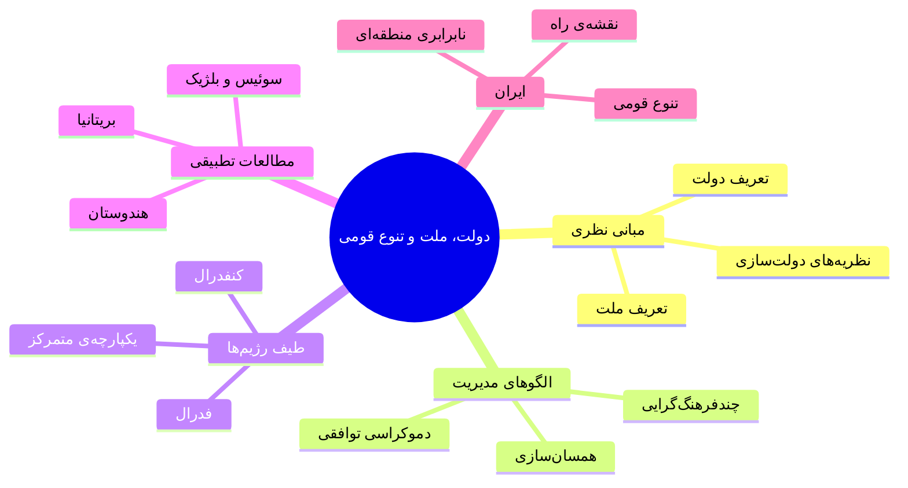

---

## ۲. مفهوم‌شناسی: دولت، ملت و قومیت {#2-مفهوم‌شناسی}

### ۲.۱. سه مفهوم بنیادین

تمایز میان **دولت** (State)، **ملت** (Nation) و **قومیت** (Ethnicity) نقطه‌ی آغاز هر تحلیلی در این حوزه است:

| مفهوم | تعریف | ماهیت | مثال |
|:---:|:---|:---:|:---|
| **🏛️ دولت (State)** | نهاد سیاسی دارای انحصار مشروع خشونت در قلمرو مشخص (وبر) | **حقوقی–سیاسی** | جمهوری فرانسه، پادشاهی متحده |
| **🌍 ملت (Nation)** | جامعه‌ای با هویت مشترک (مدنی یا قومی) که خواهان خودحکومتی است | **فرهنگی–سیاسی** | ملت کُرد، ملت کاتالان |
| **🧬 قومیت (Ethnicity)** | گروه فرهنگی با زبان، آداب یا تبار مشترک | **فرهنگی–اجتماعی** | بلوچ‌ها، باسک‌ها |

### ۲.۲. چهار عنصر سازنده‌ی دولت مدرن

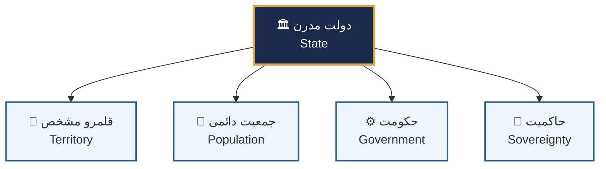

### ۲.۳. دو رویکرد به ملت

<div className="grid grid-cols-1 md:grid-cols-2 gap-6 my-8">
<div className="bg-blue-50 dark:bg-blue-950 border border-blue-200 dark:border-blue-800 rounded-xl p-6">

#### 🏛️ ملت مدنی (Civic Nation)
- مبنا: **شهروندی مشترک** و اراده‌ی سیاسی
- زبان: یک زبان رسمی (اما نه لزوماً مادری همه)
- هویت: **انتخابی** و قابل اکتساب
- 📌 نمونه: فرانسه، ایالات متحده
- 👤 اندیشمند: ارنست رنان

</div>
<div className="bg-amber-50 dark:bg-amber-950 border border-amber-200 dark:border-amber-800 rounded-xl p-6">

#### 🧬 ملت قومی (Ethnic Nation)
- مبنا: **تبار، زبان و فرهنگ** مشترک
- زبان: زبان مادری مشترک
- هویت: **ذاتی** و موروثی
- 📌 نمونه: آلمان (پیش از ۱۹۴۵)، ژاپن
- 👤 اندیشمند: یوهان گوتفرید هردر

</div>
</div>

<div className="bg-yellow-50 dark:bg-yellow-950 border-r-4 border-yellow-500 p-6 rounded-lg my-6">

**⚠️ نکته‌ی کلیدی:**
یک **دولت** ممکن است چندین **ملت** و ده‌ها **قومیت** را در بر بگیرد. عدم تطابق مرزهای دولت با مرزهای ملت، ریشه‌ی بسیاری از تنش‌های سیاسی معاصر است.

</div>

---

## ۳. نظریه‌های شکل‌گیری دولت {#3-نظریه‌های-شکل‌گیری-دولت}

### ۳.۱. شش نظریه‌ی اصلی

| # | نظریه | شرح اجمالی | اندیشمند(ان) | قوت اصلی | ضعف اصلی |
|:---:|:---|:---|:---|:---|:---|
| ۱ | **قرارداد اجتماعی** | دولت حاصل توافق ارادی افراد برای خروج از وضع طبیعی | هابز، لاک، روسو | مبنای حقوق بشر | غیرتاریخی |
| ۲ | **فتح و غلبه** | تسلط گروهی بر گروه دیگر | ابن‌خلدون، اوپنهایمر | واقع‌گرایی تاریخی | تقلیل‌گرا |
| ۳ | **مارکسیستی** | ابزار سلطه‌ی طبقاتی همراه مالکیت خصوصی | مارکس، انگلس، لنین | تحلیل اقتصادی | نادیده‌گرفتن فرهنگ |
| ۴ | **جنگ (تیلی)** | رقابت نظامی → بوروکراسی → دولت مدرن | چارلز تیلی | شواهد تاریخی قوی | اروپامحور |
| ۵ | **هیدرولیکی** | مدیریت آبیاری در مقیاس بزرگ → تمرکز | ویتفوگل | شرق‌شناسی تاریخی | بیش‌تعمیم |
| ۶ | **نهادگرایی تاریخی** | مسیرهای تاریخی ویژه (وابستگی به مسیر) | مور، اسکاچپل | جامعیت | پیچیدگی |

### ۳.۲. چرخه‌ی تیلی: «جنگ دولت می‌سازد»

> *"War made the state, and the state made war."*
> — Charles Tilly

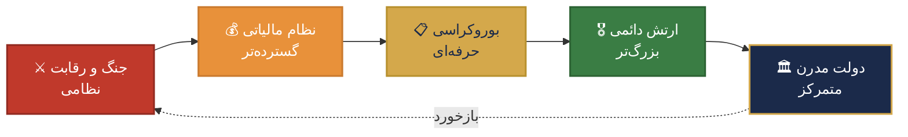

### ۳.۳. سه مسیر عمده‌ی دولت‌سازی در جهان

<div className="grid grid-cols-1 md:grid-cols-3 gap-4 my-8">
<div className="bg-blue-50 dark:bg-blue-950 border-t-4 border-blue-500 rounded-xl p-5">

#### 🇪🇺 مسیر اروپایی
جنگ → مالیات → بوروکراسی → **دموکراسی تدریجی**

📌 بریتانیا، فرانسه، آلمان

</div>
<div className="bg-orange-50 dark:bg-orange-950 border-t-4 border-orange-500 rounded-xl p-5">

#### 🌍 مسیر پسااستعماری
مرزهای مصنوعی → دولتِ وارداتی → **بحران مشروعیت**

📌 عراق، نیجریه، سودان

</div>
<div className="bg-red-50 dark:bg-red-950 border-t-4 border-red-500 rounded-xl p-5">

#### ✊ مسیر انقلابی
انقلاب → دولت ایدئولوژیک → **اصلاحات یا فروپاشی**

📌 شوروی، چین، ایران

</div>
</div>

---

## ۴. الگوهای مدیریت تنوع قومی–ملّی {#4-الگوهای-مدیریت-تنوع}

### ۴.۱. طیف الگوها: از سرکوب تا جدایی


<div className="text-center text-sm text-gray-500 dark:text-gray-400 my-2">
◀ کمترین تنوع‌پذیری ─────────────────── بیشترین تنوع‌پذیری ▶
</div>

### ۴.۲. ارزیابی تطبیقی الگوها

| الگو | مزایا | معایب | نمونه | پایداری | دموکراسی |
|:---|:---|:---|:---|:---:|:---:|
| **همسان‌سازی** | وحدت ملی قوی، ساده‌سازی اداری | سرکوب فرهنگی، مقاومت بلندمدت | فرانسه‌ی قدیم، ترکیه‌ی کمالیستی | 🟡 متوسط | 🔴 ضعیف |
| **ادغام مدنی** | انعطاف‌پذیری، جذب مهاجران | عدم پاسخ به مطالبات عمیق قومی | آمریکا، فرانسه‌ی معاصر | 🟢 بالا | 🟢 خوب |
| **چندفرهنگ‌گرایی** | رضایت اقلیت‌ها، ثبات اجتماعی | هزینه‌ی بالا، تشدید مرزهای قومی | کانادا، استرالیا | 🟢 بالا | 🟢 خوب |
| **دموکراسی توافقی** | صلح در جوامع چندپاره | کُندی تصمیم‌گیری، بن‌بست | بلژیک، لبنان | 🟡 متوسط | 🟡 متوسط |
| **فدرالیسم قومی** | خودمختاری + وحدت | خطر جدایی‌طلبی | هند، بلژیک | 🟢 بالا | 🟢 خوب |
| **خودمختاری سرزمینی** | پاسخ به مطالبات بدون جدایی | نابرابری بین مناطق | اسپانیا، عراق | 🟡 متوسط | 🟢 خوب |
| **کنفدراسیون** | احترام حداکثری به حق تعیین سرنوشت | ضعف ساختاری، ناپایداری | اتحادیه‌ی اروپا | 🔴 پایین | 🟢 خوب |

### ۴.۳. دموکراسی توافقی لیپهارت: چهار ستون

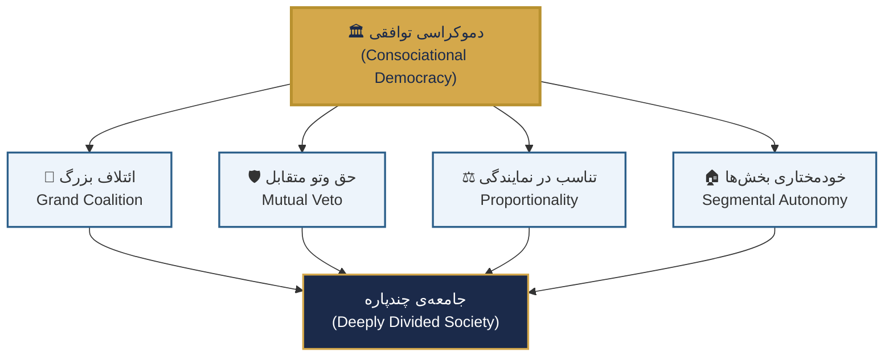

### ۴.۴. اجماع‌های نسبی در ادبیات تطبیقی

<div className="bg-green-50 dark:bg-green-950 border border-green-200 dark:border-green-800 rounded-xl p-6 my-8">

**✅ یافته‌های مشترک پژوهشگران (لیپهارت، هورویتز، کیملیکا، لینتس و استپان):**

1. **هیچ مدل واحدی** برای همه‌ی جوامع جواب نمی‌دهد — طراحی باید **زمینه‌محور** باشد.
2. **سرکوب تنوع در بلندمدت ناکارآمد است** — مدل‌های همسان‌ساز رادیکالیسم می‌زایند.
3. **فدرالیسم غیرمتقارن** اغلب از فدرالیسم متقارن کارآمدتر است.
4. **دموکراسی توافقی** در جوامع عمیقاً تقسیم‌شده مؤثرتر از دموکراسی اکثریتی است.
5. **توسعه‌ی اقتصادی عادلانه** پیش‌نیاز صلح قومی پایدار است.

</div>

---

## ۵. طیف رژیم‌های سیاسی {#5-طیف-رژیم‌های-سیاسی}

### ۵.۱. از تمرکز مطلق تا حداکثر تمرکززدایی

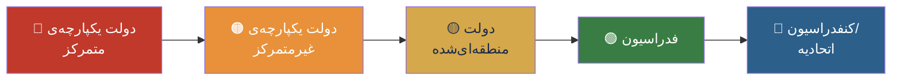

### ۵.۲. مقایسه‌ی تفصیلی پنج نوع نظام

#### نوع ۱: دولت یکپارچه‌ی متمرکز

| ویژگی | توضیح |
|:---|:---|
| **توزیع قدرت** | تمام قدرت در مرکز متمرکز |
| **واحدهای محلی** | صرفاً نمایندگان اداری مرکز |
| **اختیار ذاتی** | واحدها اختیار ذاتی ندارند |
| **نمونه‌ها** | فرانسه (پیش از ۱۹۸۲)، ترکیه‌ی کمالیستی، ایران |
| **مناسب برای** | جوامع نسبتاً همگن |
| **چالش اصلی** | بحران مشروعیت در پیرامون |

#### نوع ۲: دولت یکپارچه‌ی غیرمتمرکز

| ویژگی | توضیح |
|:---|:---|
| **توزیع قدرت** | ساختار یکپارچه + تفویض اختیارات اجرایی |
| **تفاوت با فدرالیسم** | واحدها حق ذاتی ندارند؛ تفویض قابل بازپس‌گیری |
| **نمونه‌ها** | فرانسه‌ی معاصر، اندونزی (پس از ۱۹۹۸)، اسکاندیناوی |

#### نوع ۳: دولت منطقه‌ای‌شده (Regionalized)

| ویژگی | توضیح |
|:---|:---|
| **توزیع قدرت** | میانه‌ی یکپارچه و فدرال |
| **خودمختاری** | برخی مناطق خودمختاری قانون‌گذاری دارند |
| **نمونه‌ها** | اسپانیا (Comunidades Autónomas)، ایتالیا |
| **چالش** | بحران کاتالونیا ۲۰۱۷ |

#### نوع ۴: فدراسیون

<div className="bg-green-50 dark:bg-green-950 border border-green-200 dark:border-green-800 rounded-xl p-6 my-6">

**🏗️ چهار اصل بنیادین فدرالیسم:**

1. **تقسیم قانون‌اساسی قدرت:** هیچ سطحی نمی‌تواند یک‌جانبه سهم دیگری را تغییر دهد
2. **نمایندگی دوگانه:** شهروندان هم در سطح فدرال و هم ایالتی نمایندگی دارند
3. **داوری قضایی:** دادگاه قانون اساسی اختلافات بین سطوح را حل می‌کند
4. **قانون اساسی سخت:** تغییر نیازمند موافقت واحدهاست

</div>

#### نوع ۵: کنفدراسیون

| ویژگی | توضیح |
|:---|:---|
| **حاکمیت** | واحدها حاکمیت کامل حفظ می‌کنند |
| **نهاد مرکزی** | صرفاً هماهنگ‌کننده |
| **خروج** | خروج یک‌جانبه ممکن |
| **نمونه** | مواد کنفدراسیون آمریکا (۱۷۸۱–۱۷۸۹)، اتحادیه‌ی اروپا |

### ۵.۳. مقایسه‌ی فدراسیون‌های عمده‌ی جهان

| کشور | تعداد واحدها | نوع فدرالیسم | مجلس دوم | ویژگی خاص | چالش اصلی |
|:---|:---:|:---|:---|:---|:---|
| 🇺🇸 **آمریکا** | ۵۰ | متقارن–رقابتی | سنا (۱۰۰) | قدرت ایالتی بالا | نابرابری، قطبی‌شدن |
| 🇩🇪 **آلمان** | ۱۶ | متقارن–همکاری | بوندِسرات | فدرالیسم اجرایی | تفاوت شرق/غرب |
| 🇮🇳 **هند** | ۲۸+۸ | نامتقارن–قومی | راجیاسبها | ایالت‌سازی زبانی | تنش مذهبی |
| 🇨🇦 **کانادا** | ۱۰+۳ | نامتقارن | سنا (منصوب) | دوزبانگی، کِبِک | جدایی‌طلبی کبک |
| 🇨🇭 **سوئیس** | ۲۶ | متقارن | شورای ایالات | دموکراسی مستقیم، ۴ زبان | فرایند کُند |
| 🇧🇪 **بلژیک** | ۳+۳ | نامتقارن–قومی | سنا | فدرالیسم گریز از مرکز | بن‌بست مکرر |
| 🇷🇺 **روسیه** | ۸۵ | نامتقارن | شورای فدراسیون | رسماً فدرال، عملاً متمرکز | اقتدارگرایی |
| 🇪🇹 **اتیوپی** | ۱۱ | قومی | مجلس فدراسیون | حق جدایی (ماده ۳۹) | جنگ تیگرای |

### ۵.۴. مقایسه‌ی شاخص‌های کلیدی

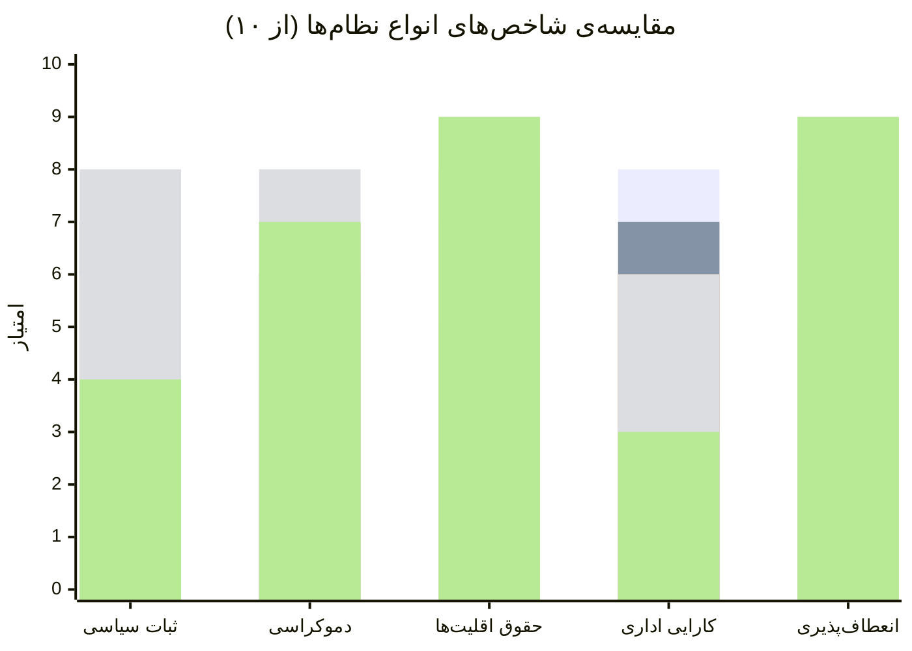

<div className="text-center text-sm text-gray-500 dark:text-gray-400">
🔴 متمرکز | 🟠 غیرمتمرکز | 🟡 منطقه‌ای | 🟢 فدرال | 🔵 کنفدرال
</div>

---

## ۶. مطالعات تطبیقی {#6-مطالعات-تطبیقی}

### ۶.۱. هندوستان: آزمایشگاه بزرگ مدیریت تنوع

<div className="bg-orange-50 dark:bg-orange-950 border border-orange-200 dark:border-orange-800 rounded-xl p-6 my-6">

**🇮🇳 هند در یک نگاه:**
- 🔢 جمعیت: بیش از **۱.۴ میلیارد** نفر
- 🗣️ زبان‌ها: بیش از **۲۰۰۰** گروه قومی و **۲۲** زبان رسمی
- 🛕 ادیان: هندوئیسم، اسلام، مسیحیت، سیکیسم، بودیسم و...
- 🏛️ نظام: **فدراسیون نامتقارن** با ۲۸ ایالت + ۸ قلمرو اتحادی

</div>

#### ابزارهای کلیدی مدیریت تنوع

| ابزار | شرح | تاریخ |
|:---|:---|:---:|
| **بازترسیم مرزهای ایالتی** | ایجاد ایالت‌ها بر پایه‌ی زبان (کمیسیون فضل‌علی) | ۱۹۵۶ |
| **سیستم سهمیه‌بندی (Reservation)** | سهمیه برای طبقات محروم در آموزش و استخدام | ۱۹۵۰ |
| **چندزبانگی رسمی** | ۲۲ زبان + فرمول سه‌زبانه در آموزش | ۱۹۵۰ |
| **فهرست‌های سه‌گانه** | تقسیم صلاحیت: فدرال (۹۷)، ایالتی (۶۶)، مشترک (۴۷) | ۱۹۵۰ |
| **ماده ۳۷۰ (کشمیر)** | خودمختاری ویژه (لغو شده در ۲۰۱۹) | ۱۹۵۰–۲۰۱۹ |
| **ضمیمه‌ی ششم** | خودمختاری مناطق قبیله‌ای شمال‌شرق | ۱۹۵۰ |

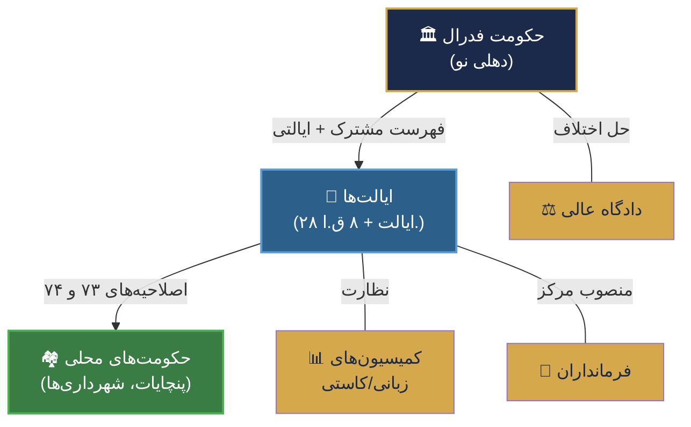

### ۶.۲. بریتانیا: واگذاری قدرت (Devolution)

<div className="bg-blue-50 dark:bg-blue-950 border border-blue-200 dark:border-blue-800 rounded-xl p-6 my-6">

**🇬🇧 بریتانیا:** رسماً دولت یکپارچه، اما از ۱۹۹۸ واگذاری نامتقارن قدرت:

| ملت | نهاد | اختیارات | از سال |
|:---|:---|:---|:---:|
| 🏴󠁧󠁢󠁳󠁣󠁴󠁿 **اسکاتلند** | پارلمان اسکاتلند | آموزش، بهداشت، حقوق، مالیات جزئی | ۱۹۹۹ |
| 🏴󠁧󠁢󠁷󠁬󠁳󠁿 **ولز** | سِنِد کِمرو | محدودتر از اسکاتلند | ۱۹۹۹ |
| 🇬🇧 **ایرلند شمالی** | مجلس استورمونت | گسترده (توافق جمعه‌ی نیک) | ۱۹۹۸ |
| 🏴󠁧󠁢󠁥󠁮󠁧󠁿 **انگلستان** | ❌ بدون پارلمان جداگانه | حکومت مستقیم وست‌مینستر | — |

</div>

### ۶.۳. نمونه‌های تکمیلی

<div className="grid grid-cols-1 md:grid-cols-2 gap-6 my-8">
<div className="bg-green-50 dark:bg-green-950 border-t-4 border-green-500 rounded-xl p-5">

#### 🇨🇭 سوئیس: الگوی موفق
- ۲۶ کانتون، ۴ زبان رسمی
- دموکراسی مستقیم + فدرالیسم + اجماع
- **آموزه:** فرهنگ اجماع + نهادهای قوی = تنوع پایدار

</div>
<div className="bg-amber-50 dark:bg-amber-950 border-t-4 border-amber-500 rounded-xl p-5">

#### 🇧🇪 بلژیک: فدرالیسم بحران‌زده
- ۵۴۱ روز بدون دولت (۲۰۱۰–۲۰۱۱)!
- تقسیم والونی/فلاندر
- **آموزه:** فدرالیسم قومی بدون مکانیسم حل اختلاف = بن‌بست

</div>
<div className="bg-red-50 dark:bg-red-950 border-t-4 border-red-500 rounded-xl p-5">

#### 🇮🇶 عراق: فدرالیسم ناتمام
- فقط اقلیم کردستان عملاً شکل گرفت
- تنش بغداد–اربیل
- **آموزه:** فدرالیسم بدون اعتماد متقابل = بی‌ثباتی

</div>
<div className="bg-purple-50 dark:bg-purple-950 border-t-4 border-purple-500 rounded-xl p-5">

#### 🇪🇹 اتیوپی: آزمایش خطرناک
- حق جدایی در قانون اساسی (ماده ۳۹)
- جنگ تیگرای (۲۰۲۰–۲۰۲۲)
- **آموزه:** حق جدایی بدون نهادسازی = فاجعه

</div>
</div>

### ۶.۴. آموزه‌های کلیدی برای ایران

| کشور | آموزه‌ی مثبت | هشدار |
|:---|:---|:---|
| 🇮🇳 **هند** | ایالت‌سازی زبانی، فدرالیسم نامتقارن | لغو ماده ۳۷۰ → نتیجه‌ی معکوس |
| 🇬🇧 **بریتانیا** | واگذاری تدریجی و نامتقارن | عدم واگذاری به انگلستان، تنش برگزیت |
| 🇨🇭 **سوئیس** | فدرالیسم + دموکراسی مستقیم + اجماع | نیاز به فرهنگ سیاسی بلوغ‌یافته |
| 🇧🇪 **بلژیک** | حل خلاقانه‌ی تعارض زبانی | بن‌بست مکرر |
| 🇮🇶 **عراق** | به‌رسمیت‌شناسی فدرالیسم | فدرالیسم بدون اعتماد ناکارآمد |
| 🇪🇹 **اتیوپی** | صراحت قانون اساسی | فدرالیسم قومی افراطی خطرناک |

---

## ۷. ایران: تحلیل ساختار قومی–ملّی {#7-ایران}

### ۷.۱. ترکیب قومی–زبانی

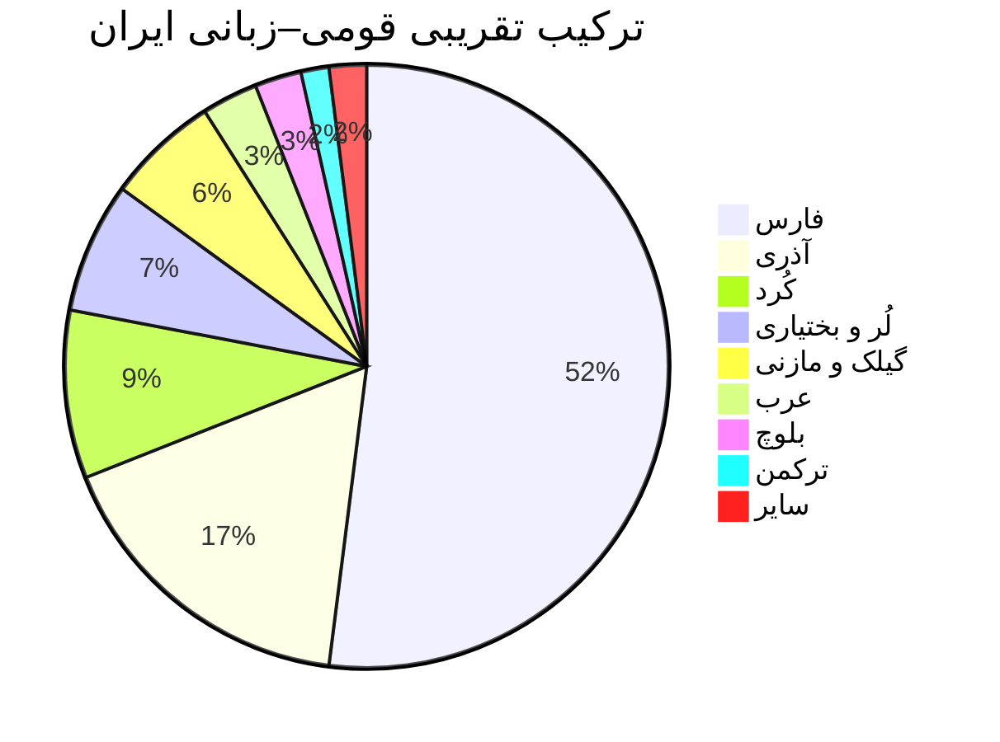

<div className="bg-yellow-50 dark:bg-yellow-950 border-r-4 border-yellow-500 p-4 rounded-lg my-4 text-sm">

**⚠️ توجه:** آمار رسمی تفکیکی قومی در ایران منتشر نمی‌شود. این ارقام بر اساس برآوردهای مختلف پژوهشی است.

</div>

| گروه قومی–زبانی | درصد تقریبی | زبان اصلی | مذهب غالب |
|:---|:---:|:---|:---:|
| **فارس** | ~۵۰–۵۵% | فارسی | شیعه |
| **آذربایجانی** | ~۱۵–۲۰% | ترکی آذربایجانی | شیعه |
| **کُرد** | ~۷–۱۰% | کُردی | سنّی/شیعه |
| **لُر و بختیاری** | ~۶–۸% | لُری/بختیاری | شیعه |
| **گیلکی و مازندرانی** | ~۵–۷% | گیلکی/مازندرانی | شیعه |
| **عرب** | ~۲–۳% | عربی | شیعه/سنّی |
| **بلوچ** | ~۲–۳% | بلوچی | سنّی |
| **ترکمن** | ~۱–۲% | ترکمنی | سنّی |
| **سایر** | ~۳–۵% | متنوع | متنوع |

### ۷.۲. آیا ایران چندملیتی است؟ سه دیدگاه

<div className="grid grid-cols-1 md:grid-cols-3 gap-4 my-8">
<div className="bg-red-50 dark:bg-red-950 border-t-4 border-red-500 rounded-xl p-5">

#### 🔴 دیدگاه تک‌ملیتی
ایران **یک ملت** با اقوام متعدد است. فارسی زبان وحدت‌بخش.

📌 **طرفداران:** ملی‌گرایان متمرکز

**➕ قوت:** تأکید بر هویت مشترک
**➖ ضعف:** نادیده‌گرفتن واقعیت تنوع

</div>
<div className="bg-amber-50 dark:bg-amber-950 border-t-4 border-amber-500 rounded-xl p-5">

#### 🟡 دیدگاه میانه
ایران **یک ملت سیاسی** با **خرده‌ملت‌های فرهنگی** (sub-nations) است.

📌 **طرفداران:** اصلاح‌طلبان، لیبرال‌ها

**➕ قوت:** سازگار با واقعیت
**➖ ضعف:** ابهام مفهومی

</div>
<div className="bg-green-50 dark:bg-green-950 border-t-4 border-green-500 rounded-xl p-5">

#### 🟢 دیدگاه چندملیتی
ایران **چند ملت** را در بر دارد: فارس، ترک، کُرد، عرب...

📌 **طرفداران:** احزاب قومی

**➕ قوت:** صراحت در شناسایی
**➖ ضعف:** خطر تشدید مرزبندی

</div>
</div>

### ۷.۳. شکاف توسعه‌ای: مهم‌ترین محرّک نارضایتی

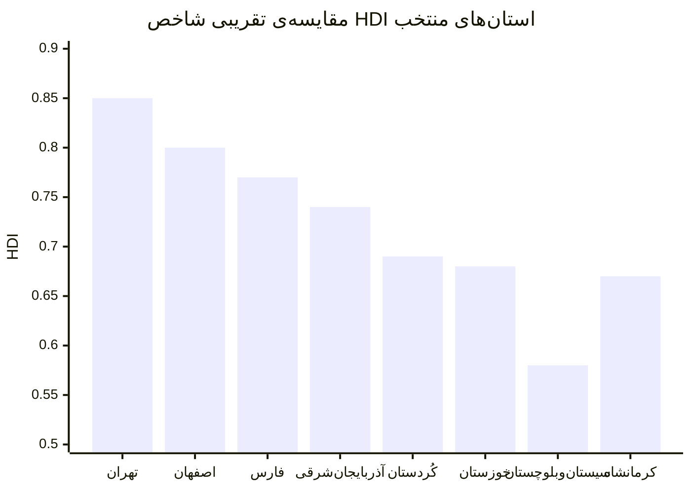

<div className="bg-red-50 dark:bg-red-950 border-r-4 border-red-500 p-6 rounded-lg my-6">

**🚨 شکاف توسعه‌ای:**
استان‌های **سیستان و بلوچستان**، **کردستان**، **خوزستان** و **کرمانشاه** — که عمدتاً اقلیت‌نشین هستند — به‌طور مداوم در شاخص‌های توسعه پایین‌تر از میانگین ملّی قرار دارند. این **نابرابری** مهم‌ترین محرّک نارضایتی قومی و بستر جدایی‌طلبی بالقوه است.

</div>

### ۷.۴. قانون اساسی فعلی: ظرفیت‌ها و کاستی‌ها

| اصل | مفاد | وضعیت اجرا |
|:---:|:---|:---|
| **۱۵** | زبان رسمی فارسی؛ آموزش به زبان مادری آزاد | 🔴 **اجرا نشده:** آموزش رسمی فقط به فارسی |
| **۱۹** | برابری حقوقی اقوام | 🟡 **ناقص:** تبعیض ساختاری در توسعه و نمایندگی |
| **۴۸** | ممنوعیت تبعیض در بهره‌برداری از منابع | 🔴 **نقض آشکار:** خوزستان نفت‌خیز اما محروم |
| **۱۰۰** | شوراهای محلی | 🟡 **ناقص:** اختیارات بسیار محدود |

### ۷.۵. خط زمانی سیاست‌های هویتی

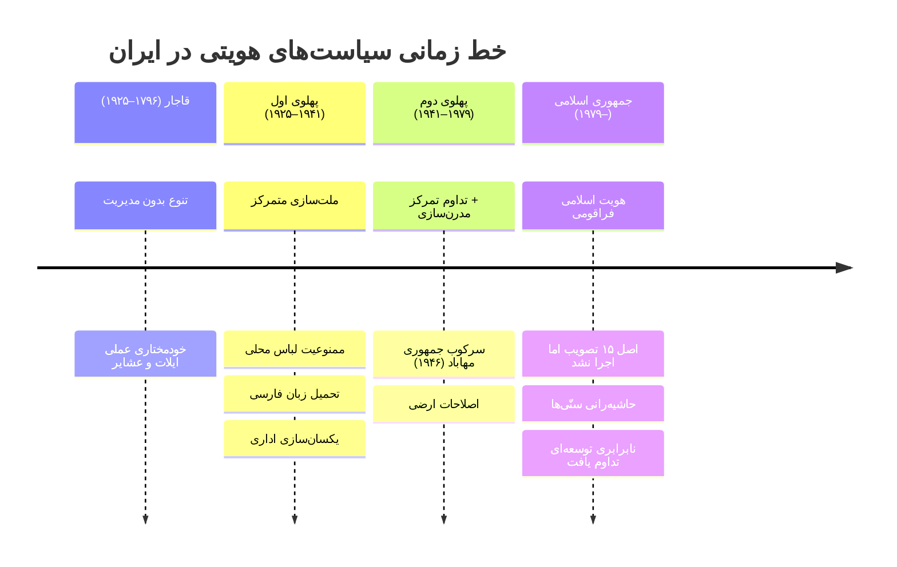

---

## ۸. نقشه‌ی راه اجرایی برای ایران {#8-نقشه‌ی-راه}

### ۸.۱. هشت اصل راهنما

<div className="bg-amber-50 dark:bg-amber-950 border border-amber-200 dark:border-amber-800 rounded-xl p-6 my-8">

| # | اصل | توضیح |
|:---:|:---|:---|
| 🛡️ **I** | **یکپارچگی سرزمینی** | هیچ طرحی نباید تمامیت ارضی را به خطر اندازد |
| 🗳️ **II** | **دموکراسی و حقوق بشر** | مبنای هر اصلاحی حقوق فردی و جمعی شهروندان |
| 🌈 **III** | **به‌رسمیت‌شناسی تنوع** | حمایت فعال از هویت‌های فرهنگی متفاوت |
| 🐢 **IV** | **تدریجی‌بودن** | مرحله‌به‌مرحله با ارزیابی مستمر |
| ⚖️ **V** | **عدم تقارن هوشمند** | واحدها می‌توانند اختیارات متفاوت داشته باشند |
| 💰 **VI** | **عدالت توزیعی** | توسعه‌ی اقتصادی عادلانه پیش‌شرط اصلاح سیاسی |
| 🤝 **VII** | **مشارکت و اجماع** | گفت‌وگوی ملّی نه تحمیل از بالا |
| ☮️ **VIII** | **سکولاریسم شمول‌گرا** | جدایی دین از حکومت با احترام به همه‌ی باورها |

</div>

### ۸.۲. سه مرحله‌ی گذار

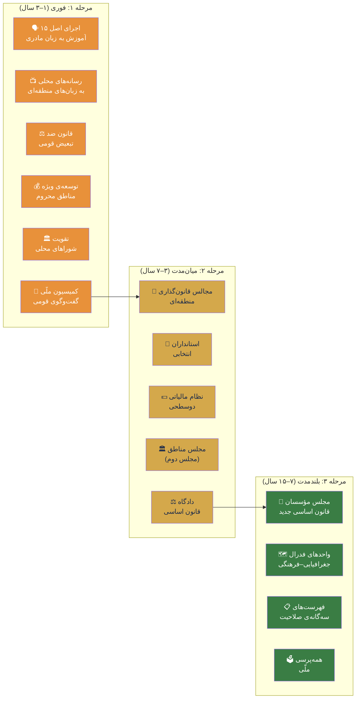

### ۸.۳. ساختار نهادی پیشنهادی

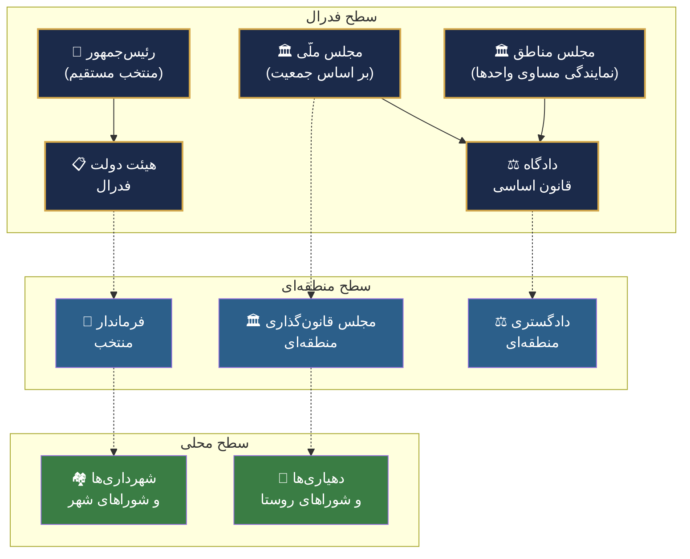

### ۸.۴. تقسیم صلاحیت‌ها

| صلاحیت فدرال (انحصاری) | صلاحیت مشترک | صلاحیت منطقه‌ای (انحصاری) |
|:---|:---|:---|
| 🎖️ دفاع ملّی و ارتش | 🏥 بهداشت عمومی | 📚 آموزش (محتوای منطقه‌ای + زبان) |
| 🌐 سیاست خارجی | 🌿 محیط زیست | 🎭 فرهنگ و میراث محلی |

```mdx
| 💵 پول و بانکداری مرکزی | ⚡ انرژی (تولید و توزیع) | 🏖️ گردشگری منطقه‌ای |
| 🛃 گمرک و تجارت خارجی | 🚂 حمل‌ونقل بین‌منطقه‌ای | 🚌 حمل‌ونقل درون‌منطقه‌ای |
| 📜 حقوق شهروندی پایه | 🎓 آموزش عالی | 🌾 کشاورزی و منابع محلی |
| ⚖️ دادگاه قانون اساسی | 🏭 صنعت و معدن | 🏗️ مسکن و شهرسازی |
| 💰 مالیات‌های فدرال | 🛡️ امنیت داخلی (هماهنگی) | 💰 مالیات‌های منطقه‌ای |
| 🛂 مهاجرت و تابعیت | 👴 تأمین اجتماعی | 👮 پلیس محلی |

### ۸.۵. مدل فدرالیسم مالی

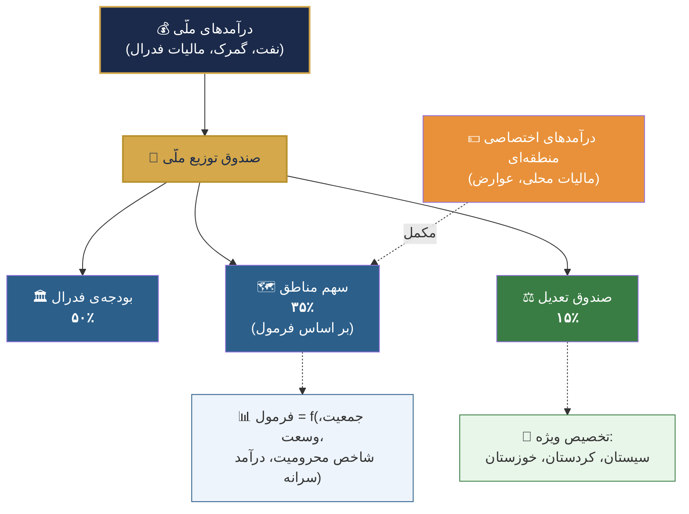

<div className="bg-blue-50 dark:bg-blue-950 border border-blue-200 dark:border-blue-800 rounded-xl p-6 my-6">

**📊 الگوی مشابه:** سیستم *Länderfinanzausgleich* آلمان — انتقال منابع از ایالت‌های ثروتمند به ایالت‌های فقیرتر برای تضمین حداقل خدمات یکسان.

</div>

### ۸.۶. سیاست زبانی پیشنهادی: مدل سه‌لایه‌ای

<div className="grid grid-cols-1 gap-0 my-8">
<div className="bg-blue-900 text-white rounded-t-xl p-6 text-center">

#### 🌐 لایه‌ی اول: زبان ملّی مشترک
**فارسی** — زبان ارتباط ملّی، قانون‌گذاری فدرال، رسانه‌ی ملّی

</div>
<div className="bg-amber-100 dark:bg-amber-900 p-6 text-center border-x-2 border-amber-300 dark:border-amber-700">

#### 🗣️ لایه‌ی دوم: زبان‌های رسمی منطقه‌ای
**ترکی آذربایجانی** (شمال‌غرب) • **کُردی** (غرب) • **عربی** (جنوب‌غرب)
**بلوچی** (جنوب‌شرق) • **ترکمنی** (شمال‌شرق) • **گیلکی/مازندرانی** (شمال)

</div>
<div className="bg-green-100 dark:bg-green-900 rounded-b-xl p-6 text-center border-x-2 border-b-2 border-green-300 dark:border-green-700">

#### 🌍 لایه‌ی سوم: زبان بین‌المللی
**انگلیسی** — از مقطع راهنمایی به‌عنوان زبان بین‌المللی

</div>
</div>

#### مقایسه با وضع فعلی و مدل هندی

| معیار | 🇮🇷 ایران فعلی | 🇮🇳 هند | 📋 مدل پیشنهادی |
|:---|:---|:---|:---|
| **زبان رسمی ملّی** | فارسی (تنها زبان رسمی) | هندی + انگلیسی | فارسی (زبان مشترک ملّی) |
| **زبان‌های منطقه‌ای** | غیررسمی (اصل ۱۵ اجرا نشده) | ۲۲ زبان رسمی | رسمیت در واحدهای فدرال |
| **آموزش ابتدایی** | فقط فارسی | به زبان ایالتی + هندی | زبان مادری + فارسی از سوم |
| **خدمات دولتی** | فقط فارسی | دوزبانه در ایالات | دوزبانه در مناطق |
| **رسانه‌ی عمومی** | عمدتاً فارسی | شبکه‌های ایالتی قوی | شبکه‌های منطقه‌ای تمام‌عیار |

### ۸.۷. واحدبندی فدرال: اصول و یک سناریوی ممکن

<div className="bg-red-50 dark:bg-red-950 border-r-4 border-red-500 p-6 rounded-lg my-6">

**🚨 هشدار مهم:** واحدبندی بر اساس **صرفاً قومیت** (مدل اتیوپی) خطرناک است. واحدها باید بر اساس **ترکیبی از معیارها** تعریف شوند:

| معیار | وزن پیشنهادی | توضیح |
|:---|:---:|:---|
| 🗣️ هویت فرهنگی–زبانی | **۳۰%** | زبان غالب و فرهنگ منطقه‌ای |
| 🗺️ جغرافیا و پیوستگی | **۲۵%** | طبیعی‌بودن مرزها |
| 📊 جمعیت و اقتصاد | **۲۰%** | تعادل جمعیتی و خودکفایی نسبی |
| 🏛️ تاریخ اداری موجود | **۱۵%** | ساختارهای استانی فعلی |
| 🗳️ ترجیح مردم | **۱۰%** | نظرسنجی و همه‌پرسی محلی |

</div>

#### یک سناریوی نمونه: ۸ واحد فدرال

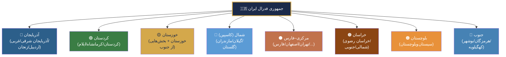

<div className="text-center text-sm text-gray-500 dark:text-gray-400 my-4">

*⚠️ این واحدبندی صرفاً یک سناریو است و باید از طریق گفت‌وگوی ملّی و کمیسیون مستقل واحدبندی تعیین شود.*

</div>

### ۸.۸. نظام نمایندگی: مجلس دوم

<div className="grid grid-cols-1 md:grid-cols-2 gap-6 my-8">
<div className="bg-blue-50 dark:bg-blue-950 border border-blue-300 dark:border-blue-700 rounded-xl p-6">

#### 🏛️ مجلس ملّی
- نمایندگان **بر اساس جمعیت** (۱ نماینده به ازای هر ۲۰۰ هزار نفر)
- **صلاحیت:** قانون‌گذاری عمومی، بودجه، نظارت بر دولت
- **انتخاب:** مستقیم مردمی، نظام **نسبی**

</div>
<div className="bg-amber-50 dark:bg-amber-950 border border-amber-300 dark:border-amber-700 rounded-xl p-6">

#### 🏛️ مجلس مناطق
- هر واحد فدرال **۴ نماینده** (صرف‌نظر از جمعیت)
- **صلاحیت:** وتوی تعلیقی بر قوانین مناطقی، تصویب تغییرات قانون اساسی، تأیید قضات
- **انتخاب:** مستقیم مردمی

</div>
</div>

#### مکانیسم‌های تضمین نمایندگی اقلیت‌ها

| مکانیسم | شرح | نمونه‌ی مشابه |
|:---|:---|:---|
| 🏛️ **مجلس مناطق** | نمایندگی مساوی بدون توجه به جمعیت | سنای آمریکا، سوئیس |
| ⚖️ **نظام انتخاباتی نسبی** | تناسب بین آرا و کرسی‌ها | آلمان، هلند |
| 🎯 **سهمیه‌ی اقلیت‌ها** | کرسی‌های تضمین‌شده | هند، نیوزلند |
| 🛡️ **حق وتوی اقلیت** | وتوی تعلیقی بر قوانین مؤثر بر حقوق اقلیت‌ها | بلژیک |
| 🔄 **چرخش مناصب** | ریاست و مناصب حساس بین گروه‌ها بچرخد | سوئیس، بوسنی |

### ۸.۹. مدیریت گذار: نقشه‌ی راه زمانی

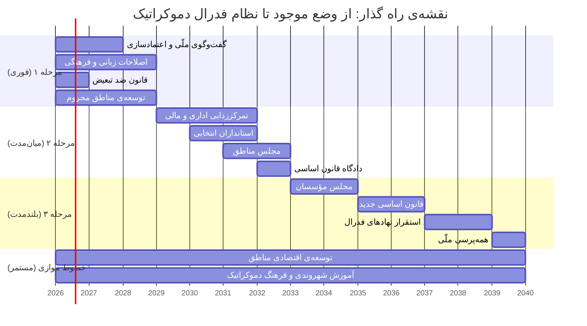

### ۸.۱۰. ماتریس ریسک و مهار

| ریسک | احتمال | شدت | راهکار مهار |
|:---|:---:|:---:|:---|
| 🔺 **تشدید جدایی‌طلبی** | 🟡 متوسط | 🔴 بالا | ترکیب خودمختاری با عدالت اقتصادی؛ واحدبندی غیرقومی؛ تقویت هویت مشترک |
| 🌐 **مداخله‌ی خارجی** | 🟡 متوسط | 🔴 بالا | دیپلماسی فعال؛ ارتش فدرال قوی؛ اتحادهای منطقه‌ای |
| 🏛️ **مقاومت نخبگان متمرکزگرا** | 🔴 بالا | 🟡 متوسط | گفت‌وگو؛ نشان‌دادن منافع ملّی تمرکززدایی؛ فشار مدنی |
| 🔒 **بن‌بست سیاسی** | 🟡 متوسط | 🟡 متوسط | مکانیسم‌های حل اختلاف (دادگاه ق.ا.، کمیسیون میانجی‌گری) |
| 📋 **ناکارآمدی اداری** | 🟡 متوسط | 🟡 متوسط | آموزش کارکنان؛ دولت الکترونیک؛ ساده‌سازی |
| 💰 **نابرابری بین واحدها** | 🔴 بالا | 🟡 متوسط | صندوق انتقالی قوی (مدل آلمان)؛ فرمول توزیع عادلانه |

### ۸.۱۱. شاخص‌های پایش (KPIs)

| شاخص | تعریف | 🎯 هدف ۵ ساله | 🎯 هدف ۱۵ ساله |
|:---|:---|:---:|:---:|
| 📊 **شکاف HDI** | اختلاف بالاترین و پایین‌ترین منطقه | < ۰.۱۵ | < ۰.۰۸ |
| 📚 **آموزش به زبان مادری** | درصد دانش‌آموزان اقلیت با دسترسی | ۵۰% | ۹۵% |
| 😊 **رضایت‌مندی قومی** | پیمایش سالانه (۱–۱۰) | > ۶ | > ۸ |
| 👥 **نمایندگی اقلیت‌ها** | درصد در مناصب کلیدی | ۲۰% | متناسب |
| 🔍 **شفافیت بودجه** | امتیاز (۱–۱۰۰) | > ۶۰ | > ۸۵ |
| 🏠 **مهاجرت معکوس** | درصد بازگشت به مناطق اقلیت‌نشین | +۱۰% | +۲۵% |
| 🏛️ **ثبات سیاسی** | Fragile States Index | +۱۰ رتبه | +۳۰ رتبه |

---

## ۹. جمع‌بندی: دَه فرمان اصلاحات ساختاری {#9-جمع‌بندی}

<div className="bg-gradient-to-b from-blue-900 to-blue-950 text-white rounded-2xl p-8 my-10">

### 📜 دَه فرمان اصلاحات ساختاری برای ایران

<div className="space-y-4 mt-6">

<div className="flex items-start gap-4 bg-white/10 rounded-lg p-4">
<span className="bg-amber-400 text-blue-900 font-bold rounded-full w-8 h-8 flex items-center justify-center shrink-0">۱</span>
<span>**وحدت در تنوع:** یکپارچگی سرزمینی + احترام به تفاوت‌ها</span>
</div>

<div className="flex items-start gap-4 bg-white/10 rounded-lg p-4">
<span className="bg-amber-400 text-blue-900 font-bold rounded-full w-8 h-8 flex items-center justify-center shrink-0">۲</span>
<span>**تدریجی‌بودن:** عجله دشمن اصلاحات است</span>
</div>

<div className="flex items-start gap-4 bg-white/10 rounded-lg p-4">
<span className="bg-amber-400 text-blue-900 font-bold rounded-full w-8 h-8 flex items-center justify-center shrink-0">۳</span>
<span>**عدالت اقتصادی** پیش‌شرط صلح قومی است</span>
</div>

<div className="flex items-start gap-4 bg-white/10 rounded-lg p-4">
<span className="bg-amber-400 text-blue-900 font-bold rounded-full w-8 h-8 flex items-center justify-center shrink-0">۴</span>
<span>**زبان مادری حق است** نه امتیاز</span>
</div>

<div className="flex items-start gap-4 bg-white/10 rounded-lg p-4">
<span className="bg-amber-400 text-blue-900 font-bold rounded-full w-8 h-8 flex items-center justify-center shrink-0">۵</span>
<span>**فدرالیسم نامتقارن** بر فدرالیسم متقارن ترجیح دارد</span>
</div>

<div className="flex items-start gap-4 bg-white/10 rounded-lg p-4">
<span className="bg-amber-400 text-blue-900 font-bold rounded-full w-8 h-8 flex items-center justify-center shrink-0">۶</span>
<span>**واحدبندی جغرافیایی–فرهنگی** نه صرفاً قومی</span>
</div>

<div className="flex items-start gap-4 bg-white/10 rounded-lg p-4">
<span className="bg-amber-400 text-blue-900 font-bold rounded-full w-8 h-8 flex items-center justify-center shrink-0">۷</span>
<span>**مجلس دوم** برای صدای مناطق ضروری است</span>
</div>

<div className="flex items-start gap-4 bg-white/10 rounded-lg p-4">
<span className="bg-amber-400 text-blue-900 font-bold rounded-full w-8 h-8 flex items-center justify-center shrink-0">۸</span>
<span>**دادگاه قانون اساسی مستقل** داور نهایی است</span>
</div>

<div className="flex items-start gap-4 bg-white/10 rounded-lg p-4">
<span className="bg-amber-400 text-blue-900 font-bold rounded-full w-8 h-8 flex items-center justify-center shrink-0">۹</span>
<span>**دموکراسی محلی** پایه‌ی دموکراسی ملّی است</span>
</div>

<div className="flex items-start gap-4 bg-white/10 rounded-lg p-4">
<span className="bg-amber-400 text-blue-900 font-bold rounded-full w-8 h-8 flex items-center justify-center shrink-0">۱۰</span>
<span>**گفت‌وگوی ملّی** جایگزین تحمیل از بالاست</span>
</div>

</div>
</div>

### جدول جامع نهایی: مقایسه‌ی ایران با الگوهای جهانی

| شاخص | 🇮🇷 ایران فعلی | 🇮🇳 هند | 🇨🇭 سوئیس | 🇬🇧 بریتانیا | 📋 مدل پیشنهادی |
|:---|:---:|:---:|:---:|:---:|:---:|
| **نوع نظام** | یکپارچه‌ی متمرکز | فدرال نامتقارن | فدرال متقارن | یکپارچه + واگذاری | فدرال نامتقارن |
| **زبان‌های رسمی** | ۱ | ۲۳ | ۴ | ۱ + محلی | ۱ ملّی + ۶ منطقه‌ای |
| **مجلس دوم** | ❌ | ✅ راجیاسبها | ✅ شورای ایالات | ✅ لُردها | ✅ مجلس مناطق |
| **دادگاه ق.ا.** | ❌ (شورای نگهبان) | ✅ دادگاه عالی | ✅ دادگاه فدرال | ❌ (محدود) | ✅ مستقل |
| **HDI** | ۰.۷۴ | ۰.۶۳ | ۰.۹۶ | ۰.۹۳ | هدف: > ۰.۸۵ |
| **شاخص دموکراسی** | ۱.۹ | ۷.۰ | ۹.۱ | ۸.۱ | هدف: > ۷.۵ |
| **حقوق اقلیت‌ها** | 🔴 ضعیف | 🟡 متوسط | 🟢 خوب | 🟢 خوب | هدف: 🟢 خوب |

### پیام پایانی

<div className="bg-gradient-to-r from-amber-50 to-blue-50 dark:from-amber-950 dark:to-blue-950 border-2 border-amber-300 dark:border-amber-700 rounded-2xl p-8 my-10 text-center">

> ایران سرزمین تنوع است — تنوع زبان، تنوع فرهنگ، تنوع جغرافیا.
> این تنوع می‌تواند **بزرگ‌ترین ثروت** ما باشد یا **بزرگ‌ترین چالش** ما.
>
> فرق این دو در **طراحی نهادی** است:
> نهادهایی که صدای همه را بشنوند، حقوق همه را تضمین کنند
> و فرصت‌ها را عادلانه توزیع کنند.
>
> این انتخاب در دست ماست.

</div>

---

## چک‌لیست اقدامات اولویت‌دار {#چک‌لیست}

| # | اقدام | اولویت | بازه‌ی زمانی |
|:---:|:---|:---:|:---:|
| ۱ | اجرای اصل ۱۵ (آموزش به زبان مادری) | 🔴 **فوری** | ۱–۲ سال |
| ۲ | تصویب قانون ضد تبعیض قومی | 🔴 **فوری** | ۱ سال |
| ۳ | برنامه‌ی ویژه‌ی توسعه‌ی مناطق محروم | 🔴 **فوری** | ۱–۳ سال |
| ۴ | تقویت شوراهای محلی و استانی | 🟠 **بالا** | ۲–۳ سال |
| ۵ | تشکیل کمیسیون ملّی گفت‌وگوی قومی | 🟠 **بالا** | ۱–۲ سال |
| ۶ | انتخابی‌شدن استانداران | 🟡 **متوسط** | ۳–۵ سال |
| ۷ | ایجاد مجالس قانون‌گذاری منطقه‌ای | 🟡 **متوسط** | ۳–۵ سال |
| ۸ | ایجاد مجلس مناطق (مجلس دوم) | 🟡 **متوسط** | ۵–۷ سال |
| ۹ | صندوق تعدیل منطقه‌ای | 🟡 **متوسط** | ۳–۵ سال |
| ۱۰ | دادگاه قانون اساسی مستقل | 🔵 **بلندمدت** | ۵–۱۰ سال |
| ۱۱ | مجلس مؤسسان و قانون اساسی جدید | 🔵 **بلندمدت** | ۷–۱۵ سال |
| ۱۲ | همه‌پرسی ملّی | 🔵 **بلندمدت** | ۱۰–۱۵ سال |

---

## منابع {#منابع}

### کتاب‌های کلیدی لاتین

<div className="grid grid-cols-1 md:grid-cols-2 gap-4 my-6">
<div className="bg-gray-50 dark:bg-gray-900 rounded-lg p-4">

1. **Lijphart, Arend.** *Patterns of Democracy* (2012)
2. **Kymlicka, Will.** *Multicultural Citizenship* (1995)
3. **Tilly, Charles.** *Coercion, Capital and European States* (1990)
4. **Linz & Stepan.** *Problems of Democratic Transition* (1996)
5. **Horowitz, Donald.** *Ethnic Groups in Conflict* (1985)

</div>
<div className="bg-gray-50 dark:bg-gray-900 rounded-lg p-4">

6. **Anderson, Benedict.** *Imagined Communities* (1983)
7. **Gellner, Ernest.** *Nations and Nationalism* (1983)
8. **Watts, Ronald.** *Comparing Federal Systems* (2008)
9. **Stepan, Alfred.** *Arguing Comparative Politics* (2001)
10. **McGarry & O'Leary.** *The Politics of Ethnic Conflict Regulation* (1993)

</div>
</div>

### منابع فارسی

<div className="bg-gray-50 dark:bg-gray-900 rounded-lg p-4 my-4">

1. **قاضی، ابوالفضل.** *حقوق اساسی و نهادهای سیاسی*
2. **بشیریه، حسین.** *آموزش دانش سیاسی*
3. **احمدی، حمید.** *قومیت و قوم‌گرایی در ایران: افسانه و واقعیت*
4. **کاتوزیان، محمدعلی.** *تضاد دولت و ملت*
5. **آبراهامیان، یرواند.** *ایران بین دو انقلاب*
6. **اشرف، احمد.** *هویت ایرانی*

</div>

### مقالات کلیدی

<div className="bg-gray-50 dark:bg-gray-900 rounded-lg p-4 my-4">

- Lijphart, A. (1969). "Consociational Democracy." *World Politics*, 21(2), 207–225.
- Stepan, A. (1999). "Federalism and Democracy: Beyond the U.S. Model." *Journal of Democracy*, 10(4), 19–34.
- Kymlicka, W. (2006). "Emerging Western Models of Multination Federalism." *Nationalism and Ethnic Politics*, 12(3–4), 371–396.
- Horowitz, D. (2002). "Constitutional Design: Proposals versus Processes." In Reynolds (ed.), *The Architecture of Democracy*.

</div>

---

<div className="text-center text-sm text-gray-500 dark:text-gray-400 mt-12 mb-6">

---

📖 این مقاله خلاصه‌ای از پژوهش جامع «دولت، ملت و تنوع قومی: مبانی نظری، الگوهای تطبیقی و راهنمای اجرایی برای ایران» است.

بازنشر با ذکر منبع بلامانع است.

*ویرایش اول — بهار ۱۴۰۴*

</div>
```

---

## Conversation 3
*Model: claude-opus-4-6*

### Request

this file mixed in the chat environment. can you give it as a powershell command (like several command to append based on chat capacity or token limitation) so I can get the file in my folder properly? 
path: D:\Code\Articles

### Response

Sure! I'll break it into multiple PowerShell commands. Copy and run them **in order** in your PowerShell terminal.

---

## Command 1 of 12 — Create file + Front matter + Section 1-2 start

```powershell
@'
---
title: "دولت، ملت و تنوع قومی: مبانی نظری، الگوهای تطبیقی و نقشه‌ی راه برای ایران"
description: 'بررسی جامع شکل‌گیری دولت‌ها، رابطه‌ی دولت با ملت‌ها و قومیت‌ها، طیف رژیم‌های سیاسی از تمرکز مطلق تا کنفدراسیون، مطالعات تطبیقی هند و بریتانیا و سوئیس، و ارائه‌ی نقشه‌ی راه اجرایی برای مدیریت تنوع قومی در ایران'
lang: fa
publishDate: '2026-02-16'
author: مهدی سالم
sourceType: markdown
category: متفرقه
keywords:
  - "📚"
  - دولت-ملت
  - فدرالیسم
  - تنوع قومی
  - سیاست تأسیسی
  - دموکراسی توافقی
  - ایران
  - مدیریت تنوع
  - حقوق اقلیت‌ها
  - تمرکززدایی
readingTime: 45
difficulty: پیشرفته
categories:
  - نظریه سیاسی
  - اصلاحات سیاسی
interface: foundational-politics
---

# دولت، ملت و تنوع قومی

## مبانی نظری، الگوهای تطبیقی و نقشه‌ی راه برای ایران

> «هنر حکمرانی، هنر زیستن با تفاوت‌هاست.»
> — ویل کیملیکا

---

## فهرست مطالب

- [۱. درآمد: چرا این بحث مهم است؟](#1-درآمد)
- [۲. مفهوم‌شناسی: دولت، ملت و قومیت](#2-مفهوم‌شناسی)
- [۳. نظریه‌های شکل‌گیری دولت](#3-نظریه‌های-شکل‌گیری-دولت)
- [۴. الگوهای مدیریت تنوع قومی–ملّی](#4-الگوهای-مدیریت-تنوع)
- [۵. طیف رژیم‌های سیاسی](#5-طیف-رژیم‌های-سیاسی)
- [۶. مطالعات تطبیقی](#6-مطالعات-تطبیقی)
- [۷. ایران: تحلیل ساختار قومی–ملّی](#7-ایران)
- [۸. نقشه‌ی راه اجرایی برای ایران](#8-نقشه‌ی-راه)
- [۹. جمع‌بندی: دَه فرمان اصلاحات ساختاری](#9-جمع‌بندی)
- [منابع](#منابع)

---

## ۱. درآمد: چرا این بحث مهم است؟ {#1-درآمد}

از مجموع تقریباً **۲۰۰ کشور** جهان، کمتر از **۱۰ درصد** از نظر قومی همگن هستند. بیشتر دولت‌ها با چالش مدیریت تنوع درونی مواجه‌اند. پرسش بنیادین این است:

<div className="bg-blue-50 dark:bg-blue-950 border-r-4 border-blue-500 p-6 rounded-lg my-8">

**🔑 پرسش محوری:**
چگونه می‌توان ساختاری سیاسی طراحی کرد که تنوع قومی و ملّی را نه **تهدید**، بلکه **فرصت** بشمارد — و هم‌زمان یکپارچگی سرزمینی، دموکراسی و توسعه‌ی پایدار را تضمین کند؟

</div>

این پرسش به‌ویژه برای **ایران** — کشوری با حداقل ۸ تا ۱۰ گروه قومی–زبانی اصلی — اهمیت حیاتی دارد.

### نقشه‌ی مفهومی مقاله


---

## ۲. مفهوم‌شناسی: دولت، ملت و قومیت {#2-مفهوم‌شناسی}

### ۲.۱. سه مفهوم بنیادین

تمایز میان **دولت** (State)، **ملت** (Nation) و **قومیت** (Ethnicity) نقطه‌ی آغاز هر تحلیلی در این حوزه است:

| مفهوم | تعریف | ماهیت | مثال |
|:---:|:---|:---:|:---|
| **🏛️ دولت (State)** | نهاد سیاسی دارای انحصار مشروع خشونت در قلمرو مشخص (وبر) | **حقوقی–سیاسی** | جمهوری فرانسه، پادشاهی متحده |
| **🌍 ملت (Nation)** | جامعه‌ای با هویت مشترک (مدنی یا قومی) که خواهان خودحکومتی است | **فرهنگی–سیاسی** | ملت کُرد، ملت کاتالان |
| **🧬 قومیت (Ethnicity)** | گروه فرهنگی با زبان، آداب یا تبار مشترک | **فرهنگی–اجتماعی** | بلوچ‌ها، باسک‌ها |
'@ | Set-Content -Path "D:\Code\Articles\foundational-politics.mdx" -Encoding UTF8
```

---

## Command 2 of 12 — Section 2 continued

```powershell
@'

### ۲.۲. چهار عنصر سازنده‌ی دولت مدرن


### ۲.۳. دو رویکرد به ملت

<div className="grid grid-cols-1 md:grid-cols-2 gap-6 my-8">
<div className="bg-blue-50 dark:bg-blue-950 border border-blue-200 dark:border-blue-800 rounded-xl p-6">

#### 🏛️ ملت مدنی (Civic Nation)
- مبنا: **شهروندی مشترک** و اراده‌ی سیاسی
- زبان: یک زبان رسمی (اما نه لزوماً مادری همه)
- هویت: **انتخابی** و قابل اکتساب
- 📌 نمونه: فرانسه، ایالات متحده
- 👤 اندیشمند: ارنست رنان

</div>
<div className="bg-amber-50 dark:bg-amber-950 border border-amber-200 dark:border-amber-800 rounded-xl p-6">

#### 🧬 ملت قومی (Ethnic Nation)
- مبنا: **تبار، زبان و فرهنگ** مشترک
- زبان: زبان مادری مشترک
- هویت: **ذاتی** و موروثی
- 📌 نمونه: آلمان (پیش از ۱۹۴۵)، ژاپن
- 👤 اندیشمند: یوهان گوتفرید هردر

</div>
</div>

<div className="bg-yellow-50 dark:bg-yellow-950 border-r-4 border-yellow-500 p-6 rounded-lg my-6">

**⚠️ نکته‌ی کلیدی:**
یک **دولت** ممکن است چندین **ملت** و ده‌ها **قومیت** را در بر بگیرد. عدم تطابق مرزهای دولت با مرزهای ملت، ریشه‌ی بسیاری از تنش‌های سیاسی معاصر است.

</div>

---
'@ | Add-Content -Path "D:\Code\Articles\foundational-politics.mdx" -Encoding UTF8
```

---

## Command 3 of 12 — Section 3

```powershell
@'

## ۳. نظریه‌های شکل‌گیری دولت {#3-نظریه‌های-شکل‌گیری-دولت}

### ۳.۱. شش نظریه‌ی اصلی

| # | نظریه | شرح اجمالی | اندیشمند(ان) | قوت اصلی | ضعف اصلی |
|:---:|:---|:---|:---|:---|:---|
| ۱ | **قرارداد اجتماعی** | دولت حاصل توافق ارادی افراد برای خروج از وضع طبیعی | هابز، لاک، روسو | مبنای حقوق بشر | غیرتاریخی |
| ۲ | **فتح و غلبه** | تسلط گروهی بر گروه دیگر | ابن‌خلدون، اوپنهایمر | واقع‌گرایی تاریخی | تقلیل‌گرا |
| ۳ | **مارکسیستی** | ابزار سلطه‌ی طبقاتی همراه مالکیت خصوصی | مارکس، انگلس، لنین | تحلیل اقتصادی | نادیده‌گرفتن فرهنگ |
| ۴ | **جنگ (تیلی)** | رقابت نظامی → بوروکراسی → دولت مدرن | چارلز تیلی | شواهد تاریخی قوی | اروپامحور |
| ۵ | **هیدرولیکی** | مدیریت آبیاری در مقیاس بزرگ → تمرکز | ویتفوگل | شرق‌شناسی تاریخی | بیش‌تعمیم |
| ۶ | **نهادگرایی تاریخی** | مسیرهای تاریخی ویژه (وابستگی به مسیر) | مور، اسکاچپل | جامعیت | پیچیدگی |

### ۳.۲. چرخه‌ی تیلی: «جنگ دولت می‌سازد»

> *"War made the state, and the state made war."*
> — Charles Tilly


### ۳.۳. سه مسیر عمده‌ی دولت‌سازی در جهان

<div className="grid grid-cols-1 md:grid-cols-3 gap-4 my-8">
<div className="bg-blue-50 dark:bg-blue-950 border-t-4 border-blue-500 rounded-xl p-5">

#### 🇪🇺 مسیر اروپایی
جنگ → مالیات → بوروکراسی → **دموکراسی تدریجی**

📌 بریتانیا، فرانسه، آلمان

</div>
<div className="bg-orange-50 dark:bg-orange-950 border-t-4 border-orange-500 rounded-xl p-5">

#### 🌍 مسیر پسااستعماری
مرزهای مصنوعی → دولتِ وارداتی → **بحران مشروعیت**

📌 عراق، نیجریه، سودان

</div>
<div className="bg-red-50 dark:bg-red-950 border-t-4 border-red-500 rounded-xl p-5">

#### ✊ مسیر انقلابی
انقلاب → دولت ایدئولوژیک → **اصلاحات یا فروپاشی**

📌 شوروی، چین، ایران

</div>
</div>

---
'@ | Add-Content -Path "D:\Code\Articles\foundational-politics.mdx" -Encoding UTF8
```

---

## Command 4 of 12 — Section 4

```powershell
@'

## ۴. الگوهای مدیریت تنوع قومی–ملّی {#4-الگوهای-مدیریت-تنوع}

### ۴.۱. طیف الگوها: از سرکوب تا جدایی


<div className="text-center text-sm text-gray-500 dark:text-gray-400 my-2">
◀ کمترین تنوع‌پذیری ─────────────────── بیشترین تنوع‌پذیری ▶
</div>

### ۴.۲. ارزیابی تطبیقی الگوها

| الگو | مزایا | معایب | نمونه | پایداری | دموکراسی |
|:---|:---|:---|:---|:---:|:---:|
| **همسان‌سازی** | وحدت ملی قوی، ساده‌سازی اداری | سرکوب فرهنگی، مقاومت بلندمدت | فرانسه‌ی قدیم، ترکیه‌ی کمالیستی | 🟡 متوسط | 🔴 ضعیف |
| **ادغام مدنی** | انعطاف‌پذیری، جذب مهاجران | عدم پاسخ به مطالبات عمیق قومی | آمریکا، فرانسه‌ی معاصر | 🟢 بالا | 🟢 خوب |
| **چندفرهنگ‌گرایی** | رضایت اقلیت‌ها، ثبات اجتماعی | هزینه‌ی بالا، تشدید مرزهای قومی | کانادا، استرالیا | 🟢 بالا | 🟢 خوب |
| **دموکراسی توافقی** | صلح در جوامع چندپاره | کُندی تصمیم‌گیری، بن‌بست | بلژیک، لبنان | 🟡 متوسط | 🟡 متوسط |
| **فدرالیسم قومی** | خودمختاری + وحدت | خطر جدایی‌طلبی | هند، بلژیک | 🟢 بالا | 🟢 خوب |
| **خودمختاری سرزمینی** | پاسخ به مطالبات بدون جدایی | نابرابری بین مناطق | اسپانیا، عراق | 🟡 متوسط | 🟢 خوب |
| **کنفدراسیون** | احترام حداکثری به حق تعیین سرنوشت | ضعف ساختاری، ناپایداری | اتحادیه‌ی اروپا | 🔴 پایین | 🟢 خوب |

### ۴.۳. دموکراسی توافقی لیپهارت: چهار ستون

```mermaid
graph TD
    R["🏛️ دموکراسی توافقی<br/>(Consociational Democracy)"]
    R --> P1["🤝 ائتلاف بزرگ<br/>Grand Coalition"]
    R --> P2["🛡️ حق وتو متقابل<br/>Mutual Veto"]
    R --> P3["⚖️ تناسب در نمایندگی<br/>Proportionality"]
    R --> P4["🏠 خودمختاری بخش‌ها<br/>Segmental Autonomy"]
    
    B["جامعه‌ی چندپاره<br/>(Deeply Divided Society)"]
    
    P1 --> B
    P2 --> B
    P3 --> B
    P4 --> B
    
    style R fill:#D4A84B,color:#1B2A4A,stroke:#B8912F,stroke-width:3px
    style B fill:#1B2A4A,color:#fff,stroke:#D4A84B,stroke-width:2px
    style P1 fill:#EDF4FB,stroke:#2C5F8A,stroke-width:2px
    style P2 fill:#EDF4FB,stroke:#2C5F8A,stroke-width:2px
    style P3 fill:#EDF4FB,stroke:#2C5F8A,stroke-width:2px
    style P4 fill:#EDF4FB,stroke:#2C5F8A,stroke-width:2px
```

### ۴.۴. اجماع‌های نسبی در ادبیات تطبیقی

<div className="bg-green-50 dark:bg-green-950 border border-green-200 dark:border-green-800 rounded-xl p-6 my-8">

**✅ یافته‌های مشترک پژوهشگران (لیپهارت، هورویتز، کیملیکا، لینتس و استپان):**

1. **هیچ مدل واحدی** برای همه‌ی جوامع جواب نمی‌دهد — طراحی باید **زمینه‌محور** باشد.
2. **سرکوب تنوع در بلندمدت ناکارآمد است** — مدل‌های همسان‌ساز رادیکالیسم می‌زایند.
3. **فدرالیسم غیرمتقارن** اغلب از فدرالیسم متقارن کارآمدتر است.
4. **دموکراسی توافقی** در جوامع عمیقاً تقسیم‌شده مؤثرتر از دموکراسی اکثریتی است.
5. **توسعه‌ی اقتصادی عادلانه** پیش‌نیاز صلح قومی پایدار است.

</div>

---
'@ | Add-Content -Path "D:\Code\Articles\foundational-politics.mdx" -Encoding UTF8
```

---

## Command 5 of 12 — Section 5

```powershell
@'

## ۵. طیف رژیم‌های سیاسی {#5-طیف-رژیم‌های-سیاسی}

### ۵.۱. از تمرکز مطلق تا حداکثر تمرکززدایی

```mermaid
graph LR
    A["🔴 دولت یکپارچه‌ی<br/>متمرکز"] --> B["🟠 دولت یکپارچه‌ی<br/>غیرمتمرکز"]
    B --> C["🟡 دولت<br/>منطقه‌ای‌شده"]
    C --> D["🟢 فدراسیون"]
    D --> E["🔵 کنفدراسیون/<br/>اتحادیه"]
    
    style A fill:#C0392B,color:#fff
    style B fill:#E8913A,color:#fff
    style C fill:#D4A84B,color:#1B2A4A
    style D fill:#3A7D44,color:#fff
    style E fill:#2C5F8A,color:#fff
```

### ۵.۲. مقایسه‌ی تفصیلی پنج نوع نظام

#### نوع ۱: دولت یکپارچه‌ی متمرکز

| ویژگی | توضیح |
|:---|:---|
| **توزیع قدرت** | تمام قدرت در مرکز متمرکز |
| **واحدهای محلی** | صرفاً نمایندگان اداری مرکز |
| **اختیار ذاتی** | واحدها اختیار ذاتی ندارند |
| **نمونه‌ها** | فرانسه (پیش از ۱۹۸۲)، ترکیه‌ی کمالیستی، ایران |
| **مناسب برای** | جوامع نسبتاً همگن |
| **چالش اصلی** | بحران مشروعیت در پیرامون |

#### نوع ۲: دولت یکپارچه‌ی غیرمتمرکز

| ویژگی | توضیح |
|:---|:---|
| **توزیع قدرت** | ساختار یکپارچه + تفویض اختیارات اجرایی |
| **تفاوت با فدرالیسم** | واحدها حق ذاتی ندارند؛ تفویض قابل بازپس‌گیری |
| **نمونه‌ها** | فرانسه‌ی معاصر، اندونزی (پس از ۱۹۹۸)، اسکاندیناوی |

#### نوع ۳: دولت منطقه‌ای‌شده (Regionalized)

| ویژگی | توضیح |
|:---|:---|
| **توزیع قدرت** | میانه‌ی یکپارچه و فدرال |
| **خودمختاری** | برخی مناطق خودمختاری قانون‌گذاری دارند |
| **نمونه‌ها** | اسپانیا (Comunidades Autónomas)، ایتالیا |
| **چالش** | بحران کاتالونیا ۲۰۱۷ |

#### نوع ۴: فدراسیون

<div className="bg-green-50 dark:bg-green-950 border border-green-200 dark:border-green-800 rounded-xl p-6 my-6">

**🏗️ چهار اصل بنیادین فدرالیسم:**

1. **تقسیم قانون‌اساسی قدرت:** هیچ سطحی نمی‌تواند یک‌جانبه سهم دیگری را تغییر دهد
2. **نمایندگی دوگانه:** شهروندان هم در سطح فدرال و هم ایالتی نمایندگی دارند
3. **داوری قضایی:** دادگاه قانون اساسی اختلافات بین سطوح را حل می‌کند
4. **قانون اساسی سخت:** تغییر نیازمند موافقت واحدهاست

</div>

#### نوع ۵: کنفدراسیون

| ویژگی | توضیح |
|:---|:---|
| **حاکمیت** | واحدها حاکمیت کامل حفظ می‌کنند |
| **نهاد مرکزی** | صرفاً هماهنگ‌کننده |
| **خروج** | خروج یک‌جانبه ممکن |
| **نمونه** | مواد کنفدراسیون آمریکا (۱۷۸۱–۱۷۸۹)، اتحادیه‌ی اروپا |

### ۵.۳. مقایسه‌ی فدراسیون‌های عمده‌ی جهان

| کشور | تعداد واحدها | نوع فدرالیسم | مجلس دوم | ویژگی خاص | چالش اصلی |
|:---|:---:|:---|:---|:---|:---|
| 🇺🇸 **آمریکا** | ۵۰ | متقارن–رقابتی | سنا (۱۰۰) | قدرت ایالتی بالا | نابرابری، قطبی‌شدن |
| 🇩🇪 **آلمان** | ۱۶ | متقارن–همکاری | بوندِسرات | فدرالیسم اجرایی | تفاوت شرق/غرب |
| 🇮🇳 **هند** | ۲۸+۸ | نامتقارن–قومی | راجیاسبها | ایالت‌سازی زبانی | تنش مذهبی |
| 🇨🇦 **کانادا** | ۱۰+۳ | نامتقارن | سنا (منصوب) | دوزبانگی، کِبِک | جدایی‌طلبی کبک |
| 🇨🇭 **سوئیس** | ۲۶ | متقارن | شورای ایالات | دموکراسی مستقیم، ۴ زبان | فرایند کُند |
| 🇧🇪 **بلژیک** | ۳+۳ | نامتقارن–قومی | سنا | فدرالیسم گریز از مرکز | بن‌بست مکرر |
| 🇷🇺 **روسیه** | ۸۵ | نامتقارن | شورای فدراسیون | رسماً فدرال، عملاً متمرکز | اقتدارگرایی |
| 🇪🇹 **اتیوپی** | ۱۱ | قومی | مجلس فدراسیون | حق جدایی (ماده ۳۹) | جنگ تیگرای |

---
'@ | Add-Content -Path "D:\Code\Articles\foundational-politics.mdx" -Encoding UTF8
```

---

## Command 6 of 12 — Section 6 (Comparative Studies)

```powershell
@'

## ۶. مطالعات تطبیقی {#6-مطالعات-تطبیقی}

### ۶.۱. هندوستان: آزمایشگاه بزرگ مدیریت تنوع

<div className="bg-orange-50 dark:bg-orange-950 border border-orange-200 dark:border-orange-800 rounded-xl p-6 my-6">

**🇮🇳 هند در یک نگاه:**
- 🔢 جمعیت: بیش از **۱.۴ میلیارد** نفر
- 🗣️ زبان‌ها: بیش از **۲۰۰۰** گروه قومی و **۲۲** زبان رسمی
- 🛕 ادیان: هندوئیسم، اسلام، مسیحیت، سیکیسم، بودیسم و...
- 🏛️ نظام: **فدراسیون نامتقارن** با ۲۸ ایالت + ۸ قلمرو اتحادی

</div>

#### ابزارهای کلیدی مدیریت تنوع

| ابزار | شرح | تاریخ |
|:---|:---|:---:|
| **بازترسیم مرزهای ایالتی** | ایجاد ایالت‌ها بر پایه‌ی زبان (کمیسیون فضل‌علی) | ۱۹۵۶ |
| **سیستم سهمیه‌بندی (Reservation)** | سهمیه برای طبقات محروم در آموزش و استخدام | ۱۹۵۰ |
| **چندزبانگی رسمی** | ۲۲ زبان + فرمول سه‌زبانه در آموزش | ۱۹۵۰ |
| **فهرست‌های سه‌گانه** | تقسیم صلاحیت: فدرال (۹۷)، ایالتی (۶۶)، مشترک (۴۷) | ۱۹۵۰ |
| **ماده ۳۷۰ (کشمیر)** | خودمختاری ویژه (لغو شده در ۲۰۱۹) | ۱۹۵۰–۲۰۱۹ |
| **ضمیمه‌ی ششم** | خودمختاری مناطق قبیله‌ای شمال‌شرق | ۱۹۵۰ |

```mermaid
graph TD
    F["🏛️ حکومت فدرال<br/>(دهلی نو)"] -->|"فهرست مشترک + ایالتی"| S["🏢 ایالت‌ها<br/>(۲۸ ایالت + ۸ ق.ا.)"]
    S -->|"اصلاحیه‌های ۷۳ و ۷۴"| L["🏘️ حکومت‌های محلی<br/>(پنچایات، شهرداری‌ها)"]
    
    F ---|"حل اختلاف"| SC["⚖️ دادگاه عالی"]
    S ---|"نظارت"| COM["📊 کمیسیون‌های<br/>زبانی/کاستی"]
    S ---|"منصوب مرکز"| GOV["👤 فرمانداران"]
    
    style F fill:#1B2A4A,color:#fff,stroke:#D4A84B,stroke-width:2px
    style S fill:#2C5F8A,color:#fff,stroke:#5B9BD5,stroke-width:2px
    style L fill:#3A7D44,color:#fff,stroke:#4CAF50,stroke-width:2px
    style SC fill:#D4A84B,color:#1B2A4A
    style COM fill:#D4A84B,color:#1B2A4A
    style GOV fill:#D4A84B,color:#1B2A4A
```

### ۶.۲. بریتانیا: واگذاری قدرت (Devolution)

<div className="bg-blue-50 dark:bg-blue-950 border border-blue-200 dark:border-blue-800 rounded-xl p-6 my-6">

**🇬🇧 بریتانیا:** رسماً دولت یکپارچه، اما از ۱۹۹۸ واگذاری نامتقارن قدرت:

| ملت | نهاد | اختیارات | از سال |
|:---|:---|:---|:---:|
| 🏴󠁧󠁢󠁳󠁣󠁴󠁿 **اسکاتلند** | پارلمان اسکاتلند | آموزش، بهداشت، حقوق، مالیات جزئی | ۱۹۹۹ |
| 🏴󠁧󠁢󠁷󠁬󠁳󠁿 **ولز** | سِنِد کِمرو | محدودتر از اسکاتلند | ۱۹۹۹ |
| 🇬🇧 **ایرلند شمالی** | مجلس استورمونت | گسترده (توافق جمعه‌ی نیک) | ۱۹۹۸ |
| 🏴󠁧󠁢󠁥󠁮󠁧󠁿 **انگلستان** | ❌ بدون پارلمان جداگانه | حکومت مستقیم وست‌مینستر | — |

</div>

### ۶.۳. نمونه‌های تکمیلی

<div className="grid grid-cols-1 md:grid-cols-2 gap-6 my-8">
<div className="bg-green-50 dark:bg-green-950 border-t-4 border-green-500 rounded-xl p-5">

#### 🇨🇭 سوئیس: الگوی موفق
- ۲۶ کانتون، ۴ زبان رسمی
- دموکراسی مستقیم + فدرالیسم + اجماع
- **آموزه:** فرهنگ اجماع + نهادهای قوی = تنوع پایدار

</div>
<div className="bg-amber-50 dark:bg-amber-950 border-t-4 border-amber-500 rounded-xl p-5">

#### 🇧🇪 بلژیک: فدرالیسم بحران‌زده
- ۵۴۱ روز بدون دولت (۲۰۱۰–۲۰۱۱)!
- تقسیم والونی/فلاندر
- **آموزه:** فدرالیسم قومی بدون مکانیسم حل اختلاف = بن‌بست

</div>
<div className="bg-red-50 dark:bg-red-950 border-t-4 border-red-500 rounded-xl p-5">

#### 🇮🇶 عراق: فدرالیسم ناتمام
- فقط اقلیم کردستان عملاً شکل گرفت
- تنش بغداد–اربیل
- **آموزه:** فدرالیسم بدون اعتماد متقابل = بی‌ثباتی

</div>
<div className="bg-purple-50 dark:bg-purple-950 border-t-4 border-purple-500 rounded-xl p-5">

#### 🇪🇹 اتیوپی: آزمایش خطرناک
- حق جدایی در قانون اساسی (ماده ۳۹)
- جنگ تیگرای (۲۰۲۰–۲۰۲۲)
- **آموزه:** حق جدایی بدون نهادسازی = فاجعه

</div>
</div>

### ۶.۴. آموزه‌های کلیدی برای ایران

| کشور | آموزه‌ی مثبت | هشدار |
|:---|:---|:---|
| 🇮🇳 **هند** | ایالت‌سازی زبانی، فدرالیسم نامتقارن | لغو ماده ۳۷۰ → نتیجه‌ی معکوس |
| 🇬🇧 **بریتانیا** | واگذاری تدریجی و نامتقارن | عدم واگذاری به انگلستان، تنش برگزیت |
| 🇨🇭 **سوئیس** | فدرالیسم + دموکراسی مستقیم + اجماع | نیاز به فرهنگ سیاسی بلوغ‌یافته |
| 🇧🇪 **بلژیک** | حل خلاقانه‌ی تعارض زبانی | بن‌بست مکرر |
| 🇮🇶 **عراق** | به‌رسمیت‌شناسی فدرالیسم | فدرالیسم بدون اعتماد ناکارآمد |
| 🇪🇹 **اتیوپی** | صراحت قانون اساسی | فدرالیسم قومی افراطی خطرناک |

---
'@ | Add-Content -Path "D:\Code\Articles\foundational-politics.mdx" -Encoding UTF8
```

---

## Command 7 of 12 — Section 7 (Iran Analysis)

```powershell
@'

## ۷. ایران: تحلیل ساختار قومی–ملّی {#7-ایران}

### ۷.۱. ترکیب قومی–زبانی

```mermaid
pie title ترکیب تقریبی قومی–زبانی ایران
    "فارس" : 52
    "آذری" : 17
    "کُرد" : 9
    "لُر و بختیاری" : 7
    "گیلک و مازنی" : 6
    "عرب" : 3
    "بلوچ" : 2.5
    "ترکمن" : 1.5
    "سایر" : 2
```

<div className="bg-yellow-50 dark:bg-yellow-950 border-r-4 border-yellow-500 p-4 rounded-lg my-4 text-sm">

**⚠️ توجه:** آمار رسمی تفکیکی قومی در ایران منتشر نمی‌شود. این ارقام بر اساس برآوردهای مختلف پژوهشی است.

</div>

| گروه قومی–زبانی | درصد تقریبی | زبان اصلی | مذهب غالب |
|:---|:---:|:---|:---:|
| **فارس** | ~۵۰–۵۵% | فارسی | شیعه |
| **آذربایجانی** | ~۱۵–۲۰% | ترکی آذربایجانی | شیعه |
| **کُرد** | ~۷–۱۰% | کُردی | سنّی/شیعه |
| **لُر و بختیاری** | ~۶–۸% | لُری/بختیاری | شیعه |
| **گیلکی و مازندرانی** | ~۵–۷% | گیلکی/مازندرانی | شیعه |
| **عرب** | ~۲–۳% | عربی | شیعه/سنّی |
| **بلوچ** | ~۲–۳% | بلوچی | سنّی |
| **ترکمن** | ~۱–۲% | ترکمنی | سنّی |
| **سایر** | ~۳–۵% | متنوع | متنوع |

### ۷.۲. آیا ایران چندملیتی است؟ سه دیدگاه

<div className="grid grid-cols-1 md:grid-cols-3 gap-4 my-8">
<div className="bg-red-50 dark:bg-red-950 border-t-4 border-red-500 rounded-xl p-5">

#### 🔴 دیدگاه تک‌ملیتی
ایران **یک ملت** با اقوام متعدد است. فارسی زبان وحدت‌بخش.

📌 **طرفداران:** ملی‌گرایان متمرکز

**➕ قوت:** تأکید بر هویت مشترک
**➖ ضعف:** نادیده‌گرفتن واقعیت تنوع

</div>
<div className="bg-amber-50 dark:bg-amber-950 border-t-4 border-amber-500 rounded-xl p-5">

#### 🟡 دیدگاه میانه
ایران **یک ملت سیاسی** با **خرده‌ملت‌های فرهنگی** (sub-nations) است.

📌 **طرفداران:** اصلاح‌طلبان، لیبرال‌ها

**➕ قوت:** سازگار با واقعیت
**➖ ضعف:** ابهام مفهومی

</div>
<div className="bg-green-50 dark:bg-green-950 border-t-4 border-green-500 rounded-xl p-5">

#### 🟢 دیدگاه چندملیتی
ایران **چند ملت** را در بر دارد: فارس، ترک، کُرد، عرب...

📌 **طرفداران:** احزاب قومی

**➕ قوت:** صراحت در شناسایی
**➖ ضعف:** خطر تشدید مرزبندی

</div>
</div>

### ۷.۳. شکاف توسعه‌ای: مهم‌ترین محرّک نارضایتی

```mermaid
xychart-beta
    title "مقایسه‌ی تقریبی شاخص HDI استان‌های منتخب"
    x-axis ["تهران", "اصفهان", "فارس", "آذربایجان شرقی", "کُردستان", "خوزستان", "سیستان و بلوچستان", "کرمانشاه"]
    y-axis "HDI" 0.5 --> 0.9
    bar [0.85, 0.80, 0.77, 0.74, 0.69, 0.68, 0.58, 0.67]
```

<div className="bg-red-50 dark:bg-red-950 border-r-4 border-red-500 p-6 rounded-lg my-6">

**🚨 شکاف توسعه‌ای:**
استان‌های **سیستان و بلوچستان**، **کردستان**، **خوزستان** و **کرمانشاه** — که عمدتاً اقلیت‌نشین هستند — به‌طور مداوم در شاخص‌های توسعه پایین‌تر از میانگین ملّی قرار دارند. این **نابرابری** مهم‌ترین محرّک نارضایتی قومی و بستر جدایی‌طلبی بالقوه است.

</div>

### ۷.۴. قانون اساسی فعلی: ظرفیت‌ها و کاستی‌ها

| اصل | مفاد | وضعیت اجرا |
|:---:|:---|:---|
| **۱۵** | زبان رسمی فارسی؛ آموزش به زبان مادری آزاد | 🔴 **اجرا نشده:** آموزش رسمی فقط به فارسی |
| **۱۹** | برابری حقوقی اقوام | 🟡 **ناقص:** تبعیض ساختاری در توسعه و نمایندگی |
| **۴۸** | ممنوعیت تبعیض در بهره‌برداری از منابع | 🔴 **نقض آشکار:** خوزستان نفت‌خیز اما محروم |
| **۱۰۰** | شوراهای محلی | 🟡 **ناقص:** اختیارات بسیار محدود |

### ۷.۵. خط زمانی سیاست‌های هویتی

```mermaid
timeline
    title خط زمانی سیاست‌های هویتی در ایران
    section قاجار (۱۷۹۶–۱۹۲۵)
        تنوع بدون مدیریت : خودمختاری عملی ایلات و عشایر
    section پهلوی اول (۱۹۲۵–۱۹۴۱)
        ملت‌سازی متمرکز : ممنوعیت لباس محلی
                         : تحمیل زبان فارسی
                         : یکسان‌سازی اداری
    section پهلوی دوم (۱۹۴۱–۱۹۷۹)
        تداوم تمرکز و مدرن‌سازی : سرکوب جمهوری مهاباد 1946
                                 : اصلاحات ارضی
    section جمهوری اسلامی (۱۹۷۹–)
        هویت اسلامی فراقومی : اصل ۱۵ تصویب اما اجرا نشد
                             : حاشیه‌رانی سنّی‌ها
                             : نابرابری توسعه‌ای تداوم یافت
```

---
'@ | Add-Content -Path "D:\Code\Articles\foundational-politics.mdx" -Encoding UTF8
```

---

## Command 8 of 12 — Section 8 start (Roadmap principles + phases)

```powershell
@'

## ۸. نقشه‌ی راه اجرایی برای ایران {#8-نقشه‌ی-راه}

### ۸.۱. هشت اصل راهنما

<div className="bg-amber-50 dark:bg-amber-950 border border-amber-200 dark:border-amber-800 rounded-xl p-6 my-8">

| # | اصل | توضیح |
|:---:|:---|:---|
| 🛡️ **I** | **یکپارچگی سرزمینی** | هیچ طرحی نباید تمامیت ارضی را به خطر اندازد |
| 🗳️ **II** | **دموکراسی و حقوق بشر** | مبنای هر اصلاحی حقوق فردی و جمعی شهروندان |
| 🌈 **III** | **به‌رسمیت‌شناسی تنوع** | حمایت فعال از هویت‌های فرهنگی متفاوت |
| 🐢 **IV** | **تدریجی‌بودن** | مرحله‌به‌مرحله با ارزیابی مستمر |
| ⚖️ **V** | **عدم تقارن هوشمند** | واحدها می‌توانند اختیارات متفاوت داشته باشند |
| 💰 **VI** | **عدالت توزیعی** | توسعه‌ی اقتصادی عادلانه پیش‌شرط اصلاح سیاسی |
| 🤝 **VII** | **مشارکت و اجماع** | گفت‌وگوی ملّی نه تحمیل از بالا |
| ☮️ **VIII** | **سکولاریسم شمول‌گرا** | جدایی دین از حکومت با احترام به همه‌ی باورها |

</div>

### ۸.۲. سه مرحله‌ی گذار

```mermaid
graph LR
    subgraph "مرحله ۱: فوری ۱ تا ۳ سال"
        A1["🗣️ اجرای اصل ۱۵<br/>آموزش به زبان مادری"]
        A2["📺 رسانه‌های محلی<br/>به زبان‌های منطقه‌ای"]
        A3["⚖️ قانون ضد<br/>تبعیض قومی"]
        A4["💰 توسعه‌ی ویژه<br/>مناطق محروم"]
        A5["🏛️ تقویت<br/>شوراهای محلی"]
        A6["🤝 کمیسیون ملّی<br/>گفت‌وگوی قومی"]
    end
    
    subgraph "مرحله ۲: میان‌مدت ۳ تا ۷ سال"
        B1["🏢 مجالس قانون‌گذاری<br/>منطقه‌ای"]
        B2["👤 استانداران<br/>انتخابی"]
        B3["💵 نظام مالیاتی<br/>دوسطحی"]
        B4["🏛️ مجلس مناطق<br/>مجلس دوم"]
        B5["⚖️ دادگاه<br/>قانون اساسی"]
    end
    
    subgraph "مرحله ۳: بلندمدت ۷ تا ۱۵ سال"
        C1["📜 مجلس مؤسسان<br/>قانون اساسی جدید"]
        C2["🗺️ واحدهای فدرال<br/>جغرافیایی و فرهنگی"]
        C3["📋 فهرست‌های<br/>سه‌گانه‌ی صلاحیت"]
        C4["🗳️ همه‌پرسی<br/>ملّی"]
    end
    
    A6 --> B1
    B5 --> C1
    
    style A1 fill:#E8913A,color:#fff
    style A2 fill:#E8913A,color:#fff
    style A3 fill:#E8913A,color:#fff
    style A4 fill:#E8913A,color:#fff
    style A5 fill:#E8913A,color:#fff
    style A6 fill:#E8913A,color:#fff
    style B1 fill:#D4A84B,color:#1B2A4A
    style B2 fill:#D4A84B,color:#1B2A4A
    style B3 fill:#D4A84B,color:#1B2A4A
    style B4 fill:#D4A84B,color:#1B2A4A
    style B5 fill:#D4A84B,color:#1B2A4A
    style C1 fill:#3A7D44,color:#fff
    style C2 fill:#3A7D44,color:#fff
    style C3 fill:#3A7D44,color:#fff
    style C4 fill:#3A7D44,color:#fff
```

### ۸.۳. ساختار نهادی پیشنهادی

```mermaid
graph TD
    subgraph "سطح فدرال"
        PRES["👤 رئیس‌جمهور<br/>منتخب مستقیم"]
        M1["🏛️ مجلس ملّی<br/>بر اساس جمعیت"]
        M2["🏛️ مجلس مناطق<br/>نمایندگی مساوی واحدها"]
        CC["⚖️ دادگاه<br/>قانون اساسی"]
        CAB["📋 هیئت دولت<br/>فدرال"]
    end
    
    subgraph "سطح منطقه‌ای"
        RGOV["👤 فرماندار<br/>منتخب"]
        RPARL["🏛️ مجلس قانون‌گذاری<br/>منطقه‌ای"]
        RCOURT["⚖️ دادگستری<br/>منطقه‌ای"]
    end
    
    subgraph "سطح محلی"
        CITY["🏘️ شهرداری‌ها<br/>و شوراهای شهر"]
        VILLAGE["🌾 دهیاری‌ها<br/>و شوراهای روستا"]
    end
    
    PRES --> CAB
    M1 --> CC
    M2 --> CC
    CAB -.-> RGOV
    M1 -.-> RPARL
    CC -.-> RCOURT
    RGOV -.-> CITY
    RPARL -.-> VILLAGE
    
    style PRES fill:#1B2A4A,color:#fff,stroke:#D4A84B,stroke-width:2px
    style M1 fill:#1B2A4A,color:#fff,stroke:#D4A84B,stroke-width:2px
    style M2 fill:#1B2A4A,color:#fff,stroke:#D4A84B,stroke-width:2px
    style CC fill:#1B2A4A,color:#fff,stroke:#D4A84B,stroke-width:2px
    style CAB fill:#1B2A4A,color:#fff,stroke:#D4A84B,stroke-width:2px
    style RGOV fill:#2C5F8A,color:#fff
    style RPARL fill:#2C5F8A,color:#fff
    style RCOURT fill:#2C5F8A,color:#fff
    style CITY fill:#3A7D44,color:#fff
    style VILLAGE fill:#3A7D44,color:#fff
```
'@ | Add-Content -Path "D:\Code\Articles\foundational-politics.mdx" -Encoding UTF8
```

---

## Command 9 of 12 — Section 8 continued (competences, fiscal, language)

```powershell
@'

### ۸.

---

## Conversation 4
*Model: claude-opus-4-6*

### Request

در چت به جدول و نمودار تبدیل می‌شوند! بهترین روش برای اینکه تو به من خروجی بدهی ولی تبدیل نشود چیست؟ مثلا ایا می‌شود فایلی با تخریب بدهی که بعد من تخریب زدایی کنم؟ یعنی به شکلی خراب شود که محیط چت که به نظرم markdwon است آنرا نشناسد؟ یا سایر فورمت‌هایی که قابل ارائه باشند و خراب نشوند؟

### Follow-up additions

**Follow-up 1:** نویسنده‌ای من:
مهدی سالم هستم.
چطور این را به متن اضافه کنم؟

### Response

فرانت‌متر از قبل `author: مهدی سالم` دارد. اما احتمالاً می‌خواهید **در بدنه‌ی مقاله هم** نام نویسنده نمایش داده شود. این دستور را اجرا کنید:

## دستور اضافه‌کردن نام نویسنده

```powershell
$file = "D:\Code\Articles\foundational-politics.mdx"
$content = Get-Content -Path $file -Raw -Encoding UTF8

# 1) اضافه‌کردن بلوک نویسنده بعد از عنوان اصلی
$authorBlock = @'

<div className="flex items-center gap-4 my-6 p-4 bg-gray-50 dark:bg-gray-900 rounded-xl border border-gray-200 dark:border-gray-700">
<div className="w-12 h-12 bg-blue-900 text-white rounded-full flex items-center justify-center font-bold text-lg shrink-0">م.س</div>
<div>
<div className="font-bold text-gray-900 dark:text-gray-100">مهدی سالم</div>
<div className="text-sm text-gray-500 dark:text-gray-400">پژوهشگر سیاست تطبیقی و طراحی نهادی • بهار ۱۴۰۴</div>
</div>
</div>

'@

$content = $content -replace '(> — ویل کیملیکا\r?\n)', "`$1$authorBlock"

# 2) اضافه‌کردن بلوک پایانی نویسنده قبل از آخرین خط
$footerBlock = @'

---

<div className="bg-gradient-to-r from-blue-50 to-amber-50 dark:from-blue-950 dark:to-amber-950 rounded-2xl p-8 my-10 border border-blue-200 dark:border-blue-800">

### ✍️ درباره‌ی نویسنده

<div className="flex items-start gap-5 mt-4">
<div className="w-16 h-16 bg-blue-900 text-white rounded-full flex items-center justify-center font-bold text-xl shrink-0">م.س</div>
<div>

**مهدی سالم** — پژوهشگر حوزه‌ی سیاست تطبیقی، طراحی نهادی و مدیریت تنوع. علاقه‌مند به بررسی الگوهای حکمرانی دموکراتیک و ارائه‌ی راهکارهای عملی برای بهبود ساختارهای سیاسی در ایران.

این مقاله بخشی از پروژه‌ی پژوهشی «سیاست تأسیسی و مدیریت تنوع» است که با هدف غنی‌سازی گفت‌وگوی ملّی درباره‌ی آینده‌ی ایران تدوین شده.

📬 برای تماس و تبادل نظر: [وب‌سایت نویسنده]

</div>
</div>
</div>

'@

$content = $content -replace '(\*ویرایش اول — بهار ۱۴۰۴\*)', "`$1$footerBlock"

Set-Content -Path $file -Value $content -Encoding UTF8 -NoNewline
Write-Host "✅ نام نویسنده اضافه شد" -ForegroundColor Green
```

---

## نتیجه

این دستور **دو بلوک** اضافه می‌کند:

| محل | چه چیزی |
|:---|:---|
| **بالای مقاله** (زیر نقل‌قول کیملیکا) | کارت کوچک نویسنده با نام و عنوان |
| **پایین مقاله** (قبل از خط پایانی) | بلوک «درباره‌ی نویسنده» با توضیحات بیشتر |

اگر لینک وب‌سایت دارید، بعداً `[وب‌سایت نویسنده]` را به `[وب‌سایت نویسنده](https://your-url.com)` تغییر دهید.

---
